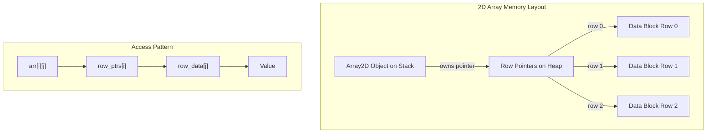

# Implementing 2d Arrays in CPP

**Published:** 2021-12-24

C++ hasn't yet caught up with implementing 2D arrays like other languages yet. So there is no inbuilt 2D array in C++.But lose no hope, with some template programming to the rescue we can create our own multidimensional data structure.

Here is a basic design of how a 2d Array will work

We can extend this further to similarly create an n-dimensional Array by using variadic templates.