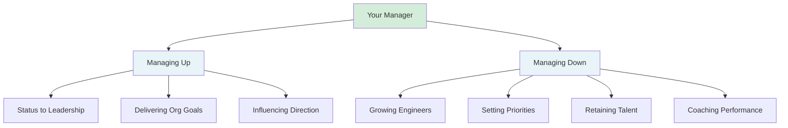
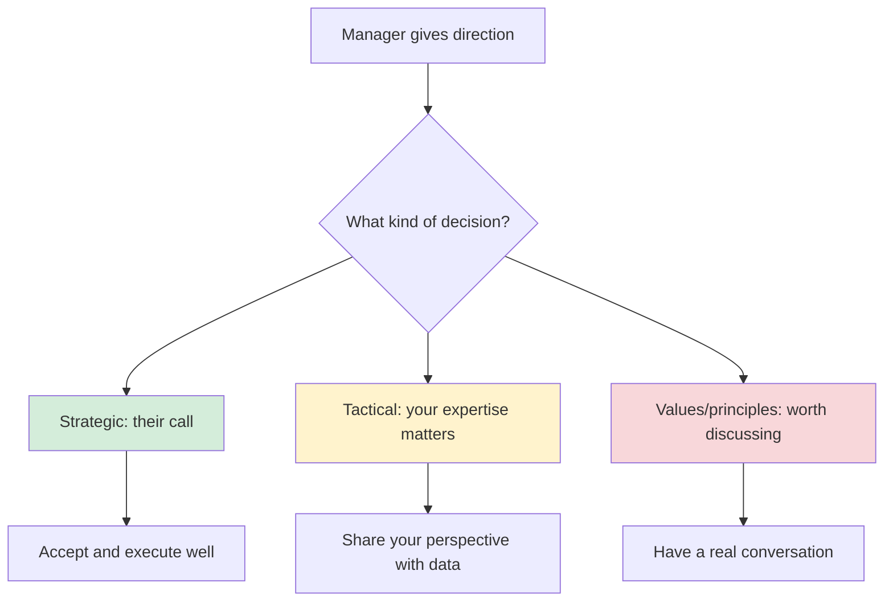
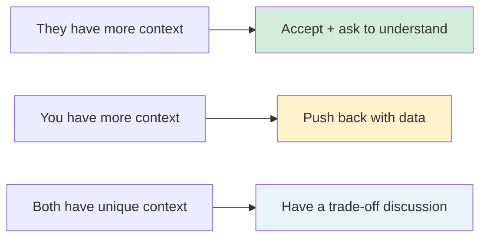
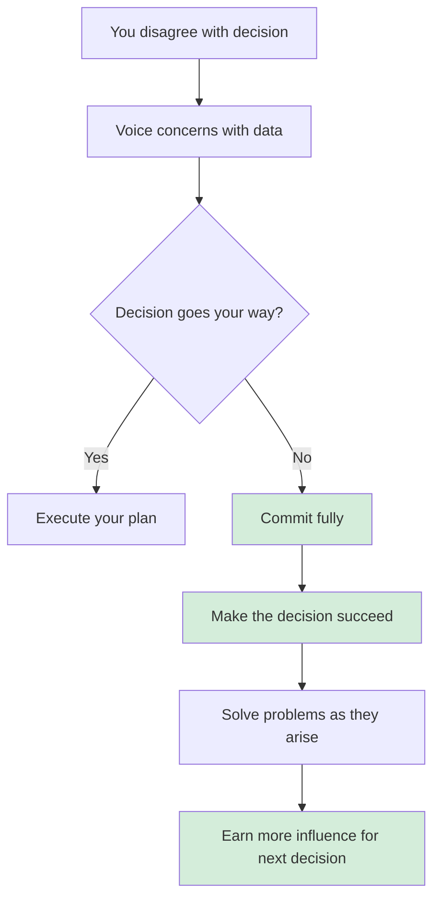

# Aligning with Your Manager: How to Become Their Right Hand

**Published:** April 12, 2026

Your manager just told you the team needs to shift focus to reliability work this quarter. You had been planning to propose a new feature that you are excited about. Your instinct is to push back, to argue that the feature will drive more impact. But should you?

Most engineers think about their relationship with their manager in terms of reporting structure: they assign work, you do it, they evaluate you. This framing is limiting. The engineers who grow fastest and have the most impact treat the relationship as a partnership. They understand what their manager is trying to achieve, align themselves with those goals, and become the person their manager relies on to get the hard things done.

This is not about being a yes-person. It is about developing shared understanding so deep that you can anticipate what matters, contribute at a higher level, and know exactly when your pushback will be valuable versus when it will be noise.

## Understand What Your Manager Actually Does

Before you can align with your manager, you need to understand what their job actually looks like. Engineering managers are evaluated on two axes: managing down (growing engineers, setting priorities, coaching poor performers, retaining talent) and managing up (communicating team status to leadership, delivering on organizational goals, influencing direction).

Their calendar is packed with 1:1s, alignment sessions with their leadership, cross-team coordination, and firefighting. Every good engineering manager is a part-time therapist. The emotional labor is real: out of ten reports, at least one is likely going through something difficult at any given time, and it is the manager's job to figure out how to help.

Understanding this context changes how you interact with them. When your manager seems distracted in your 1:1, it might not be about you. When they make a decision that seems arbitrary, there might be pressure from above that you are not seeing. When they ask you to shift priorities suddenly, someone above them probably shifted theirs.

Unfortunately, a lot of engineers see their manager as an antagonist. Some managers deserve that reputation. But many are net good and decent, and it is the engineer who does not know how to manage the relationship or extract the good parts from it. Empathy is the starting point: their job is hard, it is more emotional than most engineers realize, and approaching it as a partnership will serve you far better than approaching it as a hierarchy.

## Think Two Levels Up

The single most powerful habit for alignment is thinking two levels up. Your manager has a manager. That person has goals, pressures, and constraints that cascade down. If you understand what your skip-level cares about, you understand why your manager is making the decisions they are making.

Ask yourself: what is my manager's manager worried about? Is it reliability? Shipping speed? Cost reduction? Retention? If your director is under pressure to reduce infrastructure costs by 30%, suddenly your manager's insistence on reliability work makes perfect sense. It is not about reliability for its own sake. It is about proving the team can operate efficiently so the director can make their case to the VP.

When you understand this chain, you stop seeing your manager's requests as arbitrary and start seeing them as signals. You can even get ahead of them: "I know the director is focused on cost reduction. I looked at our cloud spend and found three services where we are over-provisioned. Want me to write up a proposal?"

That is what being a right hand looks like. You are not waiting for instructions. You are solving problems your manager has not had time to articulate yet.

## The Right Way to Communicate Upward

A useful mental model: treat your manager as an API. They are a resource with specific capabilities. Your job is to plug in optimally. Nobody can read minds. If you are not explicit about what you need, what you are working on, and where you are stuck, your manager cannot help you.

### Overcommunicate

Assume your manager does not know what you are doing by default. This is the single most common mistake engineers make: they do excellent work in silence and then wonder why their manager does not recognize it.

CC them on important communications. Put them as optional on meetings they should know about. Share updates proactively in 1:1s. Not taking credit for the work you have done is the biggest mistake I have seen, especially for junior and mid-level engineers. If you are visible and share updates, you will develop not only a good relationship with your manager but also a reputation.

Things going badly is fine. Surprising bad news is not. Deliver negative news in person or on a call, not in an email. If a project is slipping, tell your manager before they find out in a status meeting. If you made a mistake, own it early. Surprises erode trust. Proactive honesty builds it.

### Bring solutions, not just problems

"We have a problem with X" is useful. "We have a problem with X, I think we should do Y, here is my reasoning" is far more useful. It lets your manager evaluate a proposal instead of having to generate one from scratch. If you can draft the status update, write the project summary, or prepare the talking points they need for their leadership meeting, do it. You are saving them time and ensuring the narrative is accurate.

### Make your 1:1s count

Your weekly 1:1 is your highest-leverage relationship-building time. Do not waste it. Seed the agenda more than 24 hours before the meeting and let your manager know what you want to discuss. This gives them time to think and shows you take the meeting seriously.

Structure each meeting in four parts: small talk (know something about each other's lives), go through your wins, iterate through your topics, and assign action items. For wins, use the "what, so what, now what" framework: "I optimized the query pipeline (what), which reduced p99 latency by 40% (so what). I think we should apply the same pattern to the search service next (now what)." This is not bragging. It is giving your manager the information they need to represent your work upward.

Write things down during the meeting. Not only will you remember what was discussed, but the act of noting something down tells your manager "I value your time." Hold each other accountable. Create a list of next steps and follow up on them.

### Be upfront about your goals

If your goal is promotion, say so. Frame it as mutual benefit: "I want to expand my impact for the team. What are the steps I need to take to get to the next level?" If your goal is stability because you have a lot going on personally, say that too: "I have a lot going on in my personal life right now. I am focused on being a solid performer for the next few months." Managers respect honesty about goals far more than they respect people trying to perform enthusiasm they do not feel.

Consider creating a personal README and sharing it with your manager. Include your career story, what type of work gives you energy, what is going well and what is not, and how you prefer to receive feedback. Making your working style explicit removes guesswork and prevents misunderstandings.

## When to Accept, Push Back, or Discuss

This is the question that trips most engineers up. You have your own ideas and opinions. Your manager has theirs. Sometimes they conflict. How do you decide when to accept their direction and when to challenge it?

The answer is not "always agree" or "always push back." It depends on what kind of decision you are looking at.

### Accept: strategic and organizational decisions

Your manager has context you do not have. They sit in meetings you are not in. They hear priorities from leadership that have not been communicated to you yet. When the decision is strategic -- what the team should focus on this quarter, which project to prioritize, how to allocate headcount -- your default should be to accept.

This does not mean you cannot ask questions. "Can you help me understand why we are shifting to reliability work?" is a perfectly reasonable question. But asking to understand is different from asking to challenge. Once you understand the reasoning, execute. Execute well. If you prove that you can take strategic direction and run with it, your manager will start involving you in those strategic discussions earlier.

Examples of when to accept:
- Team priorities and quarterly goals
- Headcount allocation and hiring decisions
- Organizational changes and reorgs
- Decisions that have already been made at a level above your manager

### Push back: tactical and technical decisions

When the decision is about how to implement something, which technical approach to take, or how to sequence the work, your expertise is directly relevant. This is where your pushback is not just welcome, it is expected. Your manager likely does not have the same depth of technical context that you do. If they suggest an approach that will not work, saying nothing is a disservice to the team.

But how you push back matters enormously. Come with data, not opinions. "I do not think that will work" is weak. "I tried a similar approach on the billing service last year and it caused X problem because of Y. Here is what I think would work better and why" is strong.

Examples of when to push back:
- Technical architecture decisions where you have deeper context
- Timeline estimates that are unrealistic given what you know about the codebase
- Approaches that will create significant technical debt
- Sequencing decisions where you see dependencies they might have missed

### Discuss: decisions that involve values or principles

Some decisions sit in between. Your manager wants to cut corners on testing to ship faster. You believe this will cause production incidents. Your manager wants to assign a junior engineer to a project you think is too complex for them. You think the on-call rotation is unsustainable.

These are not purely strategic (your manager's call) or purely tactical (your expertise). They involve judgment about trade-offs, team health, and engineering principles. These deserve a real conversation, not a quick accept or a hard push back.

Frame it as a trade-off discussion: "I understand we need to ship faster. If we skip integration tests, here is the risk we are taking. Are we comfortable with that risk, or is there a middle ground?" This shows you understand the pressure while making the consequences explicit.

### The meta-rule

When in doubt, ask yourself: **does my manager have context I do not have, or do I have context they do not have?** If they have context you lack (organizational priorities, leadership pressure, budget constraints), lean toward accepting and asking questions to understand. If you have context they lack (technical depth, codebase knowledge, on-the-ground reality), lean toward sharing your perspective.

## Disagree and Commit

You pushed back. You made your case with data. The decision went the other way. Now what?

This is the moment that separates the engineers who build lasting influence from the ones who become known as difficult. The principle is simple: once a decision is made, you commit fully. Not grudgingly. Not passive-aggressively. Not with an "I told you so" loaded in the chamber. You make it your mission to make the decision succeed.

### Why this matters

If people cannot trust that you will commit after disagreeing, they will stop including you in decisions. Why would a manager share the full context with someone who will use it to relitigate rather than to execute? Your right to disagree is earned by your willingness to commit. The two are inseparable.

### A concrete example

Your team needs to choose between building a custom feature flagging system and adopting a vendor product like LaunchDarkly. You strongly prefer building in-house. You see limitations in the vendor product: the targeting rules are not flexible enough for your use cases, the pricing will hurt at scale, and you will be locked into their data model. You make your case with a cost comparison over three years, a list of missing features, and a lock-in risk assessment.

Your manager listens. She acknowledges your points. But she decides to go with the vendor. The director needs the team shipping customer-facing features this quarter, not building internal tools. The vendor gets you 80% of what you need in two weeks instead of three months. The decision is made.

**The wrong response:** You implement the integration grudgingly. You do the minimum required. When the vendor product hits a limitation three months later -- the one you predicted -- you say "I told you we should have built our own." You document all the problems but propose no solutions. You bring it up in retrospectives. Your colleagues start to see you as the person who is always fighting yesterday's battles.

**The right response:** You commit fully. You become the team's expert on the vendor product. You find creative workarounds for the limitations you predicted. You build a thin abstraction layer so that if you ever do need to switch, the migration will be manageable. When problems arise, you solve them instead of pointing fingers. You write an internal guide on how to use the product effectively. Six months later, your manager trusts your judgment even more -- not because you were right about the limitations, but because you showed you could disagree, commit, and make it work anyway.

### The anti-patterns

Watch for these in yourself:

- **The slow walk.** You technically do what was asked, but you drag your feet, miss deadlines, and do not bring your full effort. Everyone notices.
- **The told-you-so.** You wait for the decision to encounter problems and then point out that you predicted them. This makes you feel smart and makes everyone else feel resentful.
- **The relitigator.** You bring the decision back up in every meeting, hoping to reverse it through attrition. This wastes everyone's time and signals that you do not respect the process.
- **The minimalist.** You do the bare minimum to comply. You do not go the extra mile to make the decision work. When it fails, you tell yourself it was not your fault.

### The paradox

Engineers who disagree and commit well actually get more influence over future decisions, not less. When your manager sees that you can voice a strong opinion, lose gracefully, and then pour your energy into making the chosen path succeed, they learn something important: they can trust you with the full picture. They can include you in sensitive discussions. They can share bad news and trade-offs without worrying that you will weaponize the information.

This is how you go from being someone who is consulted occasionally to someone who is in the room when the decisions get made.

## Feedback Is How You Calibrate

The fastest way to build alignment is to get good at receiving feedback. Most engineers say they take feedback well, but what they mean is they take feedback well when it is overwhelmingly and obviously correct. The reality is that most feedback is only partially true. It might be directionally right but poorly worded, or it might apply in some situations but not others.

Your default response to any feedback should be: "Thank you for the feedback. I appreciate it and I need some time to think about it." Then actually think about it. Even if your gut reaction is defensive, sit with it for a day. Look for the kernel of truth.

When you take feedback well and visibly act on it, something powerful happens. Your manager thinks: "I gave this person feedback and they immediately adapted. I love giving this person feedback." And they give you more feedback, creating a virtuous cycle. You get better faster, they trust you more, and the alignment deepens.

Being defensive about feedback is a card you can only play once. If you push back on feedback repeatedly, people stop giving it to you. And then you are flying blind. Most people do not like giving feedback. They are putting themselves out there. If you get pushy about it, they will never give you feedback again.

The most effective engineers are feedback machines. They take feedback well and show results. Imagine doing that consistently for three years. The compounding effect is enormous.

## What "Right Hand" Actually Means

Being your manager's right hand does not mean doing whatever they say. It means:

- You understand their goals well enough to act autonomously toward them
- You surface problems before they become crises
- You know when to execute, when to flag a concern, and when to commit despite disagreement
- You make their job easier by being reliable, communicative, and proactive
- You can represent the team's technical perspective in rooms your manager is not in
- You give them honest, well-reasoned pushback when it matters, and they trust you because of it

The engineers who reach this level of alignment do not just grow faster in their careers. They have better working relationships, less anxiety about performance reviews, and more influence over the direction of their team. Your rating should never be a surprise. If it is, something in the alignment has broken down.

## Related Reading

If you are leading a large cross-team project, the dynamics of alignment scale up dramatically. I have written an 11-part series on [Leading Large Projects as a Staff Engineer](/#/blog/staff-engineers-path-leading-large-projects), and the post on [Creating Shared Understanding](/#/blog/staff-engineers-path-create-shared-understanding) covers how to build alignment across multiple teams using mental models, naming, diagrams, and design documents.

## Conclusion

Alignment with your manager is not a one-time conversation. It is an ongoing practice of understanding their context, communicating yours, and building enough trust that you can be honest with each other about what matters. Think two levels up. Treat your manager as a partner, not an authority figure. Accept strategic direction gracefully. Push back on tactical decisions with data. When you lose an argument, commit fully and make the decision succeed. Take feedback like someone who wants to get better, not someone who wants to be right. Do these things consistently and you will not just be aligned with your manager. You will be the person they cannot imagine running the team without.
