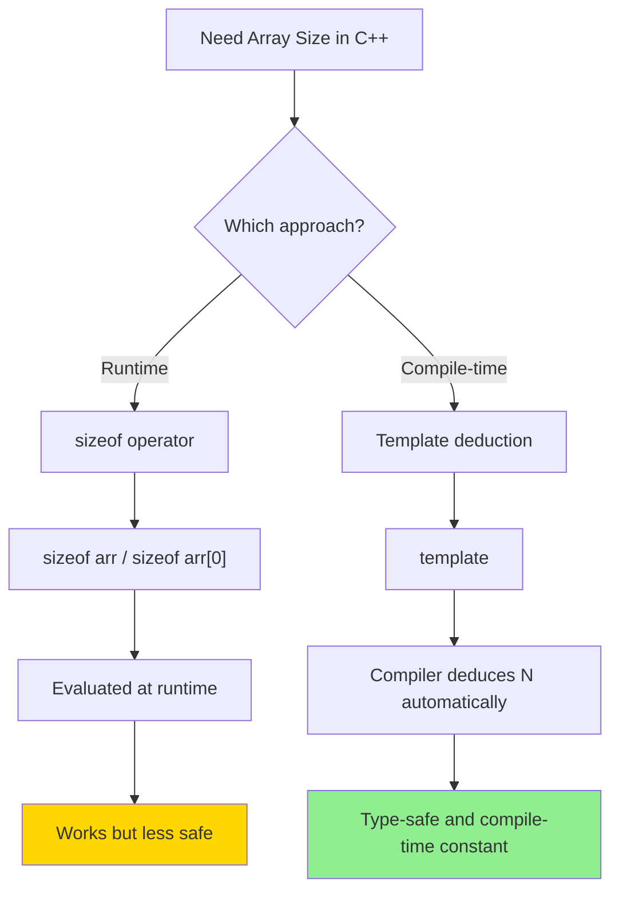
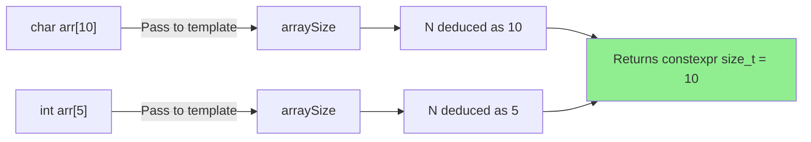

# Compile-time vs run time size computation for array in C++

**Published:** 2021-08-08

There are 2 ways in C++ to get the size of an array.  The first is using run-time computation with sizeof, but there is a better compile-time way to compute the size. The way to do it as follows:

Note: char* is not the same as char[]. When you do sizeof(char *) it will give you 4 or 8 depending on the size of char in the system.