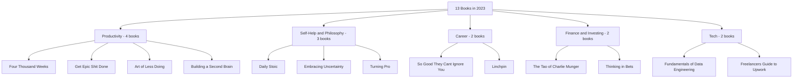

# 13 Books I read in 2023

**Published:** 2024-07-14

### 1. **Fundamentals of Data Engineering**

This book dives into the world of data engineering, covering everything from how data is collected and stored to how it's processed and used. It talks about best practices, security, and designing systems that handle data efficiently and safely.

- **Key Ideas**: Data lifecycle, architecture, security, management, and engineering principles.

### 2. **Four Thousand Weeks**

This book offers a fresh take on time management, reminding us that life is short (about 4,000 weeks). Instead of typical productivity tips, it encourages us to focus on what really matters.

- **Key Ideas**: Embrace life's limits, prioritize what matters, redefine productivity.

### 3. **So Good They Can't Ignore You**

Cal Newport argues that following your passion isn't the best career advice. Instead, getting really good at something valuable is what leads to career satisfaction.

- **Key Ideas**: Develop rare skills, build career capital, practice deliberately.

### 4. **Freelancers Guide to Upwork**

This guide is perfect for anyone looking to succeed on Upwork. It offers practical tips on creating a strong profile, writing winning proposals, and managing client relationships.

- **Key Ideas**: Profile optimization, effective proposals, client management.

### 5. **Get Epic Shit Done**

Ankur Warikoo combines personal stories with productivity tips to inspire readers to achieve their big goals.

- **Key Ideas**: Set goals, stay productive, personal growth.

### 6. **Daily Stoic**

A daily guide to Stoic philosophy, offering 366 reflections to help you lead a wiser, more mindful life.

- **Key Ideas**: Daily wisdom, Stoicism, mindfulness.

### 7. **Art of Less Doing**

Ari Meisel shares how to streamline your tasks by optimizing, automating, and outsourcing, so you can focus on what's really important.

- **Key Ideas**: Efficiency, automation, delegation.

### 8. **Embracing Uncertainty**

Susan Jeffers encourages readers to accept life's uncertainties and transform fear into power and action.

- **Key Ideas**: Face fear, embrace change, grow personally.

### 9. **Linchpin**

Seth Godin explains how to become indispensable in your job by being creative, solving problems, and contributing in unique ways.

- **Key Ideas**: Creativity, indispensability, emotional labor.

### 10. **Building a Second Brain**

Tiago Forte shows how to create a system for capturing and organizing information digitally to enhance your productivity and creativity.

- **Key Ideas**: Digital organization, knowledge management, productivity.

### 11. **Turning Pro**

Steven Pressfield talks about the mental shift needed to go from being an amateur to a professional in any field.

- **Key Ideas**: Professional mindset, dedication, overcoming resistance.

### 12. **The Tao of Charlie Munger**

A collection of insights and quotes from Charlie Munger, offering wisdom on investing and life.

- **Key Ideas**: Investment wisdom, critical thinking, decision-making.

### 13. **Thinking in Bets**

Annie Duke uses poker to teach better decision-making by considering every choice as a bet with potential risks and rewards.

- **Key Ideas**: Decision-making, risk management, thinking probabilistically.