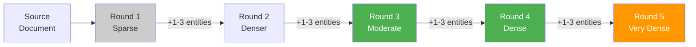
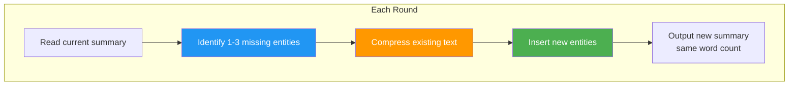

# Chain of Density Summarization: Getting Better Summaries from LLMs

**Published:** February 17, 2026


If you have ever asked an LLM to "summarize this article," you have probably noticed the results can be underwhelming. The summary is either so vague it could apply to almost anything, or so long-winded it barely counts as a summary at all. Chain of Density (CoD) prompting is a technique designed to solve exactly this problem, producing summaries that are both concise and packed with information. In this post, we will break down how it works, why it is effective, and how you can use it in practice.

## The Problem with LLM Summaries

Large language models are remarkably capable text generators, but their default summarization behavior leaves a lot to be desired. When you give a model a simple instruction like "summarize this document," the output tends to suffer from one of two failure modes:

1. **Too vague and generic.** The summary reads like a high-level abstract that could describe dozens of different articles. Key details, names, numbers, and specific findings are stripped away in favor of broad generalizations.

2. **Too verbose and redundant.** The model produces a lengthy paraphrase that barely compresses the original text. It may faithfully represent the content, but it defeats the purpose of summarization.

The root cause is that standard prompts give the model no guidance on information density. The model does not know whether you want a quick headline-style summary or a detailed but compressed briefing. It defaults to a safe middle ground that is neither particularly concise nor particularly informative.

The real challenge is getting summaries that are both short AND dense with information. That is exactly what Chain of Density addresses.

## What is Chain of Density?

Chain of Density is an iterative prompt engineering technique introduced in the paper "From Sparse to Dense: GPT-4 Summarization with Chain of Density Prompting" by Adams et al. (2023), a collaboration between Salesforce AI Research and Columbia University.

The core idea is straightforward: instead of asking the LLM to summarize a document once, you ask it to rewrite the same summary multiple times. With each rewrite, the model must add new salient entities and details from the source document while keeping the word count approximately the same. Over the course of 5 iterations, the summary evolves from sparse and generic to dense and specific.

Think of it as a compression exercise. The first summary is loose and general. Each subsequent version must pack in more information without getting longer, forcing the model to use tighter phrasing, merge concepts, and drop filler language. The result is a summary that says more in less space.

## How It Works

The Chain of Density process runs for 5 rounds. In each round, the model performs two steps:


*The iterative refinement process. Rounds 3-4 (green) are the sweet spot for readability and density.*

### Step 1: Identify Missing Entities

The model examines the source document and identifies 1 to 3 informative entities that are salient to the main topic but missing from the current summary. These entities must be:

- **Relevant** to the main story or argument
- **Specific** yet concise (5 words or fewer)
- **Novel** (not present in the previous summary)
- **Faithful** (actually present in the source document)

### Step 2: Rewrite the Summary

The model produces a new version of the summary that incorporates the missing entities while maintaining approximately the same word count (around 80 words). Crucially, the new summary must retain all entities from the previous version. Nothing gets dropped; new information is added through compression and fusion of existing phrases.

### The Progression Across Rounds

| Round | Character | Style |
|-------|-----------|-------|
| 1 | Sparse, general | Long sentences, filler phrases, broad language |
| 2 | Somewhat dense | Starts incorporating specific names and numbers |
| 3 | Moderately dense | Good balance of readability and information |
| 4 | Dense | Highly compressed, entity-rich |
| 5 | Very dense | Maximum compression, may sacrifice some readability |

The key insight from the original paper is that human evaluators consistently preferred summaries from rounds 3 and 4. Round 5 summaries, while maximally dense, sometimes become so compressed that they are harder to read. The sweet spot is in the middle.


*Within each round, the model identifies missing entities, compresses existing text, and inserts new information while maintaining the same word count.*

## The Full Prompt Template

Below is the prompt template used in the Chain of Density technique. You can use this directly with any capable LLM:

```
Article: {ARTICLE}

You will generate increasingly concise, entity-dense summaries of the above article.

Repeat the following 2 steps 5 times.

Step 1. Identify 1-3 informative entities (";" delimited) from the article
which are missing from the previously generated summary.

Step 2. Write a new, denser summary of identical length which covers every
entity and detail from the previous summary plus the missing entities.

A missing entity is:
- Relevant to the main story,
- Specific yet concise (5 words or fewer),
- Novel (not in the previous summary),
- Faithful (present in the article),
- Anywhere (can be located anywhere in the article).

Guidelines:
- The first summary should be long (4-5 sentences, ~80 words) yet highly
  non-specific, containing little information beyond the entities marked as
  missing. Use overly verbose language and fillers (e.g., "this article
  discusses") to reach ~80 words.
- Make every word count: rewrite the previous summary to improve flow and
  make space for additional entities.
- Make space with fusion, compression, and removal of uninformative phrases
  like "the article discusses."
- The summaries should become increasingly dense and concise yet
  self-contained, i.e., easily understood without the article.
- Missing entities can appear anywhere in the new summary.
- Never drop entities from the previous summary. If space cannot be made,
  add fewer new entities.

Answer in JSON. The JSON should be a list (length 5) of dictionaries whose
keys are "Missing_Entities" and "Denser_Summary".
```

This prompt is carefully designed. The instruction to start with a deliberately vague first summary ensures maximum room for improvement. The JSON output format with explicit keys makes the results easy to parse programmatically.

## Why It Works

Chain of Density is effective for several reinforcing reasons:

### Fixed Word Count as a Constraint

By requiring the summary to stay at approximately the same length across all rounds, the model is forced to make tradeoffs. It cannot simply append new information; it must compress existing text to create room. This constraint drives creative compression strategies such as:

- Replacing verbose phrases with concise alternatives
- Fusing multiple sentences into one
- Removing hedging language and filler words
- Using more precise terminology

### Iterative Refinement

Each round builds on the previous one. The model is not starting from scratch; it is incrementally improving an existing summary. This is analogous to how a human editor might revise a draft, tightening language and adding detail with each pass.

### Entity Tracking

The explicit requirement to identify and list missing entities gives the model a concrete objective for each round. Instead of vaguely trying to "improve" the summary, it has a specific task: find what is missing and incorporate it.

### Human Preference Alignment

The paper found that GPT-4-generated Chain of Density summaries (particularly from rounds 3-4) were preferred by human evaluators over both vanilla GPT-4 summaries and human-written summaries. Evaluators found CoD summaries to be more informative without being overwhelming.

## A Worked Example

To make this concrete, consider summarizing a news article about a new climate policy. Here is how the summaries might evolve:

**Round 1 (Sparse):**
```
This article discusses a new climate policy that was recently announced.
The policy aims to address environmental concerns and has generated
significant discussion among various stakeholders. Several aspects of the
policy have been highlighted as particularly noteworthy, and experts have
weighed in on its potential impact on the industry and the broader economy.
```

**Round 3 (Moderately Dense):**
```
The European Union's Carbon Border Adjustment Mechanism (CBAM), effective
October 2026, imposes tariffs on imports based on embedded carbon
emissions. Targeting steel, cement, aluminum, fertilizers, and electricity,
CBAM requires importers to purchase certificates matching EU carbon prices.
Trade partners including China and India have challenged the measure at
the WTO, calling it protectionist. EU Climate Commissioner Wopke Hoekstra
defended CBAM as essential for preventing carbon leakage while maintaining
industrial competitiveness.
```

**Round 5 (Very Dense):**
```
The EU's CBAM, effective October 2026, levies tariffs on steel, cement,
aluminum, fertilizer, and electricity imports based on embedded CO2,
requiring importers to buy certificates at EU ETS prices (~90 EUR/ton).
China, India, and Brazil filed WTO complaints citing GATT violations.
Commissioner Hoekstra cited 2023 carbon leakage data showing 47% emission
migration to non-regulated economies. Industry group Eurofer endorsed CBAM
while SME associations warned of 12-18% cost increases for downstream
manufacturers.
```

Notice how the same approximate word count packs progressively more specific information with each round.

## Practical Use Cases

Chain of Density is useful in any scenario where you need maximum information in minimum space:

### Research Paper Summarization

Academic papers are dense by nature. CoD can produce summaries that capture methodology, key findings, sample sizes, and statistical significance rather than just the general topic.

### Meeting Notes Compression

Transform lengthy meeting transcripts into tight summaries that preserve action items, decisions, responsible parties, and deadlines.

### News Article Summarization

Generate briefings that include specific names, dates, numbers, and quotes rather than generic descriptions of events.

### Document Preprocessing for RAG Pipelines

When building Retrieval-Augmented Generation systems, the quality of your document chunks matters. Using CoD to create dense summaries of documents before indexing them can improve retrieval quality, since each chunk contains more searchable entities and facts.

### Executive Briefings

Condense lengthy reports into one-paragraph briefings that capture all critical data points for decision-makers who need information fast.

## Implementing Chain of Density in Python

Here is a practical implementation using Python and any OpenAI-compatible API:

```python
import json
from openai import OpenAI

def chain_of_density_summarize(article: str, model: str = "gpt-4") -> list[dict]:
    """
    Summarize an article using Chain of Density prompting.
    Returns a list of 5 progressively denser summaries.
    """
    client = OpenAI()

    prompt = f"""Article: {article}

You will generate increasingly concise, entity-dense summaries of the above article.

Repeat the following 2 steps 5 times.

Step 1. Identify 1-3 informative entities (";" delimited) from the article
which are missing from the previously generated summary.

Step 2. Write a new, denser summary of identical length which covers every
entity and detail from the previous summary plus the missing entities.

A missing entity is:
- Relevant to the main story,
- Specific yet concise (5 words or fewer),
- Novel (not in the previous summary),
- Faithful (present in the article),
- Anywhere (can be located anywhere in the article).

Guidelines:
- The first summary should be long (4-5 sentences, ~80 words) yet highly
  non-specific, containing little information beyond the entities marked as
  missing. Use overly verbose language and fillers to reach ~80 words.
- Make every word count: rewrite the previous summary to improve flow and
  make space for additional entities.
- Make space with fusion, compression, and removal of uninformative phrases.
- The summaries should become increasingly dense and concise yet
  self-contained.
- Missing entities can appear anywhere in the new summary.
- Never drop entities from the previous summary.

Answer in JSON. The JSON should be a list (length 5) of dictionaries whose
keys are "Missing_Entities" and "Denser_Summary"."""

    response = client.chat.completions.create(
        model=model,
        messages=[{"role": "user", "content": prompt}],
        response_format={"type": "json_object"},
    )

    result = json.loads(response.choices[0].message.content)
    return result


def get_best_summary(article: str, preferred_round: int = 3) -> str:
    """
    Get the optimal summary (default: round 3 for best density/readability).
    """
    summaries = chain_of_density_summarize(article)

    # Handle both list and dict with list value responses
    if isinstance(summaries, dict):
        summaries = list(summaries.values())[0]

    idx = min(preferred_round - 1, len(summaries) - 1)
    return summaries[idx]["Denser_Summary"]
```

This gives you a clean interface: call `get_best_summary()` with your article text, and you get back the round-3 summary by default.

## Tips for Using Chain of Density

Based on the original paper and practical experience, here are some guidelines for getting the most out of this technique:

### Pick the Right Round

You do not always need all 5 rounds. The paper found that rounds 3 and 4 offer the best balance between information density and readability. Round 5 summaries tend to be so compressed they become harder to parse. Start with round 3 as your default and adjust based on your use case.

### Use It with Longer Documents

CoD works best when the source document is long enough that a single-pass summary would genuinely miss important details. For short texts (under 500 words), the iterative process adds overhead without much benefit.

### Adapt the Parameters

The technique is flexible. You can modify:

- **Number of rounds**: 3 rounds may be sufficient for shorter documents
- **Word count target**: Increase from 80 to 150 words if you need more detail
- **Entity count per round**: Request 2-5 entities if the source is very information-rich
- **Output format**: Switch from JSON to plain text if you do not need programmatic parsing

### Works Across Models

While the original paper used GPT-4, Chain of Density works with any capable LLM. Claude, Llama 3, Gemini, and Mistral all handle this prompt pattern well. The key requirement is that the model can follow multi-step instructions and maintain constraints across iterations.

### JSON Output is Your Friend

The structured JSON output with `Missing_Entities` and `Denser_Summary` keys makes it straightforward to:

- Parse results programmatically
- Track which entities were added in each round
- Select the summary from your preferred round
- Log and compare summary quality over time

### Combine with Other Techniques

CoD pairs well with other prompt engineering methods. For example, you can add a role prefix ("You are an expert scientific editor") or combine it with chain-of-thought reasoning for the entity identification step.

## Limitations and Considerations

No technique is perfect, and Chain of Density has some trade-offs to keep in mind:

- **Latency and cost**: Generating 5 summaries in one call uses more tokens than a single-pass summary. If speed or cost is a constraint, consider reducing the number of rounds.
- **Over-compression in later rounds**: Round 5 summaries can become telegraphic and harder to read. Always review the output and select the round that best fits your readability requirements.
- **Entity relevance**: The model may occasionally identify entities that are present in the source but not truly important. The "relevant to the main story" constraint helps, but it is not foolproof.
- **Source length limits**: Very long documents may exceed the model's context window. In those cases, consider chunking the document and applying CoD to each chunk, or first doing a rough summary before applying CoD.

## Conclusion

Chain of Density is a practical, well-validated technique for getting better summaries out of large language models. Instead of hoping a single prompt produces the right level of detail, CoD uses iterative refinement with a fixed word count constraint to progressively pack more information into the same space.

Key takeaways:

- **Standard LLM summaries** tend to be either too vague or too verbose. Chain of Density addresses both problems.
- **The technique is iterative**: 5 rounds of rewriting, each adding 1-3 new entities while maintaining the same word count.
- **Rounds 3-4 are the sweet spot**, balancing information density with readability.
- **The fixed word count constraint** is what drives the compression. The model must get creative to fit more information into the same space.
- **It is model-agnostic** and works with GPT-4, Claude, Llama 3, and other capable LLMs.
- **The JSON output format** makes it easy to parse results and select your preferred summary round programmatically.
- **Practical applications** range from research paper summarization to RAG pipeline preprocessing to executive briefings.

If you regularly work with LLM-generated summaries and find them lacking in specificity, Chain of Density is one of the most effective prompt engineering techniques you can add to your toolkit. The original paper is well worth reading for the full experimental results and human evaluation data.

## References

- Adams, G., Fabbri, A., Ladhak, F., Lehman, E., and Elhadad, N. (2023). "From Sparse to Dense: GPT-4 Summarization with Chain of Density Prompting." [arXiv:2309.04269](https://arxiv.org/abs/2309.04269)
- DeepLearning.AI. "ChatGPT Prompt Engineering for Developers." [Course Materials](https://www.deeplearning.ai/short-courses/chatgpt-prompt-engineering-for-developers/)
