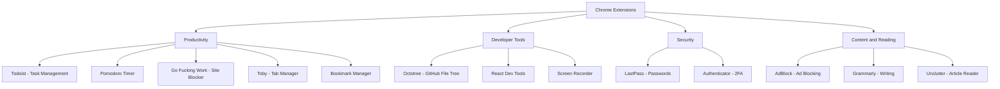

# My favorite Chrome browser extensions for productivity

**Published:** 2022-06-18

AdBlock for blocking ads. also adblock plus

Go Fucking Work is what I use to block sites like Reddit or Facebook so that I don't get distracted.

Grammarly is a grammar-checking extension for you to improve any writing. (It's also available for Firefox and Safari if you use those.)

Lastpass is the password manager

todoist todo list extension

pomadaro pomodaro timer

octotree adds a file tree on top of github

react dev tools for react debugging

Toby is a tab manager with cloud syncing.

Authenticator is for 2 factor auth

bookmark manager rearranges your bookmarks efficiently

Screen recorder makes it easy to record some KT meetings

Unclutter makes it easy for you to read your articles(in beta stage, but looks promising)
