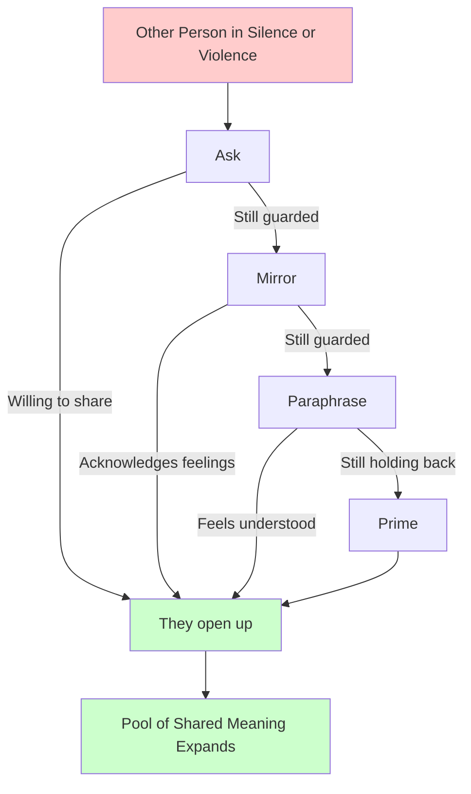

# Crucial Conversations Ch. 9: Explore Others' Paths

**Published:** March 23, 2026

You are in a postmortem and the on-call engineer has gone quiet. Or worse, a teammate is raising their voice about a deployment decision. When people retreat into silence or erupt into verbal violence, dialogue is dead. Chapter 9 of Crucial Conversations teaches a set of listening skills that can bring it back to life. For engineers, these skills are indispensable — they help you extract honest feedback in design reviews, defuse tension in incidents, and surface objections before they become resentments.

## Why People Go to Silence or Violence

When people feel unsafe in a conversation, they default to one of two unhealthy responses. Silence includes masking (pretending to agree), avoiding (steering around the topic), or withdrawing (disengaging entirely). Violence includes controlling (cutting people off, dominating the conversation), labeling ("that's a naive approach"), or attacking ("you clearly didn't think this through").

In engineering teams, silence is often the more dangerous of the two. A junior engineer who stays quiet during a design review because they feel intimidated may be sitting on the exact insight that prevents a production outage. A teammate who nods along in sprint planning but privately disagrees will deliver half-hearted work. Silence masquerades as agreement and consensus, but it is neither.

Violence is easier to spot but equally destructive. When a senior engineer dismisses alternatives with contempt, or when a manager shuts down questions with "we've already decided," the team stops contributing. The loudest voice wins, and the best ideas stay unspoken.

Both responses share the same root cause: the person no longer feels safe enough to speak honestly.

## The Listening Mindset

Before reaching for any technique, you need the right mindset. The authors describe four elements of a genuine listening posture.

**Be sincere.** If you ask someone to share their perspective but secretly just want ammunition to refute them, they will sense it. People are remarkably good at detecting insincerity. Your goal must genuinely be to understand, not to win.

**Be curious.** When someone says something you disagree with, your natural reaction is to build a counterargument. Instead, ask yourself: "Why would a reasonable, rational person say this?" This question is transformative. It shifts you from debate mode to discovery mode.

**Stay curious.** This is harder than it sounds. When someone challenges your architecture proposal or criticizes your code, curiosity tends to evaporate. The moment you feel that defensive surge, recognize it and consciously re-engage your curiosity. You do not have to agree with what they are saying — you just have to genuinely want to understand it.

**Be patient.** Strong emotions do not dissipate on command. When a colleague is frustrated after a failed deployment, they may need time to work through their feelings before they can articulate their concerns clearly. Rushing them or demanding they "get to the point" will push them back into silence.

## The AMPP Listening Toolkit

AMPP is a set of four escalating listening tools. You start with the lightest touch and increase intensity only as needed.

### Ask

Begin with a simple, open invitation to share. This works when someone seems hesitant but not deeply entrenched in silence.

In a 1:1 with a direct report: "I noticed you seemed uncomfortable in the design review. What's on your mind?" In a retro: "You mentioned the sprint felt off. Can you say more about that?"

The key is to ask genuinely open questions, not leading ones. "Don't you think the current design is fine?" is not a question — it is a statement wearing a question mark.

### Mirror

When asking alone does not work, mirror the emotions you observe. Mirroring means describing what you see in their tone, body language, or behavior, and checking whether your observation is accurate.

"You say the rollback plan is fine, but you seem uneasy about it." "I'm picking up some frustration — is that right?" "You went quiet after the incident timeline discussion. Something bothering you?"

Mirroring works because it shows you are paying attention to the person, not just the content. It gives them permission to acknowledge feelings they might be suppressing.

### Paraphrase

Paraphrasing means restating what you heard in your own words. It does two things: it confirms your understanding, and it signals to the speaker that you are genuinely processing their perspective.

After a teammate explains their concerns about a microservices migration: "So if I'm hearing you right, you're worried that splitting this service will create more operational burden than performance benefit, especially given our current team size."

Paraphrasing is not parroting. Simply repeating their words back feels mechanical. Translate their message into your own language while preserving their meaning.

### Prime

Priming is the tool of last resort, used when someone clearly has something to say but cannot or will not say it. You offer your best guess at what they might be thinking, said with humility and an invitation to correct you.

"I wonder if maybe you're concerned that this refactor is being driven by resume-building rather than actual user need. Am I off base?" "Could it be that you feel the timeline was set without enough input from the people who'll actually do the work?"

Priming feels risky because you might guess wrong. But that is actually fine — a wrong guess gives the other person something concrete to push back on, which breaks the logjam. "No, that's not it at all — what I'm actually worried about is..." is a successful outcome.

## Helping Others Retrace Their Path to Action

When someone is upset, their emotional state is the end of a chain, not the beginning. The Path to Action model describes this chain:

**Facts** (what actually happened) lead to **Stories** (the meaning they assigned) which create **Feelings** (the emotional response) which drive **Actions** (silence, violence, or healthy dialogue).

Your job as a listener is to help them walk backward along this path. Their visible behavior is the action. Underneath it are feelings. Underneath the feelings is a story. Underneath the story are facts.

Suppose a teammate is visibly angry after a code review. Their action is hostility. You mirror: "You seem really frustrated about the review." They say: "Of course I'm frustrated — nobody respects the work I put in." That is the story — they have interpreted the review comments as disrespect. Now you can gently probe for facts: "What specifically happened in the review that gave you that impression?" They might say: "Alex left 47 comments on a 200-line PR and most of them were style nitpicks."

Now you have facts. The facts are real (47 style comments is excessive). The story ("nobody respects my work") is one interpretation of those facts, but not the only one. With the facts on the table, you can have a productive conversation about what happened and what to do about it.

## Agree, Build, Compare

After you have listened and the other person has fully shared their perspective, it is your turn. The authors recommend three moves.

**Agree** where you genuinely agree. Do not manufacture agreement, but do not withhold it either. "You're right — 47 style comments on a single PR is too many. That's not a good use of anyone's time."

**Build** on what they have shared when you have additional information that extends their point. "And I'd add that we should probably set up an auto-formatter so style issues never reach the review stage."

**Compare** when your view differs. The word "compare" is deliberate — it replaces "disagree." You are not telling them they are wrong; you are offering a different perspective. "I see it a bit differently. I don't think Alex was being disrespectful — I think he doesn't have a clear sense of what's worth commenting on versus what a linter should catch. That's a process problem, not a people problem."

Compare is powerful because it keeps both perspectives alive. It does not demand that someone abandon their view — it just places another view alongside it for examination.

## Engineering Applications

**Postmortems.** The AMPP toolkit is essential for blameless postmortems. When the on-call engineer goes silent, they are probably afraid of being blamed. Ask genuinely, mirror their discomfort, paraphrase what they share, and prime if needed: "I'm guessing it felt like you were put in an impossible position with incomplete runbooks. Is that close?"

**Design reviews.** Silence in a design review is expensive. When a team member does not voice concerns, those concerns surface later as bugs, rewrites, or architecture debt. Actively use Ask and Mirror to pull out objections: "You looked skeptical when I described the caching layer. What are you seeing that I might be missing?"

**1:1s.** Managers often ask "How are things going?" and get "Fine" in return. That is silence in disguise. Mirror the gap between words and behavior: "You say things are fine, but you've seemed disengaged in the last couple of standups. What's going on?" Then paraphrase whatever they share to demonstrate you heard them.

**Cross-team negotiations.** When another team pushes back on your API proposal, resist the urge to argue louder. Use the listening tools to understand their constraints first. You will often discover that their objection is not about your design but about their operational capacity, their own deadlines, or a past experience that left scars.

## Conclusion

When dialogue breaks down, the instinct is to push harder — to repeat your point more forcefully, to overwhelm objections with data, to escalate. The AMPP toolkit offers a counterintuitive but far more effective approach: stop talking and start listening. Ask, Mirror, Paraphrase, and Prime create the safety that allows honest conversation to resume. For engineers, who work in environments where silence can hide critical risks and violence can suppress crucial dissent, these listening skills are not soft — they are load-bearing.
