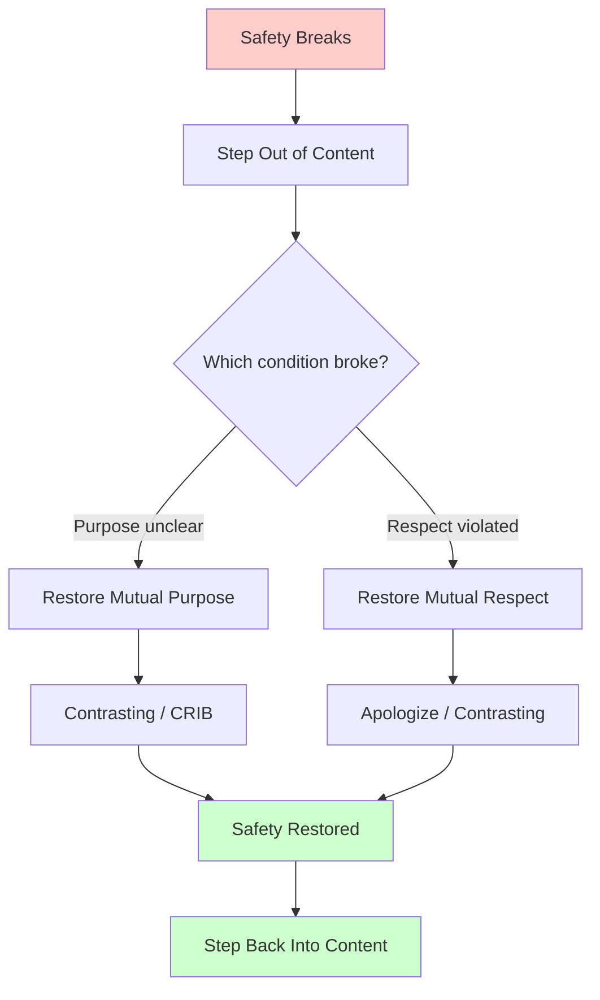
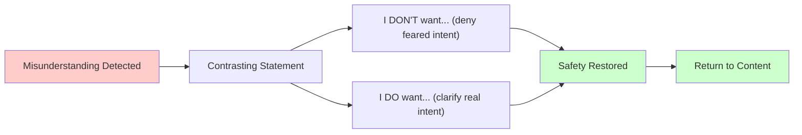
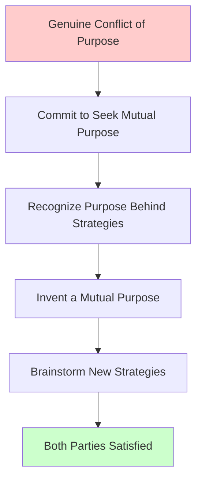

# Crucial Conversations Ch. 7: Make It Safe

**Published:** March 23, 2026

You have noticed that a conversation has gone sideways. Someone is defensive, or withdrawn, or both. The natural instinct is to push harder on the content —to make your point more clearly, to repeat it more forcefully, or to back off entirely. Chapter 7 of Crucial Conversations offers a different approach: stop talking about the content, fix the safety problem, then return to the content. This three-step pattern —step out, make it safe, step back in —is one of the most practically useful skills in the book, and it applies directly to dozens of situations engineers face regularly.

## The Core Principle: Intent, Not Content

The chapter builds on a key insight from the previous one: people do not become defensive because of what you say. They become defensive because of why they think you are saying it.

This means that when someone gets defensive during a code review, a design discussion, or a 1:1, the problem is almost never that you chose the wrong words. The problem is that the other person has made an assumption about your intent —and that assumption feels threatening.

Consider a senior engineer telling a colleague, "We need to talk about the quality of the tests in the last PR." If the colleague believes the intent is "I want to help us ship better code," they engage. If the colleague believes the intent is "I think you're a sloppy engineer and I want to build a case," they defend. Same words, completely different outcomes, determined entirely by perceived intent.

This is why the chapter's central advice is to stop arguing about content when you hit defensiveness, and instead address the intent problem directly.

## Two Conditions of Safety

The authors identify two conditions that must be present for people to feel safe enough to engage in honest dialogue:

### Mutual Purpose: The Entrance Condition

Before someone will engage with you on a difficult topic, they need to believe that you care about their goals, not just your own. They need to see a shared objective.

Mutual Purpose answers the question: "Why are we having this conversation?" If the answer is "because you want to win" or "because you want to prove me wrong," there is no Mutual Purpose, and the other person will not engage productively.

Engineering example: You want to raise concerns about a colleague's system design. If they believe your purpose is "I want us to build the most reliable system we can," they are likely to engage with your concerns. If they believe your purpose is "I want to show everyone that my approach is better," they will defend their design regardless of the technical merits of your points.

Mutual Purpose is the entrance condition —without it, the conversation never gets off the ground.

### Mutual Respect: The Continuance Condition

Even with shared purpose, a conversation will derail if either party feels disrespected. Mutual Respect means that each person believes the other values them as a person, not just as a means to an end.

Mutual Respect answers the question: "Do you regard me as a competent, worthwhile person?" The moment someone feels dismissed or looked down upon, they stop processing content entirely and start protecting their dignity.

Engineering example: During an incident postmortem, if the on-call engineer who missed an alert feels that the team respects their competence and understands the circumstances, they will openly discuss what went wrong. If they feel they are being judged as incompetent, they will minimize, deflect, or go silent —and the team loses the chance to learn from the incident.

Mutual Respect is the continuance condition —it must be maintained throughout the conversation, or dialogue breaks down.

## Tool: Share Your Intent Upfront

One of the simplest and most effective techniques is to state your purpose explicitly before diving into difficult content.

Instead of: "We need to talk about the testing gaps in the service."

Try: "I want to make sure we have a solid testing strategy before we go to production. Can we look at the current coverage together and figure out where we might have gaps?"

The first version leaves intent ambiguous. The second version establishes Mutual Purpose (shared goal of going to production confidently) and Mutual Respect (collaborative framing, not top-down criticism) before any potentially difficult content is introduced.

This works in many engineering contexts:

- **Before a tough code review:** "I want to flag a few things not because the PR isn't good, but because I think we can make the error handling more robust for the edge cases we've been hitting."
- **Before a design challenge:** "I think we're aligned on the goal. I have some concerns about the approach that I want to work through together."
- **Before a difficult 1:1 topic:** "I want to talk about something that might be uncomfortable, but I'm raising it because I want to see you succeed on this team."

## Tool: Apologize When Appropriate

When you have genuinely done something that violated respect or purpose, an honest apology is the fastest way to restore safety. The key word is "genuine." A strategic apology that is really just a way to get back to your argument will be detected and will make things worse.

Engineering example: You made a dismissive comment about a colleague's approach in a meeting. You can see they have disengaged. An appropriate apology: "I was dismissive of your suggestion earlier, and I shouldn't have been. I'd genuinely like to hear your thinking on this."

This is not about being soft or overly deferential. It is about accurately acknowledging when you have broken safety so you can restore it.

## Tool: Contrasting

Contrasting is the most versatile tool in this chapter. It is used when someone has misunderstood your intent —they think you mean something you do not, and that misunderstanding has made them defensive.

A Contrasting statement has two parts:

1. **The Don't part:** Address what they think you are saying or what they fear. Deny the misunderstood intent.
2. **The Do part:** Clarify what you actually mean. State your real intent.

The structure is: "I don't want [what they fear]. I do want [your actual intent]."

### Engineering Examples

**During a code review:**
"I don't want you to think I'm nitpicking or that I think the overall approach is wrong —the design is solid. I do want to make sure we handle the failure modes in the payment path, because that's where we've had production issues before."

**During a performance discussion:**
"I don't want you to think I'm questioning your commitment to the team —I can see how much effort you're putting in. I do want to figure out together why the last two projects ran over timeline, so we can set you up for success on the next one."

**During a design disagreement:**
"I don't want to derail the discussion or suggest we start over —I know we've invested a lot of thought in this. I do want to raise one scalability concern before we commit, because it'll be much harder to address later."

**During a postmortem:**
"I don't want to assign blame to anyone —we all know this was a systemic issue. I do want to understand exactly what happened in the alert routing so we can fix the gap."

### Why Contrasting Works

Contrasting works because it directly addresses the safety problem. When someone is defensive, they have a specific fear about your intent. Contrasting names that fear and denies it, which clears the way for them to hear your actual message.

It is not a softening technique or a compliment sandwich. It is a precision tool for correcting a specific misunderstanding about intent.

## Tool: CRIB for Finding Mutual Purpose

Sometimes the problem is not a misunderstanding of intent —it is a genuine conflict of purpose. You want one thing, they want another, and both positions seem incompatible. The CRIB framework helps in these situations:

### Commit to Seek Mutual Purpose

Start by explicitly committing to finding a solution that works for both parties. This is a genuine commitment, not a tactic. "I want to find something that works for both of us. Can we step back and try?"

### Recognize the Purpose Behind the Strategy

When people argue about solutions, they are usually arguing about strategies, not purposes. Purposes are the underlying needs; strategies are the specific ways to meet those needs.

Engineering example: You want to refactor the authentication module before adding a new feature. Your colleague wants to ship the feature this sprint. You are arguing about strategies. The shared purpose might be: "We both want to ship a reliable feature without creating tech debt that slows us down later." Once you find the shared purpose, new strategies become possible.

### Invent a Mutual Purpose

If you cannot find a shared purpose at the current level, move up to a higher-level purpose that both parties share. You might not agree on sprint priorities, but you both care about the long-term health of the system and the team's velocity over the next quarter.

### Brainstorm New Strategies

Once you have a shared purpose, brainstorm new strategies together. With a shared purpose of "ship reliably without accumulating debt," you might find a third option: ship the feature with the current auth module but scope a follow-up refactor with a specific timeline, and add integration tests that will catch the issues you are worried about.

## When to Use Each Tool

- **Share good intent:** At the start of any conversation you expect to be difficult. Proactive, not reactive.
- **Apologize:** When you have genuinely violated respect or purpose. Reactive and specific.
- **Contrasting:** When you see a misunderstanding forming —someone is reacting to something you did not mean. Reactive and targeted.
- **CRIB:** When there is a real conflict of interest, not just a misunderstanding. Requires more time and both parties' engagement.

## A Common Engineering Scenario

Consider this situation: you are in a sprint planning meeting and you believe the team is committing to more work than it can deliver. You have raised this before and been told you are "not being a team player."

Without safety tools, you have two bad options: stay silent (and watch the team overcommit again) or push your point (and get labeled as negative).

With safety tools:

1. **Share intent:** "I want us to hit our commitments this sprint. I think we all want that."
2. **Contrasting:** "I don't want to be the person who always says we can't do things —I know that's how it's come across before, and that's not my intent. I do want to make sure we're setting realistic targets so we can actually deliver on what we promise."
3. **CRIB if needed:** "It sounds like the goal is to show stakeholders we're responsive to their requests. My goal is to make sure we deliver reliably. Can we figure out a way to do both —maybe commit to the top priorities and be transparent about what's stretch?"

## Conclusion

Making it safe is not about being nice, avoiding hard topics, or sugarcoating your message. It is about ensuring that the conditions exist for honest dialogue. When you step out of the content to address safety, you are not avoiding the issue —you are removing the obstacle that prevents the issue from being discussed productively. Mutual Purpose and Mutual Respect are the two conditions to maintain. Contrasting is the tool you will use most often, and it is worth practicing until it becomes natural. The pattern of step out, make it safe, step back in is simple to describe but requires real discipline to execute in the moment, especially when your own emotions are running high. Like any engineering skill, it improves with deliberate practice.

---

## Series Navigation

This post is part of a 13-part series on Crucial Conversations for Engineers.

1. [Ch. 1: What Makes a Conversation Crucial](/#/blog/crucial-conversations-what-makes-them-crucial)
2. [Ch. 2: The Power of Dialogue](/#/blog/crucial-conversations-the-power-of-dialogue)
3. [Ch. 3: Choose Your Topic](/#/blog/crucial-conversations-choose-your-topic)
4. [Ch. 4: Start With Heart](/#/blog/crucial-conversations-start-with-heart)
5. [Ch. 5: Master My Stories](/#/blog/crucial-conversations-master-my-stories)
6. [Ch. 6: Learn to Look](/#/blog/crucial-conversations-learn-to-look)
7. **Ch. 7: Make It Safe** (you are here)
8. [Ch. 8: STATE My Path](/#/blog/crucial-conversations-state-my-path)
9. [Ch. 9: Explore Others' Paths](/#/blog/crucial-conversations-explore-others-paths)
10. [Ch. 10: Retake Your Pen](/#/blog/crucial-conversations-retake-your-pen)
11. [Ch. 11: Move to Action](/#/blog/crucial-conversations-move-to-action)
12. [Ch. 12: Navigating Tough Cases](/#/blog/crucial-conversations-tough-cases)
13. [Ch. 13: Putting It All Together](/#/blog/crucial-conversations-putting-it-all-together)

