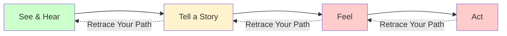

# Crucial Conversations Ch. 5: Master My Stories

**Published:** March 23, 2026

Have you ever walked out of a code review feeling angry, only to realize hours later that the feedback was actually reasonable? Or stewed over a Slack message all afternoon, convinced that a colleague was undermining you, when they were simply being direct? The gap between what happens and how we feel about it is filled by something invisible: the stories we tell ourselves. Chapter 5 of Crucial Conversations introduces one of the most powerful concepts in the book —that other people do not create our emotions. We do, through the narratives we construct in milliseconds. For engineers who pride themselves on rational thinking, this is a humbling and deeply useful insight.

## The Path to Action

The authors introduce a model called the Path to Action that traces how we get from observation to behavior:

1. **See and Hear** —You observe raw facts. A colleague rewrites your function in a pull request. Your manager schedules a 1:1 with no agenda.
2. **Tell a Story** —You instantly interpret what you observed. "They think my code is bad." "I'm about to get put on a PIP."
3. **Feel** —The story generates an emotion. Anger, anxiety, resentment.
4. **Act** —The emotion drives behavior. You fire off a defensive comment. You disengage from the project.

The critical insight is that the story step happens so fast it feels like the event directly caused the emotion. You do not experience "I saw a rewrite, then I told myself a story about my competence, then I felt angry." You experience "They rewrote my code and it made me angry." But the story is always there, and it is always yours.

## How Stories Create Emotions

This distinction matters enormously in engineering work because so much of our communication is ambiguous. A terse code review comment could mean the reviewer is dismissive, or it could mean they are busy and being efficient. A manager assigning your project to someone else could be a vote of no confidence, or it could be a resourcing decision you are not aware of.

The facts do not change. What changes is the story you attach to them. And the story determines everything that follows —your emotional state, your behavior in the next meeting, whether you escalate or collaborate.

Engineers are trained to separate signal from noise in data. The Path to Action model asks you to apply that same discipline to your own emotional responses: separate the facts from the interpretation.

## Three Clever Stories

When we feel threatened, we tend to tell ourselves one of three predictable story types. The authors call these Clever Stories because they protect our ego while making productive dialogue impossible.

### The Victim Story: "It's Not My Fault"

In a Victim Story, you cast yourself as an innocent sufferer. You emphasize what was done to you and omit anything you may have contributed to the situation.

Engineering example: A deployment goes badly. You tell yourself, "The on-call engineer didn't catch it because they never read my deployment notes." What you leave out is that your deployment notes were a single bullet point written ten minutes before the deploy, and you skipped the pre-deploy checklist because you were in a hurry.

### The Villain Story: "It's All Their Fault"

In a Villain Story, you attribute the worst possible motives to the other person. You turn a normal human being into a caricature.

Engineering example: A tech lead pushes back on your design proposal. You tell yourself, "She always shoots down ideas that aren't hers. She just wants to maintain control." What you ignore is that she raised three specific technical concerns, two of which you had not considered.

### The Helpless Story: "There's Nothing I Can Do"

In a Helpless Story, you convince yourself that any positive action is futile, which conveniently excuses you from trying.

Engineering example: You know the team's testing practices are inadequate, but you tell yourself, "Management doesn't care about quality. There's no point raising it again." What you ignore is that you have never presented concrete data on defect rates or proposed a specific, incremental improvement plan.

## The Downward Spiral

These stories do not stay contained. They become self-fulfilling prophecies. If you tell yourself a Villain Story about a colleague, you start treating them with suspicion. They notice the change and become guarded. Their guardedness confirms your story. The relationship deteriorates, and both of you now have plenty of "evidence" for your narratives.

In engineering teams, this spiral is particularly destructive. It turns code reviews into battlegrounds, makes incident postmortems political, and creates factions within teams. Two engineers who both tell Villain Stories about each other can poison an entire team's collaboration for months.

## Retracing Your Path

The antidote is to work backward through the Path to Action. When you notice a strong emotion, especially one that is pushing you toward silence or aggression, stop and retrace:

1. **Notice your behavior.** Am I withdrawing? Am I about to send a sharp message? Am I venting to a third party instead of talking to the person involved?
2. **Identify your feelings.** What exactly am I feeling? Angry? Disrespected? Anxious? Be specific. "Upset" is too vague to be useful.
3. **Analyze your stories.** What story is generating this feeling? Is it a Victim, Villain, or Helpless story?
4. **Get back to facts.** What did I actually see and hear, stripped of all interpretation? If I were a camera in the room, what would the footage show?

This is not easy. It requires the same kind of disciplined thinking that debugging requires —refusing to accept your first hypothesis and instead following the evidence.

### A Practical Example

Suppose you are in a design review and a senior engineer says, "This approach has significant scalability issues." You feel a wave of defensiveness.

Retrace your path:

- **Behavior:** You are about to argue back point by point without really listening.
- **Feeling:** Embarrassed. Angry.
- **Story:** "He thinks I'm incompetent. He's showing off in front of the team."
- **Facts:** He said the approach has scalability issues. That is all.

Once you get back to the facts, you are in a position to respond productively: "Can you walk me through the specific scalability concerns? I want to understand where the bottlenecks would appear."

## Telling the Rest of the Story

After retracing your path, the authors suggest asking three questions to challenge your Clever Story:

**"What am I pretending not to know?"** This question punctures Victim Stories. You probably know that you contributed to the problem in some way. In the deployment example, you know your notes were insufficient. In a sprint planning conflict, you know you committed to a timeline you were not confident about.

**"Why would a reasonable, rational, decent person do this?"** This question punctures Villain Stories. It does not ask you to excuse bad behavior. It asks you to consider alternative explanations before locking onto the worst one. The tech lead who pushed back on your design might be doing exactly what a good tech lead should do.

**"What do I really want?"** This question punctures Helpless Stories. Usually what you really want is a good outcome for the team, a working relationship with the other person, and to be treated with respect. Once you reconnect with those goals, the "nothing I can do" story becomes harder to sustain, and you start thinking about what you actually could do.

## Applying This in Engineering Work

The Path to Action model is especially valuable in a few common engineering scenarios:

**Code reviews:** Before responding to a comment that stings, retrace your path. What did the reviewer actually write? What story are you attaching to it?

**1:1s with your manager:** If you walk in with a Victim or Helpless story already running, you will not have a productive conversation. Get back to facts first.

**Postmortems:** The entire purpose of a blameless postmortem is to stay at the facts level and resist the pull of Villain Stories. Understanding the Path to Action model makes you better at facilitating these.

**Cross-team conflicts:** When another team misses a deadline that affects you, the Villain Story writes itself. Asking "why would a reasonable team do this?" opens the door to learning about constraints you were not aware of.

## Conclusion

The core message of this chapter is that between what happens and how you feel, there is a story —and that story is yours to examine and change. You cannot control what other people say or do, but you can control the narrative you construct about it. For engineers, this is not soft, feel-good advice. It is a debugging technique for your own emotional responses, and it is one of the most practically useful skills in the entire book. The next time you feel a strong negative emotion at work, pause and ask: what is the story I am telling myself, and is it the only possible story?

