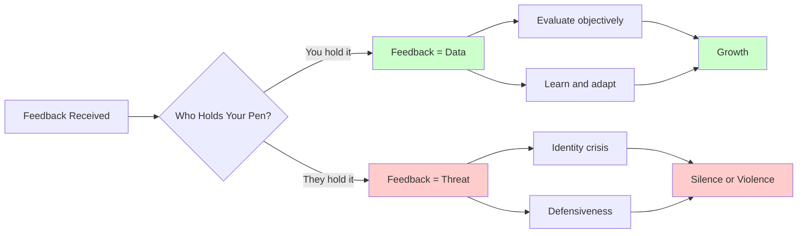
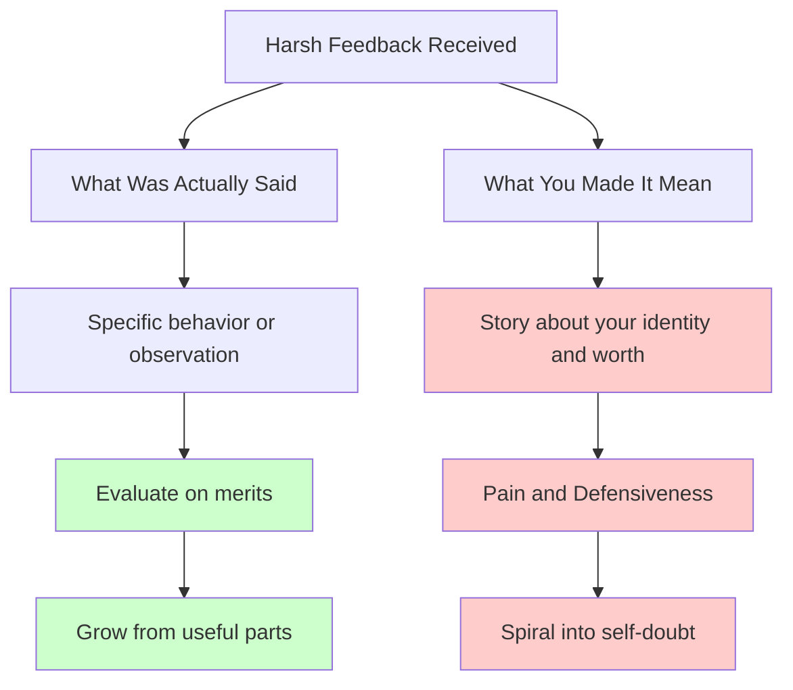

# Crucial Conversations Ch. 10: Retake Your Pen

**Published:** March 23, 2026

You open your pull request and find 30 comments from a senior engineer. Your stomach drops. Or your manager delivers a performance review that calls your technical judgment into question. You feel gutted for days. Chapter 10 of Crucial Conversations introduces a powerful metaphor for why feedback hits so hard and what you can do about it. It is not about developing thick skin — it is about understanding who holds the pen that writes your story.

## The Pen Metaphor

Imagine you carry a pen that writes the narrative of your professional identity — your competence, your worth, your standing on the team. When you hold that pen, you define what feedback means. A critical code review becomes data, not a verdict. A tough performance review becomes input, not identity.

But most of us have handed that pen to someone else. We gave it to our manager, our tech lead, the senior engineer whose approval we crave, or the promotion committee. When they hold the pen, their words do not just describe our work — they define who we are. A dismissive comment in a design review does not just critique the design; it writes "you are not good enough" into our self-narrative.

This is why a two-word Slack message — "seems wrong" — from one person might roll off your back while the same message from another person ruins your afternoon. The difference is not the content. The difference is who holds your pen.

## Why Feedback Hurts (It Is Not What You Think)

The research presented in Crucial Conversations challenges a common assumption. Most people believe feedback hurts because of what was said or how it was said — that if the delivery were kinder or the content more accurate, it would sting less. The data tells a different story. The strongest predictor of how much feedback hurts is the internal state of the receiver, not the content or delivery of the feedback.

This finding has a discouraging implication and an empowering one. The discouraging implication is that no amount of feedback training for managers will fully solve the problem. The empowering implication is that you have far more control over your response to feedback than you think — because the variable that matters most is inside you.

The authors capture this with a sharp observation: "If you live by the compliment, you'll die by the criticism." If your sense of professional worth rises when your tech lead praises your design, it will crash just as hard when they question it. The highs and the lows are two sides of the same coin — and the coin is that you have given someone else your pen.

## How Engineers Give Their Pen Away

In software engineering, there are many opportunities to hand over your pen without realizing it.

**Code reviews.** When your self-worth is tied to writing "clean" code, every review comment feels like a judgment on your intelligence rather than a suggestion for improvement. You start dreading PRs, over-polishing before submission, or getting defensive in review threads.

**Performance reviews.** The annual or semi-annual review becomes a verdict on your entire identity as an engineer. You spend weeks anxious beforehand and days recovering afterward, regardless of whether the feedback is positive or negative.

**Promotion decisions.** If you have handed your pen to the promotion committee, a "not yet" decision does not feel like timing or leveling calibration — it feels like a statement about your fundamental capability.

**Architecture and design debates.** When a respected engineer pushes back on your proposal, you might experience it not as intellectual disagreement but as a declaration that you do not belong at the table.

**Manager relationships.** If your manager's opinion is the sole input into your self-assessment, you are completely dependent on one person's perspective. A single bad 1:1 can send you into a spiral.

The common thread is that external validation has become the foundation of internal confidence. The pen is out of your hands.

## Separating What Was Said From What You Made It Mean

The core skill of retaking your pen is learning to separate facts from stories. This echoes the Path to Action model from earlier chapters, but here it is applied inward.

**What was said (fact):** "This design doesn't account for the failure modes we discussed last quarter."

**What you made it mean (story):** "They think I'm careless. They don't trust me. I'm falling behind my peers."

The fact is a specific, addressable observation about a design. The story is a sweeping narrative about your competence and standing. The fact might be completely accurate — maybe you did miss those failure modes. But the story is something you authored, not something they said.

This separation is not about dismissing feedback or pretending criticism does not exist. It is about responding to what actually happened rather than to the narrative your brain invented in the milliseconds after it happened.

A practical exercise: after receiving feedback that stings, write down two things. First, the exact words that were said (or written). Second, the story you told yourself about what those words mean. Seeing them side by side on paper (or in a notes app) makes the gap between fact and story uncomfortably clear.

## Taking Your Pen Back

The authors describe three steps to retake your pen.

### Recognize You Gave It Away

The first step is noticing when you are in a pen-less state. Common signals include disproportionate emotional reactions to routine feedback, obsessive replaying of conversations, anxiety about upcoming reviews or 1:1s, and a sense that your professional worth is entirely contingent on someone else's opinion.

If you dread opening code review notifications, that is a signal. If a single critical comment from a particular person can derail your entire day, that is a signal. If you find yourself constantly seeking reassurance from your manager, that is a signal.

### Own the Story You Are Telling

Once you recognize the pattern, examine the story. "My tech lead thinks I'm not senior-level material" is a story. "My tech lead asked me to reconsider the caching strategy" is a fact. You constructed the bridge between the two, and you can deconstruct it.

Ask yourself: what evidence supports this story? What evidence contradicts it? Is there a simpler explanation? If a friend told you this exact story, what would you tell them?

### Write a More Useful Story

This is not about toxic positivity or pretending everything is fine. A more useful story is one that is still honest but does not hand someone else the authority to define your worth.

Instead of "My manager thinks I'm underperforming," try: "My manager has concerns about my delivery speed on this particular project. That's worth understanding. It does not define my overall capability as an engineer."

Instead of "The review comments prove I don't belong on this team," try: "The reviewer identified real issues in my code. That is literally what code review is for. I will learn from these and the code will be better."

The new story is not softer — it is more accurate. It deals with the specific facts without inflating them into existential narratives.

## Practical Applications for Engineers

**After a tough code review:** Read the comments once for content. If you notice an emotional reaction, stop. Write down what was actually said and what you made it mean. Address the technical feedback on its merits. If a comment feels personal or disrespectful, address that separately and directly — but from a place of holding your own pen, not from a place of wounded defensiveness.

**After a performance review:** Give yourself 24 to 48 hours before responding or making plans. During that time, separate the specific feedback items from the story you are telling about what the review means. A "meets expectations" rating is data about your manager's assessment of a time period, not a verdict on your career.

**After a promotion denial:** This is perhaps the hardest pen to reclaim. Promotion decisions are inherently evaluative and often opaque. Separate the decision (fact) from the meaning you assign it (story). "I was not promoted this cycle" is very different from "I will never be promoted" or "I'm not as good as my peers." Seek specific, actionable feedback, and evaluate it on its merits.

**In daily interactions:** Notice when you are scanning for approval signals. Notice when a short or neutral message from a particular person triggers anxiety. These are signs that you have given your pen to that person. You can appreciate their opinion without making it the sole author of your professional identity.

## Conclusion

Retaking your pen does not mean ignoring feedback or becoming impervious to criticism. It means being the primary author of your own professional narrative. You can take feedback seriously without letting it define you. You can respect someone's technical opinion without making their approval a prerequisite for your own confidence. For engineers, who work in environments saturated with evaluation — code reviews, design reviews, performance reviews, promotion panels — this skill is not optional. It is the difference between a career driven by growth and a career driven by anxiety.

---

## Series Navigation

This post is part of a 13-part series on Crucial Conversations for Engineers.

1. [Ch. 1: What Makes a Conversation Crucial](/#/blog/crucial-conversations-what-makes-them-crucial)
2. [Ch. 2: The Power of Dialogue](/#/blog/crucial-conversations-the-power-of-dialogue)
3. [Ch. 3: Choose Your Topic](/#/blog/crucial-conversations-choose-your-topic)
4. [Ch. 4: Start With Heart](/#/blog/crucial-conversations-start-with-heart)
5. [Ch. 5: Master My Stories](/#/blog/crucial-conversations-master-my-stories)
6. [Ch. 6: Learn to Look](/#/blog/crucial-conversations-learn-to-look)
7. [Ch. 7: Make It Safe](/#/blog/crucial-conversations-make-it-safe)
8. [Ch. 8: STATE My Path](/#/blog/crucial-conversations-state-my-path)
9. [Ch. 9: Explore Others' Paths](/#/blog/crucial-conversations-explore-others-paths)
10. **Ch. 10: Retake Your Pen** (you are here)
11. [Ch. 11: Move to Action](/#/blog/crucial-conversations-move-to-action)
12. [Ch. 12: Navigating Tough Cases](/#/blog/crucial-conversations-tough-cases)
13. [Ch. 13: Putting It All Together](/#/blog/crucial-conversations-putting-it-all-together)

