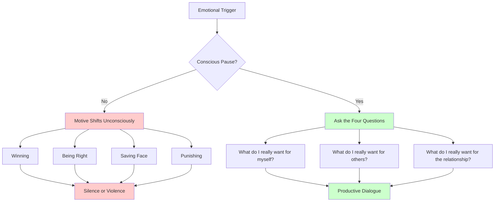

# Crucial Conversations Ch. 4: Start With Heart

**Published:** March 23, 2026

You are in a design review and someone challenges your proposal in a way that feels dismissive. Within seconds, you are no longer thinking about the best technical outcome. You are thinking about winning the argument. You are mentally cataloging every flaw in their alternative approach. You are preparing a rebuttal that will demonstrate, conclusively, that you are right and they are wrong. The conversation has not even gotten heated yet, but your motives have already shifted.

Chapter 4 of "Crucial Conversations" tackles the most internal aspect of dialogue: managing your own motives. The principle is deceptively simple — "work on me first, us second" — but it addresses the root cause of most conversational failures.

## How Motives Shift Under Stress

When a conversation becomes crucial — when opinions diverge, stakes rise, and emotions intensify — your motives undergo an unconscious transformation. You enter the conversation wanting a good outcome. You leave the conversation having fought for something else entirely.

The book identifies four common motive shifts:

**Wanting to win.** The conversation becomes a competition. You stop evaluating ideas on merit and start keeping score. In a code review, this looks like defending every line of your implementation not because you believe it is correct, but because conceding any point feels like losing.

**Wanting to be right.** Similar to winning, but more intellectual. You become invested in your position being validated rather than in finding the best answer. In an architecture discussion, this manifests as dismissing alternatives without genuinely considering them because acknowledging their merit would mean you were wrong.

**Wanting to save face.** You become more concerned with how you appear than with the outcome. You avoid asking clarifying questions because they might reveal you do not understand something. You hedge your positions so you can claim you were right regardless of what happens.

**Wanting to punish.** When you feel disrespected or attacked, your motive shifts to retaliation. You want the other person to feel the discomfort you are feeling. In engineering, this can be subtle — a dismissive tone in a review comment, an unnecessarily harsh critique of someone's approach, bringing up past mistakes that are not relevant to the current discussion.

The critical point is that these shifts happen unconsciously. Nobody walks into a meeting thinking "I am going to prioritize winning over reaching a good decision." The shift happens beneath your awareness, driven by the same fight-or-flight physiology that makes crucial conversations difficult in the first place.

## Work on Me First, Us Second

The book's foundational principle for handling crucial conversations is that you must get your own motives right before you can productively engage with anyone else. This is not about suppressing your emotions or pretending you are not frustrated. It is about honestly examining what you are trying to accomplish and realigning with what actually matters.

This principle is counterintuitive for engineers, who are trained to focus on external problems. When a conversation goes wrong, the instinct is to analyze what the other person did — they were defensive, they were dismissive, they were not listening. The "start with heart" approach reverses this: before examining anyone else's behavior, examine your own motives.

This is not about self-blame. It is about recognizing that your motives are the one variable you have direct control over, and that getting them right changes everything about how the conversation unfolds.

## The Four Transformative Questions

The practical tool in this chapter is a set of four questions to ask yourself when you notice your motives shifting:

1. **What am I acting like I want?** This question forces you to look at your actual behavior rather than your stated intentions. If you are raising your voice, interrupting, and listing every flaw in someone's argument, you are acting like you want to win — regardless of what you would say your goal is.

2. **What do I really want for myself?** Step back from the heat of the moment. What is the outcome you actually care about? In the design review example, you probably want to arrive at the best technical solution and maintain your credibility as a thoughtful engineer. Neither of those is served by winning an argument.

3. **What do I really want for the other person?** This question is easy to skip but essential. If you genuinely want the other person to grow, feel respected, and contribute their best thinking, your behavior in the conversation will reflect that. If you are honest and realize you want them to feel foolish, you have identified a motive that needs correcting.

4. **What do I really want for the relationship?** What kind of working relationship do you want with this person after the conversation ends? In most engineering contexts, you want a relationship characterized by mutual respect, honest feedback, and productive collaboration. Many of the behaviors people default to in crucial conversations actively undermine these goals.

### Why These Questions Work

There is a neurological reason these questions are effective, not just a motivational one. The fight-or-flight response that activates during crucial conversations diverts cognitive resources away from the prefrontal cortex — the part of the brain responsible for complex reasoning, perspective-taking, and long-term planning. When you pause to ask yourself reflective questions, you literally redirect cognitive activity back to the prefrontal cortex. The act of deliberate self-reflection interrupts the automatic stress response and restores access to your higher-order thinking.

This is why the advice to "just stay calm" during difficult conversations is largely useless. Calmness is the result of cognitive engagement, not a prerequisite for it. The questions provide the mechanism that produces the calmness.

## Refusing the Fool's Choice

Chapter 4 revisits the Fool's Choice introduced earlier — the false belief that you must choose between honesty and respect. Here, it appears in a more specific form: the belief that in this particular situation, with this particular person, you really do have to choose.

The Fool's Choice is especially seductive in engineering because technical disagreements can feel zero-sum. Either the service uses synchronous calls or asynchronous messaging. Either we rewrite the module or we patch it. The binary nature of many technical decisions makes it feel natural to frame the conversation itself as binary: either I push my view or I defer to theirs.

But the conversation about a technical decision is not the same as the decision itself. A decision may ultimately be binary, but the dialogue that leads to it does not have to be. You can fully advocate for your position, fully hear the other person's position, and genuinely explore whether there are options neither of you has considered — all while maintaining respect and honesty.

The book illustrates this with the story of a CEO named Greta who received critical feedback in a meeting. Her initial instinct was to attack the person giving the feedback — to make an example of them for challenging her publicly. But she paused and asked herself what she really wanted. She wanted honest feedback from her team. She wanted a culture where people spoke up. Attacking the messenger would destroy exactly what she claimed to value. That moment of self-reflection changed her response entirely.

## Engineering Applications

The "start with heart" principle applies to many common engineering situations:

**Design review conflicts.** When your design is challenged, notice whether your motive has shifted from "find the best solution" to "defend my proposal." Ask yourself the four questions. If you realize you want to be right more than you want to be effective, you can consciously redirect toward genuine curiosity about the alternative approach.

**Promotion conversations.** When discussing promotion readiness — either your own or someone you manage — the stakes and emotions can cause motives to shift toward self-protection or people-pleasing. A manager might avoid honest feedback to preserve a comfortable relationship. An engineer might become defensive rather than curious when hearing about growth areas. Starting with heart means asking what you really want for the person's career, not just what feels comfortable in the moment.

**Code review defensiveness.** Every engineer has felt the sting of a critical code review comment. The instinct to respond defensively — "you do not understand the context," "this is a style preference, not a bug," "well, your code does the same thing" — is a motive shift toward saving face. Pausing to ask what you really want (better code, professional growth, a reputation for being receptive to feedback) reframes the review from a personal attack into useful information.

**Incident response.** During high-pressure incidents, the temptation to assign blame or prove that the failure was not your fault is intense. Starting with heart during a postmortem means asking yourself whether you want to protect your reputation or actually prevent the next incident. These goals are not as aligned as they might appear, and which one you prioritize will determine whether you contribute honestly to the investigation.

## Conclusion

The first casualty of a crucial conversation is your motive. Under stress, your goals unconsciously shift from productive outcomes to winning, being right, saving face, or punishing. The principle of "work on me first, us second" is the foundation of effective dialogue because your motives shape every word you say and every reaction you have. The four questions — what am I acting like I want, what do I really want for myself, for the other person, and for the relationship — provide a practical mechanism for catching and correcting motive shifts. These questions work not just psychologically but neurologically, redirecting cognitive resources back to the prefrontal cortex. And refusing the Fool's Choice — the false binary of honest or respectful — is only possible when your motives are aligned with what you truly value.
