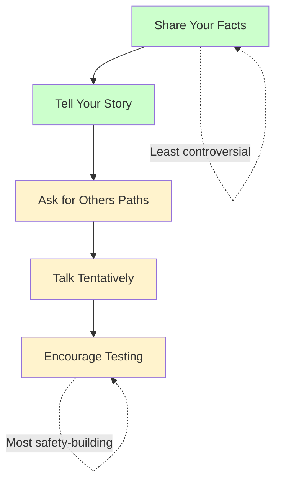

# Crucial Conversations Ch. 8: STATE My Path

**Published:** March 23, 2026

There is a particular kind of moment that every engineer recognizes: you see a problem that nobody else seems to see —or nobody else is willing to name. Maybe the architecture will not scale. Maybe the timeline is unrealistic. Maybe a senior leader's pet project is heading toward failure. You know you should speak up, but you also know that speaking up poorly could damage relationships, get you labeled as negative, or simply fail to land. Chapter 8 of Crucial Conversations addresses this exact challenge: how to speak up honestly and persuasively without triggering defensiveness. The answer is not about courage alone. It is about a specific method for organizing and delivering your message.

## The Three Ingredients

The authors argue that speaking up effectively requires three things simultaneously:

**Confidence:** You must believe that your perspective deserves to be heard. Not that you are certainly right, but that your view adds to the shared pool of meaning and the conversation is worse without it.

**Humility:** You must genuinely acknowledge that you might be wrong, or that your view is incomplete. This is not false modesty —it is intellectual honesty about the limits of your own perspective.

**Skill:** You need a method for communicating that holds both confidence and humility at the same time. Without skill, confidence becomes arrogance and humility becomes silence.

Most engineers are not short on confidence or humility individually. They lack the skill to express both simultaneously, which is why they tend to oscillate between saying nothing and saying too much.

## The STATE Framework

The chapter introduces the STATE acronym as a step-by-step method for sharing difficult messages:

### S —Share Your Facts

Start with the observable facts —the things you have seen, heard, or measured that anyone else in your position would also have seen.

Facts are the foundation of your message for several reasons:

- **They are the least controversial part of your message.** If you say "the service had three P1 incidents in the last month," nobody can reasonably argue with that. If you start with "our reliability practices are a mess," you will get immediate pushback.
- **They create a shared reality.** Before you can discuss what something means, you need agreement on what happened.
- **They are persuasive.** Facts carry their own weight. When you present a clear factual picture, listeners often draw the same conclusions you did without you needing to push them there.
- **They reduce defensiveness.** Facts feel less like a personal attack than conclusions do.

Engineering example: Instead of starting with "The codebase is becoming unmaintainable" (a conclusion), start with "In the last quarter, the average time to implement a feature in this module increased from three days to eight days. We also had four bugs that were traced back to unexpected interactions between components that used to be independent."

### T —Tell Your Story

After establishing the facts, share your interpretation —the conclusion or concern you have drawn from those facts. This is the story step from the Path to Action model discussed in Chapter 5. You are walking the other person through your reasoning in the same order you experienced it: facts first, then interpretation.

Continuing the example: "Looking at these trends, I'm concerned that the current architecture is becoming a bottleneck. My read is that the coupling between these modules has reached a point where changes in one area have unpredictable effects in others."

The key is to present your story as a story —your interpretation, not the objective truth. You are sharing how you connected the dots, and you are doing it in a way that invites the other person to see your reasoning and offer their own.

### A —Ask for Others' Paths

After sharing your facts and your story, actively invite the other person to share their perspective. This is not a formality. You are genuinely asking because your story might be wrong, and their facts or interpretation might change your view.

"That's how I'm seeing it, but I might be missing context. How do you see the situation? Are there factors I'm not accounting for?"

This step is especially important in engineering because the people closest to a system often have information that is not visible from the outside. The engineer who wrote the module might know about constraints, tradeoffs, or upcoming changes that completely reframe the picture.

### T —Talk Tentatively

Throughout the conversation —but especially when sharing your story —use language that signals openness rather than certainty. This is about the way you frame your interpretation, not about being wishy-washy.

Tentative language examples:

| Instead of this | Try this |
|---|---|
| "This design is wrong." | "I think there may be a problem with this design." |
| "You clearly didn't consider scale." | "I'm not sure the scaling implications have been fully worked through." |
| "This will never work in production." | "I'm concerned this might not hold up under production load. Here's why." |
| "Management is setting us up to fail." | "From what I can see, the current timeline seems very aggressive for the scope." |

Tentative language is not weak language. It is accurate language. Unless you have absolute certainty (which in engineering, as in life, is rare), tentative language more precisely reflects your actual epistemic state. It also leaves room for the other person to engage rather than defend.

### E —Encourage Testing

Finally, actively make it safe for the other person to disagree with you. This is the step most people skip, and skipping it undermines everything before it.

If you share your facts, tell your story, and then stare expectantly at the other person, the implicit message is "now agree with me." Instead, explicitly signal that you want their honest reaction:

- "I could be way off on this. What am I missing?"
- "I want to hear where you disagree."
- "Push back on this if you see it differently."
- "I'd rather be wrong now than find out later. Tell me where my reasoning breaks down."

This is not performative. If you ask for disagreement and then argue with every point the other person raises, you have signaled that the invitation was fake. Encouraging testing means genuinely wanting to hear a different perspective, even if it means your conclusion was wrong.

## Why Facts First Matters

The order of the STATE framework is not arbitrary. Starting with facts is critical because of how human psychology works.

When you start with your conclusion ("This architecture won't scale"), the listener's first reaction is to evaluate whether they agree, and if they don't, to start building a counter-argument. They are not listening to understand; they are listening to respond.

When you start with facts ("Here are the incident trends and the development velocity data"), the listener follows your reasoning from a neutral starting point. By the time you share your conclusion, they have already seen the same data and may have arrived at a similar interpretation on their own. Your conclusion feels like a reasonable inference rather than an arbitrary judgment.

This is why starting with conclusions in engineering discussions so often leads to unproductive debates. Two people arguing about conclusions without first aligning on facts will talk past each other indefinitely.

## Walking Others Through Your Path to Action

The STATE framework is essentially walking someone through your Path to Action in order:

1. Here is what I observed (facts).
2. Here is the story I told myself about it (interpretation).
3. Here is how that makes me feel or what it leads me to think we should do (action).
4. Now tell me if you saw different things or tell a different story.

By making your reasoning transparent, you give the other person the ability to engage with any step in the chain. Maybe they agree with your facts but have a different interpretation. Maybe they have additional facts that change the picture. Maybe they agree with your interpretation but have a different view on the right response.

This transparency is fundamentally more productive than presenting only your conclusion, because it gives the other person something concrete to engage with rather than just a position to accept or reject.

## Engineering Applications

### Raising Concerns in Design Reviews

Suppose you believe a proposed design has a fundamental flaw, but the design is from a senior architect and the team seems enthusiastic.

**Facts:** "The proposed design routes all writes through a single coordinator. Based on our current traffic patterns, that's about 50,000 writes per second at peak, and our projections show that doubling in the next year."

**Story:** "I'm worried that the coordinator becomes a bottleneck and a single point of failure. I might be wrong —maybe there's a caching or batching strategy I'm not seeing that addresses this."

**Ask:** "Can you walk me through how the design handles the case where write volume exceeds what a single coordinator can process?"

**Tentative:** Note the "I'm worried" and "I might be wrong" framing —not "this is wrong."

**Encourage:** "If there's something I'm not understanding about the design, I genuinely want to know."

### Pushing Back on Unrealistic Deadlines

**Facts:** "The feature as scoped involves changes to four services, a new database migration, and integration with two external APIs. Our last feature of similar scope took six weeks, and this is scoped for three."

**Story:** "My concern is that if we commit to three weeks, we'll either cut corners on testing or miss the deadline, and both outcomes damage our credibility with stakeholders."

**Ask:** "Am I misjudging the scope? Is there context about the timeline that I'm not seeing?"

**Encourage:** "If the team thinks three weeks is realistic, I want to understand what I'm overestimating."

### Speaking Truth to Power

**Facts:** "We've had two engineers leave in the last quarter, and three more have mentioned in 1:1s that they're frustrated with the current project direction. Exit interview feedback from the last departure specifically mentioned unclear technical strategy."

**Story:** "I think there's a morale problem that's connected to how technical decisions are being made, and I'm concerned it'll get worse if we don't address it."

**Ask:** "You have a broader view of the org than I do. Is this something you're seeing too, or do you think there's a different explanation?"

**Encourage:** "I might be overweighting the signals I'm hearing. Tell me if you think I'm reading this wrong."

## Common Mistakes

**Starting with your story instead of facts.** "I think the team is burning out" triggers debate. "Overtime hours have increased 40% over the last two sprints" starts a different kind of conversation.

**Being tentative about facts.** Facts should be stated clearly and directly. Tentativeness applies to your interpretation, not to observable data. "I think maybe there might have been some incidents" undermines your credibility. "There were three P1 incidents last month" does not.

**Asking for others' paths as a formality.** If you ask "what do you think?" and then immediately start rebutting, you have shown that the question was rhetorical. Ask, then actually listen.

**Confusing tentative with vague.** "I have some concerns about some things" is vague and unhelpful. "I'm concerned that the current caching strategy may not handle our invalidation requirements, based on the patterns we saw in the last load test" is tentative but specific.

## Conclusion

The STATE framework solves a problem that engineers face constantly: how to share an unpopular or uncomfortable view in a way that is honest, persuasive, and does not damage the relationship. The sequence matters —facts first, then interpretation, then invitation. The tone matters —confident enough to share your view, humble enough to mean it when you say you might be wrong. And the follow-through matters —if you ask for disagreement, you must actually welcome it. This is not a natural communication style for most people, which is why it needs to be practiced deliberately. But for engineers who regularly need to raise concerns, challenge assumptions, and speak up about risks, it is an essential skill.

