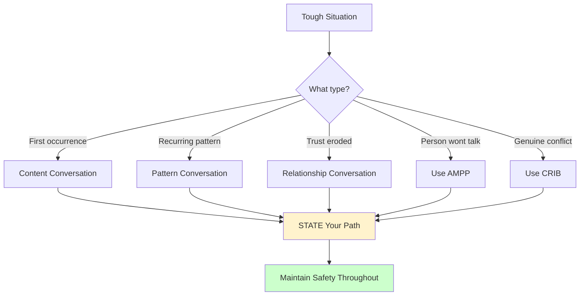
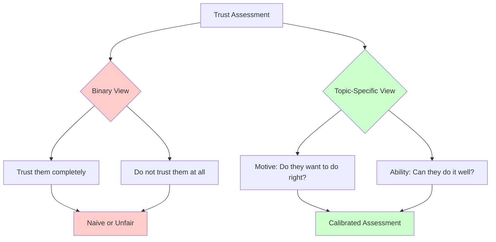

# Crucial Conversations Ch. 12: Navigating Tough Cases

**Published:** March 23, 2026

"Yeah, but my situation is different." This is the most common objection people raise after learning the Crucial Conversations framework. They believe their particular challenge is the exception — too sensitive, too political, too deeply personal for these skills to work. Chapter 12 tackles these "impossible" scenarios head-on and demonstrates that the framework holds even in the hardest cases. For engineers, this chapter provides practical approaches for the conversations we most want to avoid.

## Why People Think Their Situation Is Too Hard

Every difficult conversation feels unique from the inside. The specifics differ — a teammate who never follows through, a manager who plays favorites, a peer who takes credit for your work. But the underlying dynamics are remarkably consistent. People go to silence or violence when they feel unsafe. Stories escalate when facts are scarce. And avoidance makes every problem worse.

The belief that "my situation is the exception" is itself a story — usually one that justifies inaction. If the conversation is truly impossible, then you are absolved of the responsibility to have it. This is comfortable but costly. The problems that feel too hard to discuss are almost always the problems most urgently in need of discussion.

## Trust Is Not Binary

One of the most practical insights in this chapter is the reframing of trust. People tend to think of trust as a single, binary attribute: either you trust someone or you do not. This framing makes trust problems feel unsolvable — once trust is "broken," what can you do?

The authors propose a more nuanced model. Trust is topic-specific and has two dimensions: motive and ability.

**Motive** is about intent. Do you believe this person wants to do the right thing? Do they care about the outcomes that matter to you?

**Ability** is about capability. Even with the best intentions, can this person actually deliver?

This decomposition is enormously useful. You might trust a junior engineer's motive completely — they are eager, hardworking, and committed to the team. But you might not yet trust their ability to design a distributed system without close guidance. That is not a trust problem in the colloquial sense; it is a specific gap that can be addressed with mentoring and incremental responsibility.

Conversely, you might fully trust a colleague's technical ability but question their motive on a particular issue — perhaps they are optimizing for their own promotion rather than the team's needs. Again, this is a specific, addressable concern, not a wholesale trust collapse.

In practice, this means you can have targeted conversations: "I have no doubt you want this project to succeed. I'm concerned about whether we have the right expertise on the team to handle the distributed consensus piece. Can we talk about how to bridge that gap?" This is far more productive than the vague "I don't trust them" that usually drives avoidance.

## Addressing Sensitive Topics

Some conversations are hard not because of conflict but because of sensitivity. Giving feedback about personal hygiene. Raising concerns about someone's communication style. Pointing out that a colleague's behavior is making others uncomfortable. These topics feel radioactive.

The framework's approach is consistent: be factual, be private, and be respectful.

**Be factual.** Stick to observable behaviors, not interpretations. "In the last three team meetings, you interrupted other speakers a total of eleven times" is a fact. "You're domineering and rude" is a story. Facts are harder to dispute and less likely to trigger defensiveness.

**Be private.** Sensitive conversations should never happen in front of an audience. Pull the person aside. A private Zoom call or a walk outside the office creates psychological safety that a public setting destroys.

**Be respectful.** Use Contrasting to make your respect explicit: "I'm not questioning your expertise or your commitment to the team. I do want to talk about something specific that I think is affecting how others engage with you in meetings."

For engineering managers, this pattern applies to some of the hardest management conversations: addressing underperformance, discussing interpersonal conflicts, or surfacing concerns about work habits. The temptation is to soften the message until it disappears. The skill is to deliver it clearly while maintaining respect.

## Dealing With People Who Will Not Talk

Some people respond to every attempt at dialogue with monosyllables, shrugs, or stony silence. This is maddening, but it is just another form of silence — and the AMPP toolkit from Chapter 9 applies.

Start with Ask: "I'd really like to understand your perspective on this. What are you thinking?" If that gets nowhere, Mirror: "You seem reluctant to discuss this. I'm noticing you've gone very quiet." If mirroring does not break through, Paraphrase what you can infer: "It sounds like you might feel this decision was made without your input." And if all else fails, Prime: offer your best respectful guess. "I wonder if you're concerned that raising issues will be held against you. Is that part of it?"

The key insight is patience. People who have learned that speaking up leads to punishment will not suddenly open up because you asked nicely once. You may need multiple conversations over time to establish that it is genuinely safe to speak.

In engineering contexts, this often manifests with junior team members who have been burned by toxic teams in the past, with people from cultures where challenging authority is deeply uncomfortable, or with anyone who has learned that "honest feedback" is a trap. Building psychological safety with these individuals is a long game, not a single conversation.

## Broken Promises and Pattern Conversations

A colleague agrees to complete a task and then misses the deadline. Again. You addressed it the first time, they apologized, and it happened again. Now what?

The authors distinguish between three levels of conversation:

**Content** is about the specific instance. "You said you'd have the API spec ready by Friday, and it's Tuesday with no spec."

**Pattern** is about the recurrence. "This is the third time in two months that a deliverable has been late. I'm seeing a pattern."

**Relationship** is about the impact on trust and the working dynamic. "When commitments are repeatedly missed, I find myself working around you rather than with you. That's not sustainable."

Most people get stuck at the content level. They address each instance as if it were the first time, which feels futile and is. When a behavior recurs, the conversation must elevate to pattern. And when the pattern persists, the conversation must reach the relationship level.

For engineers, this framework is directly applicable to sprint commitments, on-call responsibilities, code review turnaround times, and any other recurring obligation. Addressing the pattern ("This is the third sprint where stories carried over") is fundamentally different from addressing the instance ("This story isn't done yet"), and the distinction matters.

## Confronting Difficult Behaviors

Some of the toughest engineering conversations involve behaviors that are not about work output at all.

**Passive-aggressive behavior.** A teammate agrees in meetings but undermines decisions in back-channels. The skill here is to describe the specific pattern factually: "In the last design review, you agreed with the approach. Then I saw your messages in the platform channel suggesting we should go a different direction. I want to understand the disconnect."

**Taking credit.** A peer presents your work as their own. Address it directly and privately, using facts: "The proposal you presented to leadership on Monday was based on the design doc I wrote last month. I wasn't credited. I need us to figure out how to handle attribution going forward."

**Microaggressions.** Comments or behaviors that are individually small but cumulatively harmful. These require the most courage to address because they are easy to dismiss ("you're overreacting") and hard to document. The approach is to be specific, to name the behavior (not the intent), and to describe the impact: "When you expressed surprise that I understood the networking layer, it felt dismissive of my background. I don't think that was your intent, but I wanted you to know the impact."

In each case, the framework is the same: create safety, stick to facts, share your story tentatively, and invite dialogue. The topics are hard, but the skills do not change.

## Describing the Gap

When someone is not meeting expectations — whether in quality, initiative, or behavior — the authors recommend describing the gap between what was expected and what was observed.

"We agreed that you'd own the monitoring rollout end-to-end, including writing the runbooks and training the team. What I've seen is that the dashboards are set up but the runbooks haven't been started and no training has been scheduled. Can you help me understand what happened?"

This approach is effective because it is anchored in shared expectations. You are not attacking the person; you are pointing to a gap between an agreement and reality. It gives them space to explain (maybe there are legitimate reasons) while making the gap undeniable.

For engineering managers, this is the core skill for performance conversations. Instead of vague feedback ("you need to show more ownership"), describe the specific gap between the expected behavior and the observed behavior, and invite the person to discuss it.

## Conclusion

The toughest conversations are not exceptions to the Crucial Conversations framework — they are the reason it exists. Trust is not binary; it is specific and addressable. Sensitive topics can be discussed with facts, privacy, and respect. Silent people can be drawn out with patient, skillful listening. Broken promises require pattern-level conversations, not just content-level ones. None of these scenarios are comfortable, but all of them are navigable. For engineers, who regularly face underperformance, interpersonal friction, and politically charged decisions, the ability to handle these tough cases is what separates teams that talk about problems from teams that solve them.

---

## Series Navigation

This post is part of a 13-part series on Crucial Conversations for Engineers.

1. [Ch. 1: What Makes a Conversation Crucial](/#/blog/crucial-conversations-what-makes-them-crucial)
2. [Ch. 2: The Power of Dialogue](/#/blog/crucial-conversations-the-power-of-dialogue)
3. [Ch. 3: Choose Your Topic](/#/blog/crucial-conversations-choose-your-topic)
4. [Ch. 4: Start With Heart](/#/blog/crucial-conversations-start-with-heart)
5. [Ch. 5: Master My Stories](/#/blog/crucial-conversations-master-my-stories)
6. [Ch. 6: Learn to Look](/#/blog/crucial-conversations-learn-to-look)
7. [Ch. 7: Make It Safe](/#/blog/crucial-conversations-make-it-safe)
8. [Ch. 8: STATE My Path](/#/blog/crucial-conversations-state-my-path)
9. [Ch. 9: Explore Others' Paths](/#/blog/crucial-conversations-explore-others-paths)
10. [Ch. 10: Retake Your Pen](/#/blog/crucial-conversations-retake-your-pen)
11. [Ch. 11: Move to Action](/#/blog/crucial-conversations-move-to-action)
12. **Ch. 12: Navigating Tough Cases** (you are here)
13. [Ch. 13: Putting It All Together](/#/blog/crucial-conversations-putting-it-all-together)

