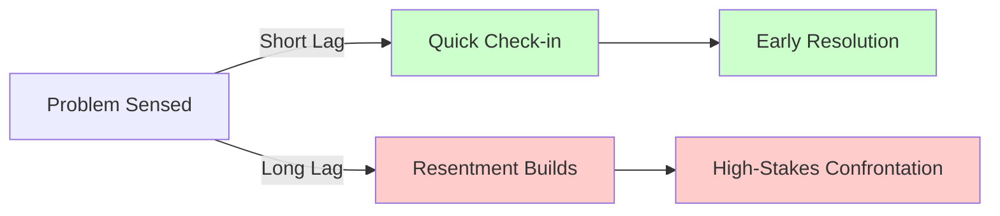
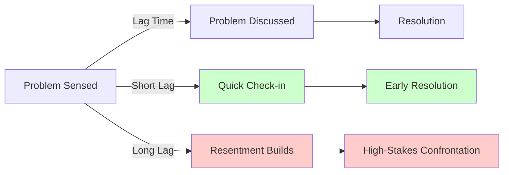
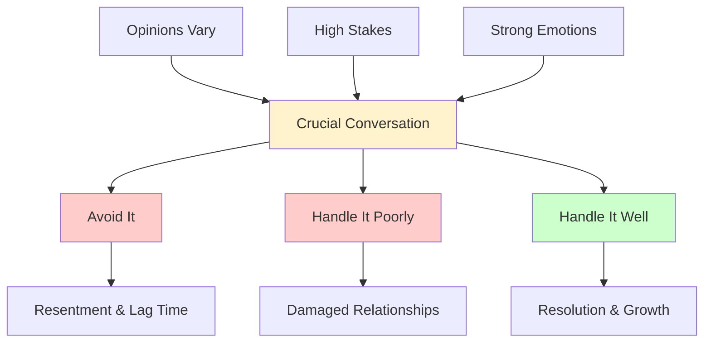

# Crucial Conversations Ch. 1: What Makes a Conversation Crucial

**Published:** March 23, 2026

Every engineer has been in a meeting where the architecture decision feels wrong, the deadline is unrealistic, or someone's work is clearly not meeting the bar — and nobody says anything. The room goes quiet, heads nod along, and the team marches toward a predictable failure. This is the cost of mishandling crucial conversations, and it is one of the most consequential skill gaps in software engineering.

The book "Crucial Conversations" opens by defining exactly what makes certain conversations different from everyday exchanges, and why most of us handle them so poorly. Understanding this framework is the first step toward having better outcomes in the conversations that matter most.

## The Three Elements of a Crucial Conversation

A conversation becomes crucial when three conditions converge:

1. **Opinions vary.** People see the situation differently and have conflicting views on the right path forward.
2. **Stakes are high.** The outcome of this conversation will meaningfully affect people, projects, or the organization.
3. **Emotions run strong.** People feel invested, threatened, or frustrated, and their emotional state is elevated.

Think about the last time you were in a heated design review where one camp wanted microservices and another wanted a monolith, the project timeline depended on the decision, and people were visibly frustrated. That is a crucial conversation. Or consider a 1:1 where you need to tell a teammate that their code quality has been slipping, their promotion case depends on improvement, and you know they will take it personally. Also a crucial conversation.

The key insight is that these three elements do not just define the conversation — they also explain why it is so hard. The combination of disagreement, consequence, and emotion is precisely the cocktail that makes our brains work against us.

## Why We Handle Them Poorly

There are several reasons most people consistently fumble crucial conversations.

### Biology Works Against Us

When stakes are high and emotions are strong, your body activates the fight-or-flight response. Blood flows away from the prefrontal cortex (where you do your best reasoning) and toward your limbs and survival instincts. You are literally dumber in the moments when you most need to be smart. This is not a character flaw — it is physiology.

### The Element of Surprise

Crucial conversations frequently ambush us. You walk into a standup expecting a routine status update, and suddenly someone challenges your technical approach in front of the whole team. You are caught off guard, emotionally activated, and expected to respond intelligently in real time. Most people cannot do this well without deliberate practice.

### No Role Models

Think about where you learned to handle high-stakes disagreements. For most of us, the answer is: watching our parents argue, navigating schoolyard conflicts, or observing dysfunctional workplace dynamics. Very few people grew up watching skilled crucial conversations modeled for them. We are largely self-taught in a domain where self-teaching tends to produce bad habits.

### Self-Defeating Patterns

Over time, most people develop coping mechanisms that feel protective but are actually counterproductive. Some avoid conflict entirely and let resentment build. Others become aggressive and shut down dissent. Both patterns reinforce themselves because they provide short-term relief while creating long-term damage.

## The Lag Time Problem

One of the most practical concepts in the chapter is "lag time" — the gap between when you first notice a problem and when you actually discuss it. Research suggests that this lag time is one of the strongest predictors of team and organizational health.

In engineering, lag time shows up everywhere. You notice a teammate's pull requests have been getting sloppy for weeks before you say anything. You suspect the project timeline is unrealistic in week two but do not raise it until week eight. You see a junior engineer struggling but wait for their manager to notice instead of offering direct feedback.

The longer the lag, the worse the eventual conversation becomes. Small issues calcify into entrenched patterns. Resentment accumulates. The conversation that could have been a quick, low-stakes check-in becomes a high-stakes confrontation.

## The Three Choices

When a crucial conversation presents itself, you have exactly three options:

1. **Avoid it.** Stay silent, work around the problem, complain to others instead. This is the most common choice in engineering teams and the most damaging over time.
2. **Handle it poorly.** Have the conversation but do it badly — get aggressive, get passive-aggressive, make it personal, or back down at the first sign of resistance.
3. **Handle it well.** Engage honestly and respectfully, say what needs to be said, listen to what needs to be heard, and reach a genuine resolution.

The research on this is striking. Studies cited in the book found that 90% of project failures can be predicted by whether team members speak up when they see problems. Teams where people have the skills and willingness to engage in crucial conversations have roughly half the failure rate of teams that do not.

## Engineering-Specific Impact

The consequences of avoiding or mishandling crucial conversations are especially visible in software engineering because the work is deeply collaborative and the decisions are consequential.

**Architecture decisions.** When a senior engineer proposes an approach and nobody pushes back despite having concerns, the team often ends up with a design that nobody truly believes in. Months later, the technical debt from that un-challenged decision becomes obvious, but now it is much harder to change course.

**Performance feedback.** Engineers who do not receive honest, timely feedback about their work cannot improve. When managers or peers avoid the crucial conversation about quality, the engineer is deprived of the information they need. This is not kindness — it is a failure of responsibility.

**Missed deadlines.** The pattern of knowing a deadline is at risk but not raising it is so common in engineering that it has its own name in some organizations. The crucial conversation about timeline feasibility is one of the most important and most frequently avoided discussions in project management.

**Postmortems.** Incident reviews are supposed to be opportunities for honest reflection, but they frequently become either blame-fests (handling it poorly) or superficial exercises where nobody names the real problems (avoiding it). A well-run postmortem is a masterclass in crucial conversation skills.

## Conclusion

A crucial conversation is defined by the convergence of differing opinions, high stakes, and strong emotions. Most people handle these conversations badly because biology, surprise, lack of role models, and self-defeating habits all work against them. The lag time between noticing a problem and discussing it is a reliable predictor of team health. In engineering, the ability to engage in crucial conversations directly impacts architecture quality, team performance, project outcomes, and individual growth. Recognizing when you are in a crucial conversation — or avoiding one — is the essential first step toward handling them better.

---

## Series Navigation

This post is part of a 13-part series on Crucial Conversations for Engineers.

1. **Ch. 1: What Makes a Conversation Crucial** (you are here)
2. [Ch. 2: The Power of Dialogue](/#/blog/crucial-conversations-the-power-of-dialogue)
3. [Ch. 3: Choose Your Topic](/#/blog/crucial-conversations-choose-your-topic)
4. [Ch. 4: Start With Heart](/#/blog/crucial-conversations-start-with-heart)
5. [Ch. 5: Master My Stories](/#/blog/crucial-conversations-master-my-stories)
6. [Ch. 6: Learn to Look](/#/blog/crucial-conversations-learn-to-look)
7. [Ch. 7: Make It Safe](/#/blog/crucial-conversations-make-it-safe)
8. [Ch. 8: STATE My Path](/#/blog/crucial-conversations-state-my-path)
9. [Ch. 9: Explore Others' Paths](/#/blog/crucial-conversations-explore-others-paths)
10. [Ch. 10: Retake Your Pen](/#/blog/crucial-conversations-retake-your-pen)
11. [Ch. 11: Move to Action](/#/blog/crucial-conversations-move-to-action)
12. [Ch. 12: Navigating Tough Cases](/#/blog/crucial-conversations-tough-cases)
13. [Ch. 13: Putting It All Together](/#/blog/crucial-conversations-putting-it-all-together)

