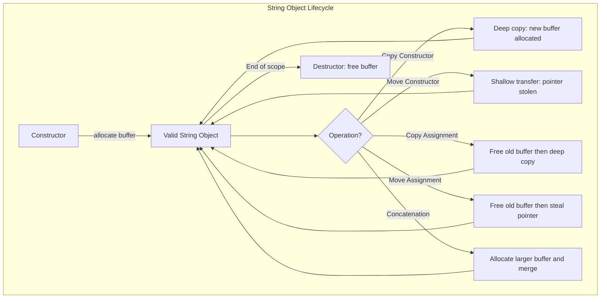

# Custom String implementation in C++

**Published:** 2021-08-11

A C++ string class can be implemented in more than one way. I used char*(or rather T*) as a base for implementation. The reason for templatization was to mimic the way standard library does things.

It supports all the construction, copy and assignment operations as well as outputting to stdout and concatenation.

