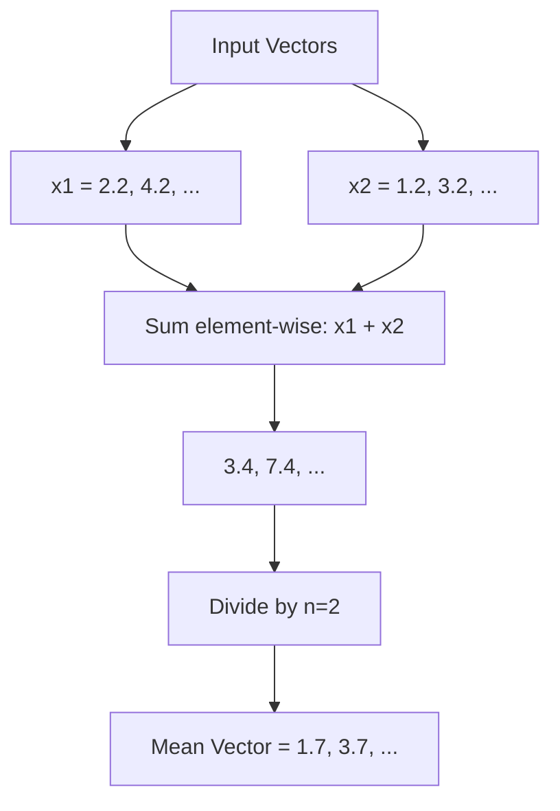
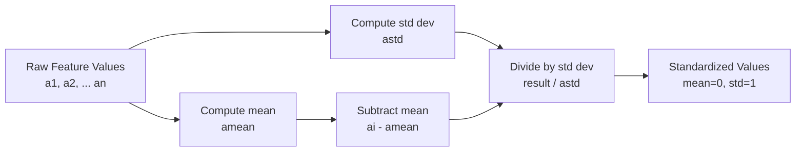
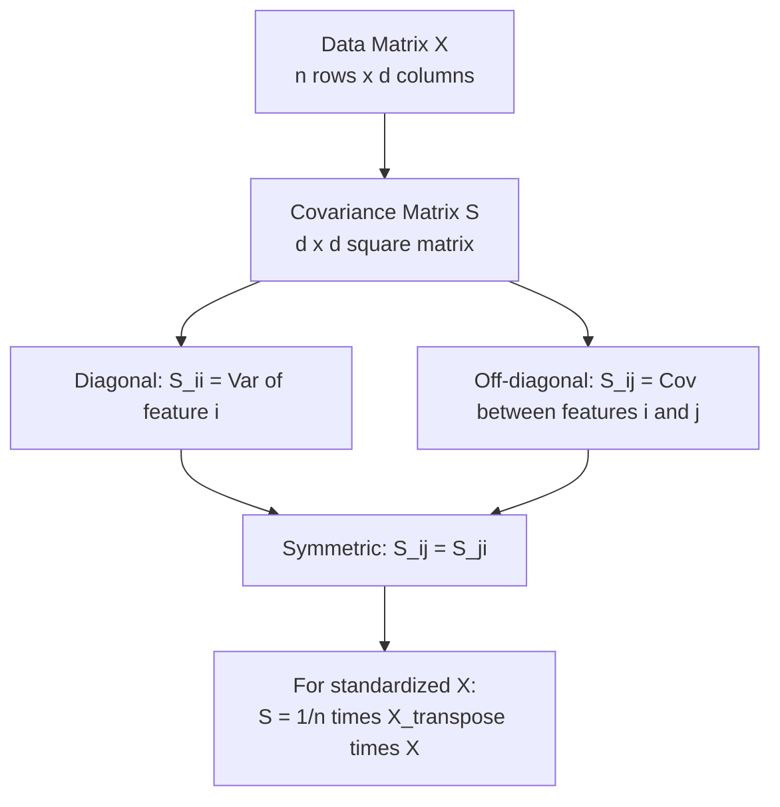

# Dimensionality Reduction In Machine Learning: Some mathematical prerequisites: Mean Vector, Covariance Matrix and Column Standardization

**Published:** 2019-06-01


This is part 2 of Introduction to Dimensionality Reduction. In this blog post, we would several different mathematical prerequisites that one must know before trying to understand machine learning.

 

#### Mean Vector

The sample mean is a vector each of whose elements is the sample mean of one of the random variables – that is, each of whose elements is the arithmetic average of the observed values of one of the variables.



mean-vector1

**Lets say we have two vectors**

**x1 = [2.2, 4.2,...]**

**x2 = [1.2, 3.2,...]**

**x_mean = 1/2(x1+x2)**

**= 0.5* [3.4, 7.4, ..]**

**= [1.7,3.7, .. ]**

So essentially we summed up elements at ith index of the first array and the corresponding index of the second array.

```python
import numpy as np

# Computing the mean vector from multiple data points
x1 = np.array([2.2, 4.2, 1.5])
x2 = np.array([1.2, 3.2, 2.8])
x3 = np.array([3.0, 5.0, 0.9])

# Stack into a matrix where each row is a data point
X = np.vstack([x1, x2, x3])

# Mean vector: average across rows (axis=0)
mean_vector = np.mean(X, axis=0)
print(f"Mean vector: {mean_vector}")  # [2.133, 4.133, 1.733]

# Equivalent to summing all vectors and dividing by n
manual_mean = (x1 + x2 + x3) / 3
print(f"Manual mean: {manual_mean}")
```

**So we can say every array can be considered as a vector with each of its indices as one of the dimensions**.

If we plot all these arrays and their indices in a multidimensional space,we would see that they look like a 3d scattered plot. 

We can define mean vector for that scattered group geometrically something like this picture below.

#### Data preprocessing: Column Standardization



**Column standardization is a type of feature normalization where we move the data in such a way that the mean of the data becomes 0 and the standard deviation becomes 1.**

featuref1f2f3f4X=110a123X=220a214X=330a344X=430a344X=nxanz

**Let a1, a2... an, represent n values of a feature f****j**

Let's say we apply column standardization on these and we get a new feature

**f****j standardized**

Let a1', a2'... an' represent n values of a feature fj standardized

then the mean of all such vectors would be defined as

**mean(a1',a2'...an') =0**

and the standard deviation 

**std(a1',a2'...an') =1**

**The way we do it is by subtracting each element from the mean and dividing by standard deviation. On doing so for the new vector, the mean becomes 0 and the standard deviation becomes 1.**

So how do we obtain a1', a2'... an'

let's say mean(a1', a2'... an') be amean

and standard deviation(a1', a2'... an') be astd

**a****i****' = (a****i****- a****mean****)/a****std**

Geometrically speaking we move the distribution to the origin and constrict it in a hypercube of unit 1. Hence it is also called mean centering.

We may need to squish or expand the data depending upon if the standard dev of the data is greater or less than 1.

```python
import numpy as np
from sklearn.preprocessing import StandardScaler

# Sample feature values (e.g., heights in cm)
data = np.array([[170], [160], [180], [175], [165]])

# Manual column standardization
mean_val = np.mean(data, axis=0)
std_val = np.std(data, axis=0)
standardized = (data - mean_val) / std_val
print(f"Mean before: {np.mean(data, axis=0)}")      # [170.0]
print(f"Std before:  {np.std(data, axis=0)}")        # [7.07]
print(f"Mean after:  {np.mean(standardized, axis=0):.1f}")  # 0.0
print(f"Std after:   {np.std(standardized, axis=0):.1f}")   # 1.0

# Using sklearn StandardScaler (equivalent)
scaler = StandardScaler()
standardized_sklearn = scaler.fit_transform(data)
print(f"Sklearn result matches: {np.allclose(standardized, standardized_sklearn)}")
```

#### Covariance Matrix



Let's say we have a matrix X

featuresf1f2f3f4X=1x11x12x13x14X=2x21x22x23x24X=3x31x32x33x34

we can define its covariance matrix S

featuresf1f2f3f41s11s12s13s142s21s22s23s243s31s32s33s344s41s42s43s44

where xi,j are ith row and jth column in X

and si,j are ith row and jth column in S

The dimensions of  X here are n*d where n is number of points and d is number of dimensions(or features)

Whereas the covariance matrix is of size d*d. Hence covariance matrix is always a square matrix

***Covariance has two properties***

**1) Cov(X,Y)=Cov(Y,X)**

**2) Cov(X,X)= Var(X)**

**This means s(i,j) = s(j,i)**

Another interesting property is for a column normalized vector X,

**covariance matrix S=(1/n)*****(X****transpose**** ***** *X)**

```python
import numpy as np

# Create a sample data matrix (4 data points, 3 features)
X = np.array([
    [1.0, 2.0, 3.0],
    [4.0, 5.0, 6.0],
    [7.0, 8.0, 9.0],
    [2.0, 4.0, 6.0]
])

# Compute covariance matrix using numpy (uses n-1 by default)
cov_matrix = np.cov(X, rowvar=False)
print(f"Data shape: {X.shape}")           # (4, 3)
print(f"Covariance matrix shape: {cov_matrix.shape}")  # (3, 3)
print(f"Covariance matrix:\n{cov_matrix}")

# Verify symmetry: Cov(X,Y) = Cov(Y,X)
print(f"Symmetric: {np.allclose(cov_matrix, cov_matrix.T)}")  # True

# Verify diagonal contains variances: Cov(X,X) = Var(X)
for i in range(X.shape[1]):
    print(f"Var(F{i+1}): {np.var(X[:, i], ddof=1):.2f} == Cov({i},{i}): {cov_matrix[i,i]:.2f}")

# For mean-centered data: S = (1/n) * X_T @ X
X_centered = X - X.mean(axis=0)
cov_manual = (1 / len(X)) * X_centered.T @ X_centered
print(f"Manual covariance (1/n * X_T @ X):\n{cov_manual}")
```

We will leave the proof as an exercise but proving it should be trivial.

Stay tuned for the next post on dimensionality reduction. We would start describing a classical way of doing Dimensionality Reduction called Principal component Analysis.