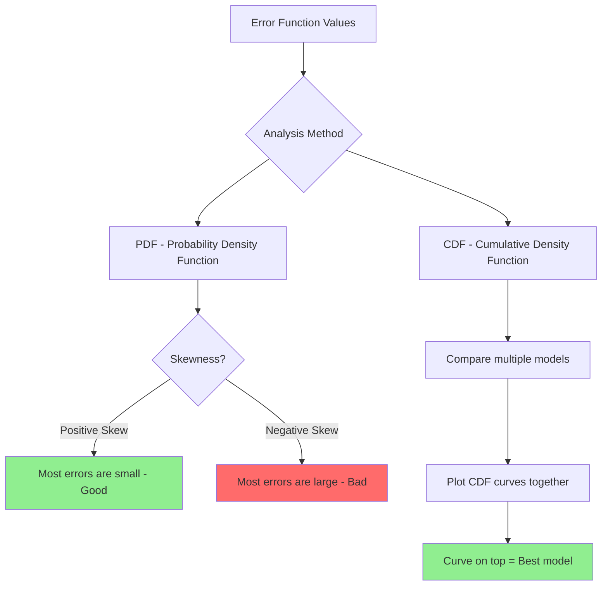
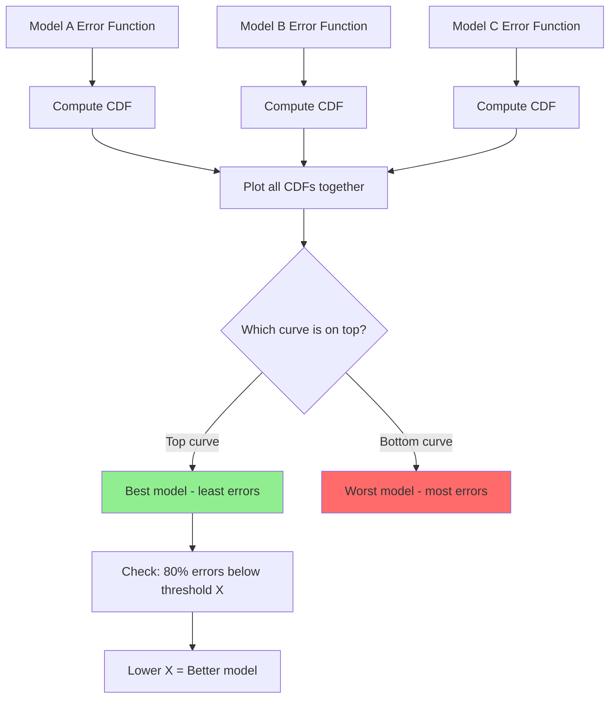

# Distribution of error functions

**Published:** 2019-09-22


We can plot error distributions like probability density function
and cumulative density function and make important deductions
based on it.

We can use plot Probability Density functions(PDF) and Cumulative density function (CDF) by using the error function as a random variable



### Using PDF of error distribution

An ideal pdf for error distributions would be a curve which is positively skewed. 

What that means that most of the errors are small and very few errors are large.

On the other hand, if error distribution is negatively skewed it means most of the errors are large and that's not a good thing.

Computing common error functions and analyzing their distributions:

```python
import numpy as np
from sklearn.metrics import mean_squared_error, mean_absolute_error

y_true = np.array([3.0, -0.5, 2.0, 7.0, 4.5])
y_pred = np.array([2.5,  0.0, 2.1, 8.0, 4.0])

errors = y_true - y_pred
abs_errors = np.abs(errors)

# Common error metrics
mse = mean_squared_error(y_true, y_pred)
rmse = np.sqrt(mse)
mae = mean_absolute_error(y_true, y_pred)

print(f"Errors:  {errors}")
print(f"MSE:     {mse:.4f}")
print(f"RMSE:    {rmse:.4f}")
print(f"MAE:     {mae:.4f}")
# MSE:  0.4520, RMSE: 0.6723, MAE: 0.5000

# Check skewness of the error distribution
from scipy.stats import skew
print(f"Skewness: {skew(errors):.4f}")
# Positive skew means most errors are small (good)
```

### Using CDF of error distribution



Let's say we want to compare error functions of different models. One good way to do it is to find and plot CDF of all these error functions.

The curve which is on top of the other curves(in this case the green curve) would be the most ideal here. The one on top of other curves would show the least amount of errors.

Further, If we see 80% of errors for the green curve lie for X< -1.

Hence, this means 80% of errors in the green error CDF like below -1 which for other curves is higher than -1.

Plotting PDF and CDF of an error distribution:

```python
import numpy as np
import matplotlib.pyplot as plt

# Simulate error distributions for two models
np.random.seed(42)
errors_model_a = np.random.normal(0, 0.5, 1000)
errors_model_b = np.random.normal(0, 1.0, 1000)

fig, axes = plt.subplots(1, 2, figsize=(12, 4))

# PDF via histogram
axes[0].hist(np.abs(errors_model_a), bins=50, density=True, alpha=0.6, label="Model A")
axes[0].hist(np.abs(errors_model_b), bins=50, density=True, alpha=0.6, label="Model B")
axes[0].set_title("PDF of Absolute Errors")
axes[0].set_xlabel("Absolute Error")
axes[0].legend()

# CDF comparison
for errors, label in [(errors_model_a, "Model A"), (errors_model_b, "Model B")]:
    sorted_err = np.sort(np.abs(errors))
    cdf = np.arange(1, len(sorted_err) + 1) / len(sorted_err)
    axes[1].plot(sorted_err, cdf, label=label)

axes[1].set_title("CDF of Absolute Errors")
axes[1].set_xlabel("Absolute Error")
axes[1].set_ylabel("Cumulative Probability")
axes[1].legend()

plt.tight_layout()
plt.show()
# Model A's CDF curve sits above Model B's, indicating smaller errors
```