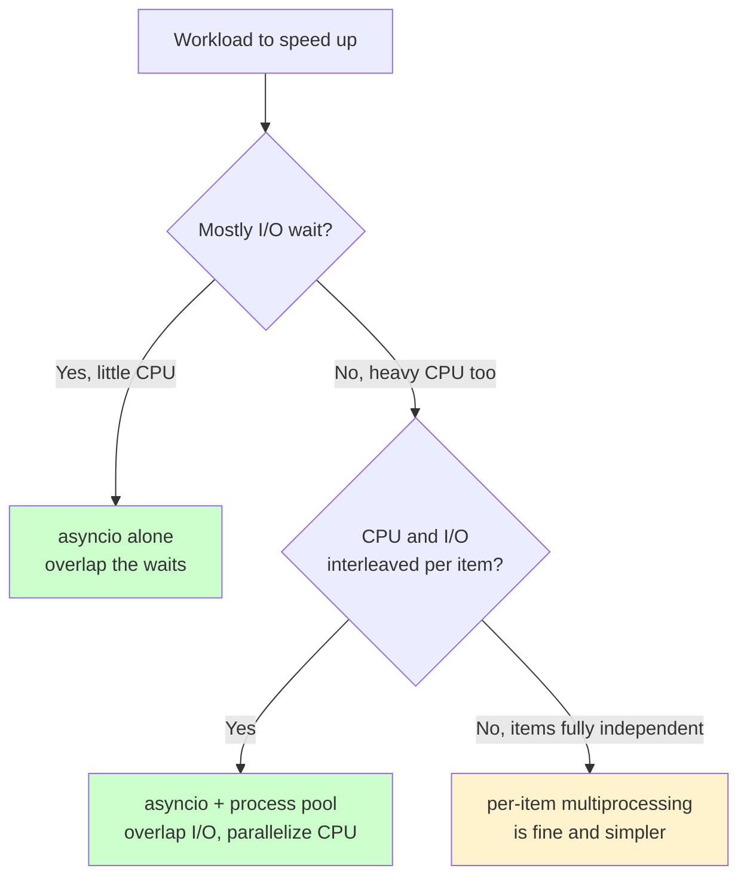

# Async Hides I/O, Not CPU: Composing asyncio and multiprocessing in a Real OCR Pipeline

**Published:** June 13, 2026

A document-processing service that does OCR (turning page images into text) is rarely bound by a single resource: it waits on a remote call for each page and burns CPU on the work around it. That mix is what makes such a service hard to scale and to reason about, and this post pins down why with measurements on a small, reproducible version of it.

## What OCR is, and why it keeps coming up

OCR — optical character recognition — turns images of text into machine-readable text: scanned contracts, photographed receipts, forms, ID documents, and PDF pages that are really just pictures. It is a recurring workload because a large share of real-world documents arrive as images rather than text, and any system that ingests documents at scale — search indexing, data extraction, archival digitization, RAG over scanned corpora — starts with an OCR step. 

That step might be a classic engine like Tesseract, a hosted OCR API (AWS Textract, Google Cloud Vision, Azure, and the like), or increasingly a vision-capable LLM — but a remote or out-of-process call makes each page a slow, I/O-bound request measured in hundreds of milliseconds to seconds. Multiply that by hundreds or thousands of pages and OCR latency dominates the job, so the practical question is how to schedule those calls — and the CPU work that surrounds them, such as rendering pages to images and post-processing the extracted text — for throughput.

## The service that prompted this

I have run into this shape more than once across different companies. The case that prompted this writeup was an OCR service behind a FastAPI endpoint that was both I/O-bound (the OCR call itself, a request to a popular hosted OCR service endpoint) and CPU-bound (rendering pages and post-processing the returned text), and that combination made it stubborn to scale and even to benchmark — we kept hitting performance issues that did not respond the way a purely I/O-bound service would. 

Part of the reason is that FastAPI runs on the same single-threaded event loop as the pipeline below, so a CPU-heavy stage blocks the loop and caps throughput regardless of how many OCR calls you have in flight. The experiments here are a stripped-down, reproducible stand-in for that service: the I/O stage is a `claude -p` subprocess rather than a paid OCR API (so it runs without credentials), but it has the same character — a slow, out-of-process call the event loop can overlap — and the point is to isolate why a mixed CPU+I/O workload behaves the way it does and what actually moves the number.

## What asyncio can and can't reclaim

Scheduling I/O-bound calls is exactly what asyncio is for, and on a pure-I/O workload it is close to free: a serial crawler issuing 200 requests at 50 ms each took about 10.6 s on my machine, and the `aiohttp` version finished in about 0.12 s — roughly 89x faster — because the waits overlap instead of stacking. But an OCR pipeline is not pure I/O; the rendering and post-processing stages are CPU. This post measures what that does to the speedup. I built a three-stage pipeline (render a PDF page, OCR it with a `claude -p` subprocess, run a heavy pure-Python analysis) and timed serial, async, async-plus-process-pool, and pure-multiprocessing variants. The short version: async alone caps at about 2x once a heavy CPU stage is present, a process pool reaches 3x, and the async-plus-pool hybrid beats per-page multiprocessing at matched parallelism. The four experiments below each follow the same shape — **Hypothesis** (what I expected and why), **What we compare** (the exact configurations pitted against each other), and **What we found** (the measured result) — so it is always clear what is being held constant and what is changing.

### A note on the numbers

One caveat that governs every number below. The OCR stand-in is a live `claude -p` subprocess (a network round-trip, like the hosted OCR API it replaces), so the timings are **single-run and nondeterministic** — they depend on the service, the network, and the machine, and will differ every run. I captured one real run per experiment and built the charts from it. The claim in each case is the *shape and ordering* of the result, not the exact seconds. Everything is runnable in the companion repo, [`high-performance-python`](https://github.com/deepanshululla/high-performance-python/tree/main/chapter_9_asynchronous_io), alongside my [re-measuring-the-book post](/#/blog/hpp-remeasured-apple-silicon).

## The workload

*Source: [`ex09_ocr_pipeline`](https://github.com/deepanshululla/high-performance-python/tree/main/chapter_9_asynchronous_io/ex09_ocr_pipeline).*

Each page of a 34-page PDF flows through three stages with different performance characters:


- **render** rasterizes the page to a PNG with `pypdfium2`. CPU-bound, holds the GIL, tens of milliseconds.
- **OCR** shells out to `claude -p --model haiku` to transcribe the image. I/O-bound — the work runs in a separate process, so the calling thread or event loop is free while it waits. Seconds per page.
- **analyze** runs an all-pairs Levenshtein edit-distance pass over a fixed-size vocabulary. Pure Python, holds the GIL, about 3 s per page.

The heavy analysis stage is deliberate. With a trivial analysis, OCR is about 99% of the time and every async variant gets a near-linear speedup; the about-3-s CPU stage is what makes the CPU a real share of the pipeline and exposes the limits below.

## Experiment 1 — serial vs. async (2.05x)

**Hypothesis.** Running the pages through an event loop should overlap the slow OCR calls across pages and cut the total time. But each page also carries a heavy, GIL-holding analysis stage, and asyncio runs on a single thread — so it should hide OCR I/O behind other pages' OCR I/O, yet *not* overlap the CPU stages of different pages with each other. Prediction: a real speedup, but well short of the near-linear win a pure-I/O workload gives.

**What we compare.** The same 6 pages, run two ways. *Serial* renders, OCRs, and analyzes each page strictly one at a time. *Async* runs the same three stages per page, but lets up to 4 OCR subprocesses overlap, bounded by a semaphore (this is the only thing that changes):

```python
async def _handle_page(pdf_path, idx, render_dir, sem):
    png = render_page(pdf_path, idx, render_dir)   # CPU (holds GIL; serializes vs other CPU)
    async with sem:
        text = await ocr_page_async(png)           # I/O (overlaps other pages' OCR)
        await asyncio.sleep(0)
    stats = analyze_text(text)                       # CPU (holds GIL)
    return {"page": idx, "stats": stats}
```

**What we found.** Async cut the time roughly in half — a 2.05x speedup, not the 10x-plus a pure-I/O job of this size would give (one captured run, 6 pages, concurrency 4):

| quantity | value |
| --- | ---: |
| serial total | 53.9 s |
| &nbsp;&nbsp;— OCR (I/O) | 36.2 s (67%) |
| &nbsp;&nbsp;— analyze (CPU) | 17.4 s (32%) |
| &nbsp;&nbsp;— render (CPU) | 0.33 s (1%) |
| async pipeline (c=4) | 26.3 s |
| **speedup** | **2.05x** |


*Left: the serial bar split into a tall amber OCR segment (I/O) with a substantial teal analyze segment (CPU) stacked on it. Right: serial total vs. the async pipeline, landing just below half.*

The async pipeline keeps up to four `claude` subprocesses in flight, so the 36 s of serial OCR collapses to roughly one or two waves. But the 17 s of analysis is pure Python: only one page's analysis runs at a time, and while it runs without awaiting, the event loop is blocked and cannot advance the other pages' pending OCR. The async total floors near "overlapped OCR plus serial CPU," and the speedup stalls at about 2x.

### Why it stalls at 2x

The mechanism: **asyncio overlaps I/O with I/O, but not CPU with CPU**, because one thread under the GIL runs one piece of Python bytecode at a time. Once CPU is a real share of the work, that share is a floor.

## Experiment 2 — how much OCR concurrency helps (knee at c=4)

*Source: [`hypothesis/h01_ocr_concurrency`](https://github.com/deepanshululla/high-performance-python/tree/main/chapter_9_asynchronous_io/hypothesis/h01_ocr_concurrency).*

**Hypothesis.** If the 2x cap from Experiment 1 really is the serial CPU stage, then raising the number of overlapping OCR calls should help only until the overlapped I/O shrinks below the total CPU time — after that the CPU is the bottleneck and more concurrency buys nothing. Prediction: runtime falls steeply, then plateaus on the *serial-CPU floor* (the sum of every page's analyze time), not down near a single OCR call's latency.

**What we compare.** Exactly the Experiment 1 async pipeline, run at OCR concurrency 1, 2, 4, and 8 — nothing else changes — against the serial baseline and that theoretical serial-CPU floor:

| configuration | total | vs. serial |
| --- | ---: | ---: |
| serial | 61.0 s | 1.0x |
| async c=1 | 54.7 s | 1.12x |
| async c=2 | 29.4 s | 2.07x |
| async c=4 | 23.2 s | 2.63x |
| async c=8 | 22.8 s | 2.68x |
| *serial-CPU floor* | *17.9 s* | *(the asymptote)* |


*The teal curve plunges from c=1 to c=4, then flattens. The amber dashed line is the serial baseline; the grey dotted line is the serial-CPU sum (about 18 s) — the asymptote the curve bends toward but cannot cross. The red ring marks the knee at c=4.*

**What we found.** From 1 to 4 the time nearly halves twice; from 4 to 8 it barely moves (23.2 s to 22.8 s). The plateau sits just above the 17.9 s serial-CPU floor, not near a single OCR call's latency. Once four OCR subprocesses overlap, the I/O is essentially hidden; what remains is about 18 s of analysis that runs one page at a time. More concurrency cannot lower a CPU-bound floor. The operational consequence: pick a modest concurrency at the knee (here, 4) and stop — beyond it you pay coordination overhead and risk downstream rate limits for no gain.

### Is c=4 the core count?

It is a reasonable suspicion — 4 looks a lot like a core count — and I have not isolated it, so take what follows as reasoning from the mechanism rather than a measured conclusion.

What I am fairly confident about is the *floor*: the plateau sits on the serial-CPU sum, and that sum is single-threaded. The analyze stage runs on the one event-loop thread under the GIL, so it should sit near 18 s whether the machine has 4 cores or 40 — adding cores cannot lower a one-thread floor. What I am less sure about is the *knee's exact location*. The knob being swept is OCR concurrency, and the OCR calls are network-bound subprocesses (the model runs remotely), so in principle you can keep many more in flight than you have cores; that argues the knee is set by when the I/O becomes fully hidden (a function of OCR latency and page count) rather than by cores. But each concurrent `claude -p` is also a local process, so at higher concurrency the subprocesses and the event loop do contend for cores, and I cannot rule out that this nudges where the curve flattens. Settling it would take a controlled run pinned to fewer cores, which I have not done here.

Either way, the practical takeaway is the same: c=4 is specific to this workload and machine, not a universal number, so the robust rule is to sweep and stop at your own knee. And note that core count *does* bind directly in Experiment 3, where the parallel speedup is capped by how many CPU workers — cores — can run analyze at once.

## Experiment 3 — adding a process pool (3.0x)

*Source: [`hypothesis/h02_gil_process_pool`](https://github.com/deepanshululla/high-performance-python/tree/main/chapter_9_asynchronous_io/hypothesis/h02_gil_process_pool).*

**Hypothesis.** The floor from Experiment 2 exists because one process has one GIL, so the pages' analyze stages run one at a time. Moving those CPU stages into separate processes (each with its own GIL) should let them run in parallel across cores while the event loop still overlaps the OCR I/O. Prediction: async + a process pool beats async-only, landing near the *parallelized* CPU time (sum / cores) instead of the serial CPU sum.

**What we compare.** Three runs of the same 6 pages, all at OCR concurrency 4. *Serial* is the baseline. *Async-only* is Experiment 1's pipeline, where render and analyze run on the event-loop thread (GIL-bound). *Async + process pool* keeps the OCR as coroutines but offloads render and analyze to a 4-process `ProcessPoolExecutor` via `loop.run_in_executor` — so the only change from async-only is *where the CPU runs*:

```python
async def _handle(pdf, idx, render_dir, pool, sem):
    loop = asyncio.get_running_loop()
    png = await loop.run_in_executor(pool, render_page, pdf, idx, render_dir)  # CPU -> pool
    async with sem:
        text = await ocr_page_async(png)          # I/O -> event loop
        await asyncio.sleep(0)
    return await loop.run_in_executor(pool, analyze_text, text)               # CPU -> pool
```

**What we found.** The pool reached 3.0x over serial — and, more to the point, 1.28x over async-only, which Experiment 2 had shown was stuck against the CPU floor:

| configuration | total | vs. serial |
| --- | ---: | ---: |
| serial | 54.9 s | 1.0x |
| async-only (GIL CPU) | 23.4 s | 2.35x |
| async + process pool | 18.3 s | 3.00x |
| *serial-CPU sum* | *17.8 s* | |


*Serial (amber), async-only (blue), async + process pool (teal). The grey dotted line is the serial-CPU sum. Async-only stalls well above it; the pooled bar reaches it.*

Async-only lands at 23.4 s — the floor from the concurrency sweep. Moving analysis and render into a four-process pool drops it to 18.3 s: 1.28x over async-only, 3.0x over serial. The pooled run sits on the 17.8 s serial-CPU sum because the CPU is now running across four cores (roughly sum/4) and what remains on the critical path is the overlapped OCR plus pool overhead.

The 1.28x over async-only is modest here because OCR I/O is still the larger share and the pool adds pickling and process-startup cost. Heavier analysis widens the gap; trivial analysis would make the pool a net loss. asyncio and multiprocessing are not alternatives in this workload — asyncio handles the OCR I/O, the process pool handles the CPU.

## Experiment 4 — per-page multiprocessing vs. the hybrid

*Source: [`hypothesis/h03_multiprocessing_vs_hybrid`](https://github.com/deepanshululla/high-performance-python/tree/main/chapter_9_asynchronous_io/hypothesis/h03_multiprocessing_vs_hybrid).*

**Hypothesis.** The pages are independent, so the obvious simpler design is to skip asyncio entirely and hand each *whole* page — render, blocking OCR, analyze — to its own worker process with `ProcessPoolExecutor.map`. No event loop, no semaphore. Prediction: at *matched parallelism* this ties the async + pool hybrid from Experiment 3, since both are bounded by the same `max(overlapped OCR, CPU / workers)`.

**What we compare.** At matched N — where N worker processes = N overlapping OCR calls = an N-process CPU pool — pure per-page multiprocessing versus the async + pool hybrid, for N = 2, 4, and 6. The two designs get the same degree of parallelism; only the *structure* differs. Pure multiprocessing is one blocking function per page:

```python
def process_page_blocking(args):
    pdf_path, idx, render_dir = args
    png = render_page(pdf_path, idx, render_dir)  # CPU
    text = ocr_page(png)                           # I/O — the worker just BLOCKS here
    return {"page": idx, "stats": analyze_text(text)}  # CPU

with ProcessPoolExecutor(max_workers=workers) as pool:
    list(pool.map(process_page_blocking, [(pdf, i, render_dir) for i in pages]))
```

**What we found.** The prediction was wrong. Rather than tying, the hybrid is faster at every matched N — by 14% to 33%:

| N (matched) | pure multiprocessing | async + pool hybrid | hybrid speedup |
| ---: | ---: | ---: | ---: |
| 2 | 30.0 s | 22.5 s | **1.33x** |
| 4 | 19.5 s | 16.2 s | **1.21x** |
| 6 | 11.7 s | 10.2 s | **1.14x** |

*(serial baseline: 56.4 s; "N" sets workers = OCR concurrency = CPU pool size for both.)*


*Seconds vs. matched parallelism N. The violet line (pure multiprocessing) sits above the teal dashed line (hybrid) at every N, the gap shrinking as N grows. The amber star is a decoupled hybrid running 6-way OCR with only 2 CPU workers.*

### Why the hybrid wins

The cause is structural. In pure per-page multiprocessing, a worker runs one page start to finish: render, then block about 7 s on `claude` with the CPU idle, then about 3 s of analysis. The OCR wait and the CPU work are strictly sequential inside each worker, and stay sequential across every page that worker handles. At N=2 with 6 pages, each worker spends roughly 21 s waiting on OCR and 9 s computing, back to back.

The hybrid decouples them: the event loop keeps N OCR calls in flight while the process pool runs analyses for pages whose OCR already returned, so the CPU work is hidden underneath the OCR wait rather than appended after it. The gap is widest at low N (1.33x at N=2), where each worker serializes the most pages, and narrows as N rises and there are fewer pages per worker (1.14x at N=6, roughly one page per worker, little left to serialize).

### A measurement trap to avoid

Note one measurement trap: comparing pure-MP with 6 workers against a hybrid with 4 makes pure-MP look faster, but that is a parallelism mismatch (6 processes vs. 4), not a paradigm difference. The table above matches worker counts; at matched N the hybrid wins.

## Summary



- asyncio reclaims I/O wait and only I/O wait; on a pure-I/O workload that is a near-linear win (89x here).
- A heavy GIL-bound CPU stage is a floor asyncio cannot lower; more concurrency stops helping once the I/O is hidden (knee at c=4; plateau at the 18 s CPU floor; async cap of about 2x).
- Separate processes lower that floor (3.0x with a four-process pool); asyncio handles the I/O, the pool handles the CPU.
- Per-page multiprocessing serializes I/O and CPU within each worker; the hybrid overlaps them and is 1.14x–1.33x faster at matched parallelism.

## Conclusion

The same async machinery that delivers 89x on a pure-I/O crawl delivers about 2x once a heavy CPU stage enters the pipeline, because asyncio overlaps I/O with I/O but the GIL serializes the CPU. A process pool lowers the CPU floor and reaches 3x, used together with asyncio rather than instead of it. And how the work is split matters: running each independent item end-to-end in its own process serializes the I/O-and-CPU overlap, so the async-plus-pool hybrid is faster than per-page multiprocessing at matched parallelism. These are single-run captures from a live model call, so the seconds will differ on other hardware; the shapes — I/O hides behind I/O, CPU does not, processes lower the CPU floor, overlap beats per-item isolation — are what should hold. The full pipeline and all three experiments are in the [companion repo](https://github.com/deepanshululla/high-performance-python/tree/main/chapter_9_asynchronous_io).

