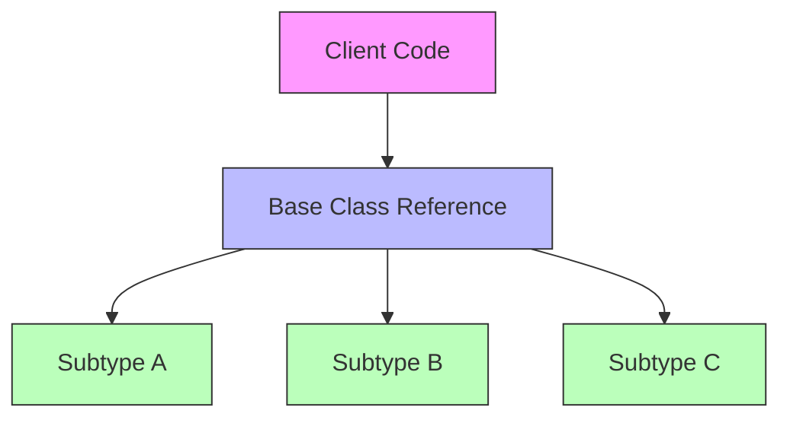
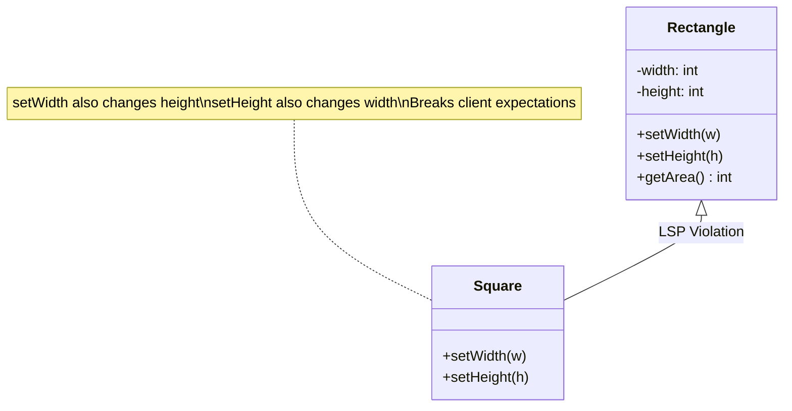
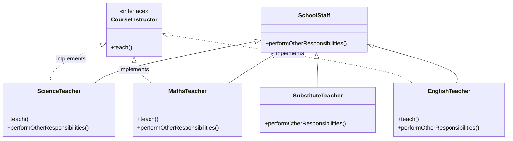

# Clean Code Concepts: Be Solid: Liskov Substitution Principle

**Published:** 2019-10-27

Writing clean code is more of an art rather than a science. So What really makes code **cleaner**?. In this series called Clean Code Concepts, we investigate some of the ways to write code in a clean way.

There are several aspects to write cleaner code, some are language agnostic others are language dependent.

In this series, we focus on some of the language-agnostic parts of writing clean code.

Understanding of these concepts can be used to improve the ability to write cleaner code in any language.

Let’s dive right into the SOLID concepts of object-oriented design.

**S.O.L.I.D** is an acronym for the **first five object-oriented design**(**OOD**) principles by Robert C. Martin. It stands for:

- **S** – Single-responsibility principle

- **O** – Open-closed principle

- **L** – Liskov substitution principle

- **I** – Interface segregation principle

- **D** – Dependency Inversion Principle

In this blog post, we would focus exclusively on the Open-Closed principle along with examples in Java and python.

Liskov substitution principle states that:

**Objects in a program should be replaceable with instances of their subtypes without altering the correctness of that program.**

To elaborate, The main idea behind LSP is that, for any class, a client should be able to use any of its subtypes indistinguishably.

This client should not notice and be completely unaware of the class hierarchy.  

To put it in more detail, a good class must define a clear and concise interface, and as long as subclasses honor that interface, the program will remain correct.

A good example of LSP here is

*LSP says the client should be able to use any subtype through the base class reference without knowing or caring which subtype it is.*

A great example illustrating LSP (given by Uncle Bob in a podcast I heard recently) was how sometimes something that sounds right in natural language doesn't quite work in code.

In mathematics, a Square is a Rectangle. Indeed it is a specialization of a rectangle. The "is a" makes you want to model this with inheritance. However if in the code you made Square derive from, then a `Square` should be usable anywhere you expect a `Rectangle`. This makes for some strange behavior.

Imagine you had `SetWidth` and `SetHeight` methods on your `Rectangle` base class; this seems perfectly logical. However if your `Rectangle` reference pointed to a `Square`, then `SetWidth` and `SetHeight` doesn't make sense because setting one would change the other to match it. In this case `Square` fails the Liskov Substitution Test with `Rectangle` and the abstraction of having `Square`inherit from `Rectangle` is a bad one.

https://stackoverflow.com/questions/56860/what-is-an-example-of-the-liskov-substitution-principle

*The Square-Rectangle problem: Square inheriting from Rectangle violates LSP because Square changes the behavior of setWidth and setHeight in unexpected ways.*

Lets take another example of how we can use LSP as part of our code:

So in this ScienceTeacher, MathsTeacher, EnglishTeacher extend the functionality of SchoolStaff class and inherit performOtherReponsibilities() function. Rest of the methods of the schoolstaff class are private.

So why not put teach() method in the SchoolStaff class because there is other staff in school who are not teaching. For eg, a substitute teacher may come in and perform all responsibilities except Teaching.

That's why the course instructor interface is created so that the Science, maths and English teacher can implement it.

Now we will have no problem replacing objects of SchoolStaff with either of Science, Maths or a Substitute teacher.