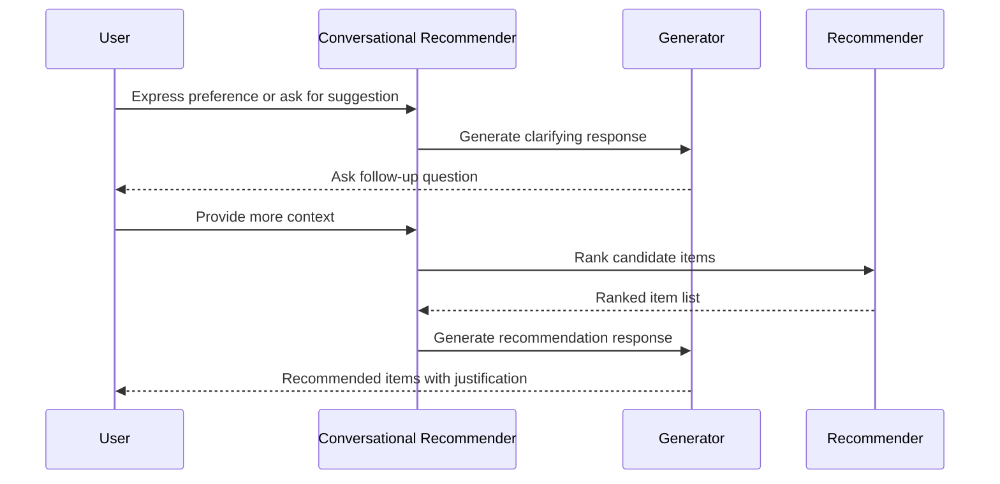
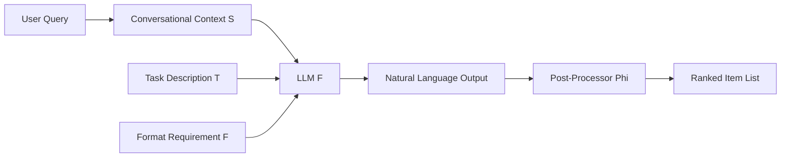
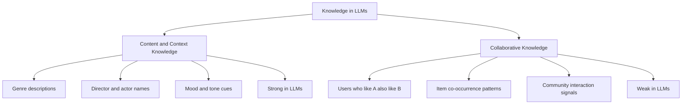

# Notes on paper: Large Language Models as Zero-Shot Conversational Recommenders

**Published:** 2024-07-15

### Link to paper

https://arxiv.org/abs/2308.10053

### Notes

The following diagram shows the multi-turn conversational recommendation flow between a user and the CRS system:

CRS possesses the potential to:

(1) understand not only users’ historical actions but also users’ (multi-turn) natural-language inputs;

(2) Provide not only recommended items but also human-like responses for multiple purposes, such as preference refinement, knowledgeable discussion, or recommendation justification.
Towards this a typical conversational recommender contains two components a generator to generate natural-language responses and a recommender to rank items to meet users’ needs

The conversational recommendation scenario, though involving more natural language interactions, is still in its infancy.

**Data**: Reddit-Movie, a large-scale conversational recommendation dataset with over 634k naturally occurring recommendation seeking dialogs from users from Reddit
Evaluation: duplicates are removed

**Analysis**: the authors posit that LLMs leverage both content/context knowledge (e.g., “genre”, “actors” and “mood”) and collaborative knowledge (e.g.,“users who like A typically also like B”) to make conversational recommendations. the authors design several probing tasks to uncover the model’s workings and the characteristics of the CRS data.

Summary

- CRS recommendation abilities should be reassessed by eliminating repeated items as ground truth.

- LLMs, as zero-shot conversational recommenders, demonstrate improved performance on established and new datasets over fine-tuned CRS models.

- LLMs primarily use their superior content/context knowledge, rather than their collaborative knowledge, to make recommendations.

- CRS datasets inherently contain a high level of content/context information, making CRS tasks better-suited for LLMs than traditional recommendation tasks.

- LLMs suffer from limitations such as popularity bias and sensitivity to geographical regions.

What generally they are saying so far is if you structure your data in such a way that it has the recommendation as well as the context of the recommendation then it makes it easier for the CRS to make those recommendations.

the recommender component of a CRS is specifically designed to optimize the following objective: during the 𝑘 th turn of a conversation, where 𝑢𝑘 is the recommender, the recommender takes the conversational context (𝑢𝑡 , 𝑠𝑡 , I𝑡) 𝑘−1 𝑡=1 as its input, and generate a ranked list of items Iˆ 𝑘 that best matches the ground-truth items in I𝑘 .

### Framework

The following diagram illustrates the overall conversational recommendation pipeline, from user input through the LLM to the final ranked list of items:

Our goal is to utilize LLMs as zero-shot conversational recommenders. Specifically, without the need for fine-tuning, we intend to prompt an LLM, denoted as F, using a task description template 𝑇 , format requirement 𝐹 , and conversational context 𝑆 before the 𝑘 th turn. This process can be formally represented as: Iˆ 𝑘 = Φ (F (𝑇 , 𝐹, 𝑆)) .

Models. We consider several popular LLMs F that exhibit zero-shot prompting abilities in two groups. To try to ensure deterministic results, we set the decoding temperature to 0 for all models. • GPT-3.5-turbo 4 and GPT-4 from OPENAI with abilities of solving many complex tasks in zero-shot setting but are closed-sourced. • BAIZE 5 and Vicuna , which are representative open-sourced LLMs fine-tuned based on LLAMA-13B.

Processing. We do not assess model weights or output logits from LLMs. Therefore, we apply a post-processor Φ (e.g., fuzzy matching) to convert a recommendation list in natural language to a ranked list Iˆ 𝑘 . The approach of generating item titles instead of ranking item IDs is referred to as a generative retrieval paradigm

### Performance

1) LLMs perform better than finetuned CRS models in a zero-shot setting. For a comparison between models’ abilities to recommend new items to the user in conversation, we re-train existing CRS models on all datasets for new item recommendation only
2) GPT models perform better than open source ones.We hypothesize this is due to GPT-4’s larger parameter size enables it to retain more correlation information between movie names and user preferences that naturally occurs in the language models’ pre-training Kndata. Vicuna and BAIZE, while having comparable performance to prior models on most datasets, have significantly lower performance than its teacher, GPT-3.5-t.
* smaller distilled models via imitation learning cannot fully inherit larger models ability on downstream tasks
3) LLMs may generate out-of-dataset item titles, but few hallucinated recommendations. We note that language models trained on open-domain data naturally produce items out of the allowed item set during generation. In practice, removing these items improves the models’ recommendation performance.

## Setup

The following diagram contrasts the two types of knowledge that LLMs use for recommendation:

Knowledge in LLMs
* Collaborative filtering; Collaborative knowledge, which requires the model to match items with similar ones, according to community interactions like “users who like A typically also like B”.we define the collaborative knowledge in LLMs as the ability to make accurate recommendations using item mentions in conversational contexts
* Content/context knowledge, we define the content/context knowledge in LLMs as the ability to make accurate recommendations based on all other conversation inputs rather than item mentions,such as contextual descriptions, mentioned genres, and director names

Finding 4 - LLMs mainly rely on content/context knowledge to make recommendations.
drop in performance for most models across various datasets when replacing the original conversation text Original (𝑆0) with other texts, indicating that LLMs leverage both content/context knowledge and collaborative knowledge in recommendation task

Finding 5 - GPT-based LLMs possess better content/context knowledge than existing CRS
we observe the superior recommendation performance of GPT-based LLMs against representative conversational recommendation or text-only models on all datasets, showing the remarkable zero-shot abilities in understanding user preference with the textual inputs and generating correct item titles.

Finding 6 - LLMs generally possess weaker collaborative knowledge than existing CRS. In Table 5, the results from INSPIRED and ReDIAL indicate that LLMs underperform existing representative CRS or ItemCF models by 30% when using only the item-based conversation context ItemOnly. . There are several possible reasons for this weak collaborative knowledge in LLMs. First, the training corpus may not contain sufficient information for LLMs to learn the underlying item similarities. Second, although LLMs may possess some collaborative knowledge, they might not align with the interactions in the target datasets, possibly because the underlying item similarities can be highly dataset- or platform-dependent.

Reddit provides more content/context information than the other two CRS datasets. Based on the results in Figure 7a, we observe that the Reddit dataset has the most content/context information among the three conversational recommendation datasets. . Meanwhile, the content/context information in Reddit is close to question answering and conversational search, which is higher than existing conversational recommendation and chit-chat datasets.

Finding 8 - Collaborative information is insufficient for satisfactory recommendations, given the current models. Quantifying the collaborative information in datasets is challenging. Instead of proposing methods to measure collaborative information, we aim to make new observations based on general performance results presented

Finding 9 - Collaborative information can be dataset- or platform-dependent. From Figure 7b shows that the models solely pre-trained on ML-25M (PT) outperform a random baseline, indicating that the data in CRS may share item similarities with pure interaction data from another platform to some extent

Finding 10 - LLM recommendations suffer from popularity bias in CRS. Popularity bias refers to a phenomenon that popular items are recommended even more frequently than their popularity would warrant. Figure 8 shows the popularity bias in LLM recommendations, though it may not be biased to the popular items in the target datasets

Finding 11 - Recommendation performance of LLMs is sensitive to geographical regions. Despite the effectiveness in general, it is unclear whether LLMs can be good recommenders across various cultures and regions. Specifically, pre-trained language models’ strong open-domain ability can be attributed to pre-training from massive data . But it also leads to LLMs’ sensitivity to data distribution. T

. Conversational recommender systems (CRS) aim to understand user preferences and provide personalized recommendations through conversations.Unlike those papers, we uncover a repeated item shortcut in the previous evaluation protocol, and propose a framework where LLMs serve as zero-shot CRS with detailed analyses to support our findings from both model and data perspectives

## References

- existing work reveals language models’ performance and sample efficiency on downstream tasks can be improved simply through scaling up their parameter sizes

- language models could further generalize to a wide range of unseen tasks by instruction tuning, learning to follow task instructions in natural language

- Following these advances, many works successfully deploy large language models to a wide range of downstream tasks such as question answering, numerical reasoning, code generation, and commonsense reasoning without any gradient updates

- there have been various attempts by the recommendation community to leverage large language models for recommendation, this includes both adapting architectures used by large language models