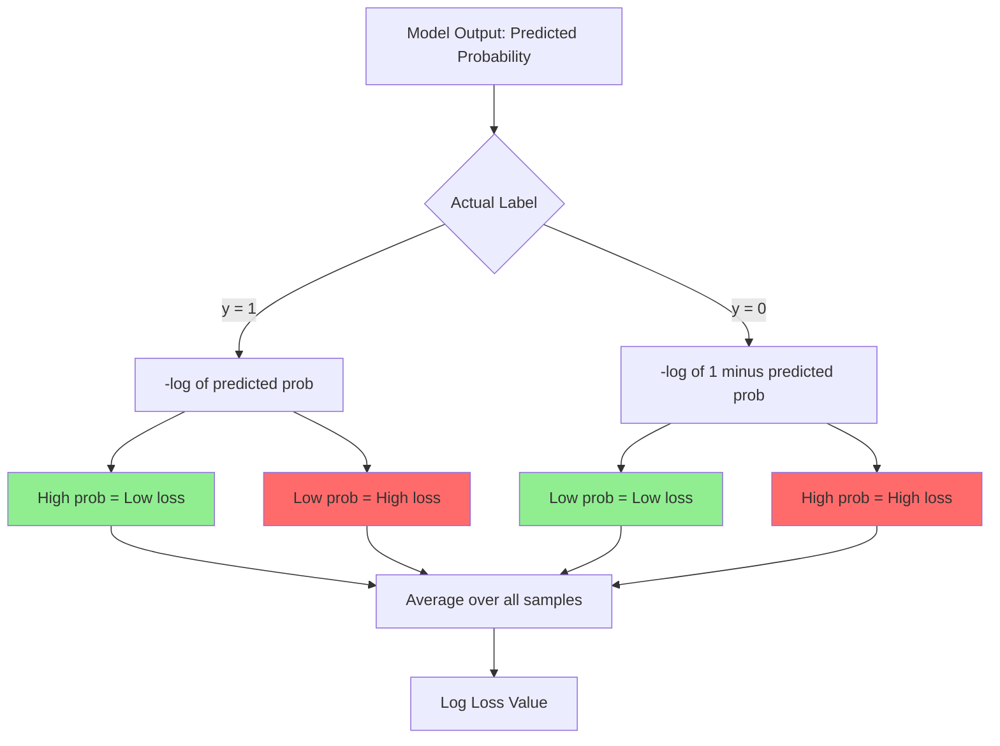
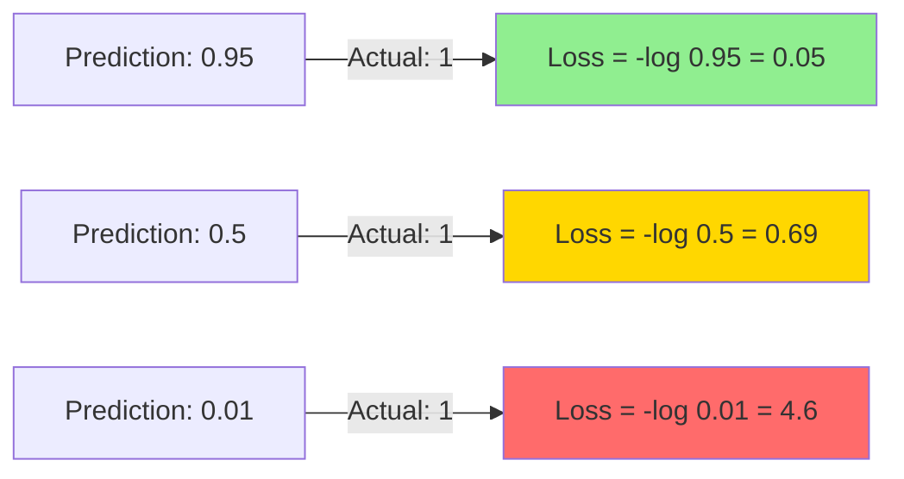

# Logarithmic loss (or cross-entropy)

**Published:** 2019-08-25

Logarithmic loss (or cross-entropy) measures the performance of a classification model where the prediction input is a probability value between 0 and 1.

The goal of our machine learning models is to minimize this value. It is also heavily used in Kaggle competitions to estimate the score of submissions.

A perfect model would have a log loss of 0. Log loss increases as the predicted probability diverge from the actual label. So predicting a probability of .012 when the actual observation label is 1 would be bad and result in a high log loss.

We compute log loss by this formula for binary classifiers:

Lets take an example

x(Input)y(Actual label)y^(Prediction or probability of class label=1)x110.95x200.91x310.87x410.65x500.7

log loss = -[(log(0.95) + log(0.09)+log(0.87)+log(0.65)+log(0.3))]/5

Log loss can be defined as average negative log of probability of correct clas label.

here is a plot of -log(x)

As we can see form above figure, the  smaller the log loss, the better it is. 

### Multiclass Log loss

The formula we discussed above only holds for binary classifiers. For multiclass log loss estimation we use: