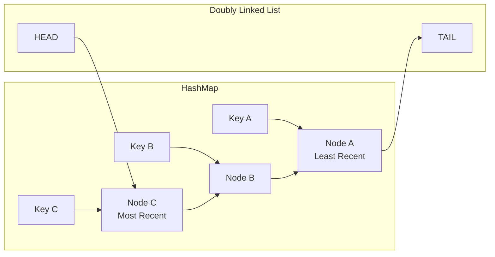
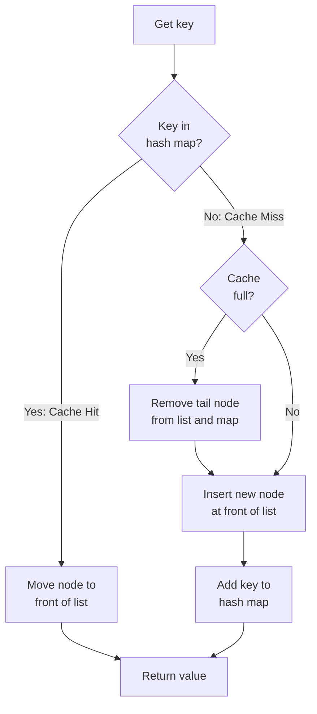
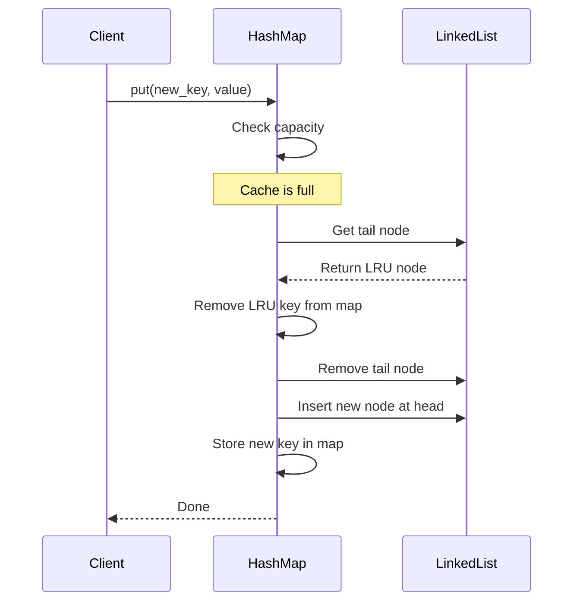

# LRU Caches in Python

**Published:** 2022-12-24

The **Least Recently Used** (LRU) cache is a cache eviction algorithm that organizes elements in order of use. In LRU, as the name suggests, the element that hasn't been used for the longest time will be evicted from the cache.

## LRU Cache Data Structure

An LRU cache combines a **doubly linked list** with a **hash map** to achieve O(1) time complexity for both lookups and evictions. The hash map provides fast key-based access, while the doubly linked list maintains the usage order.

## Cache Hit vs Cache Miss Flow

When a key is accessed, the cache either finds it (hit) or does not (miss). On a hit, the node is moved to the front. On a miss, a new node is inserted at the front and the least recently used node may be evicted if the cache is full.

## Eviction Process

When the cache reaches capacity and a new entry must be added, the eviction process removes the least recently used item from the tail of the doubly linked list.

