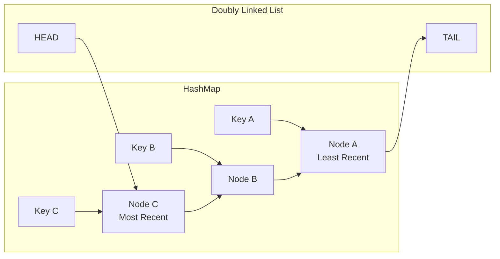
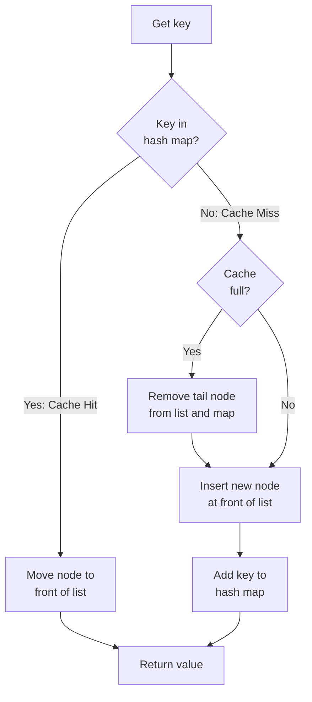
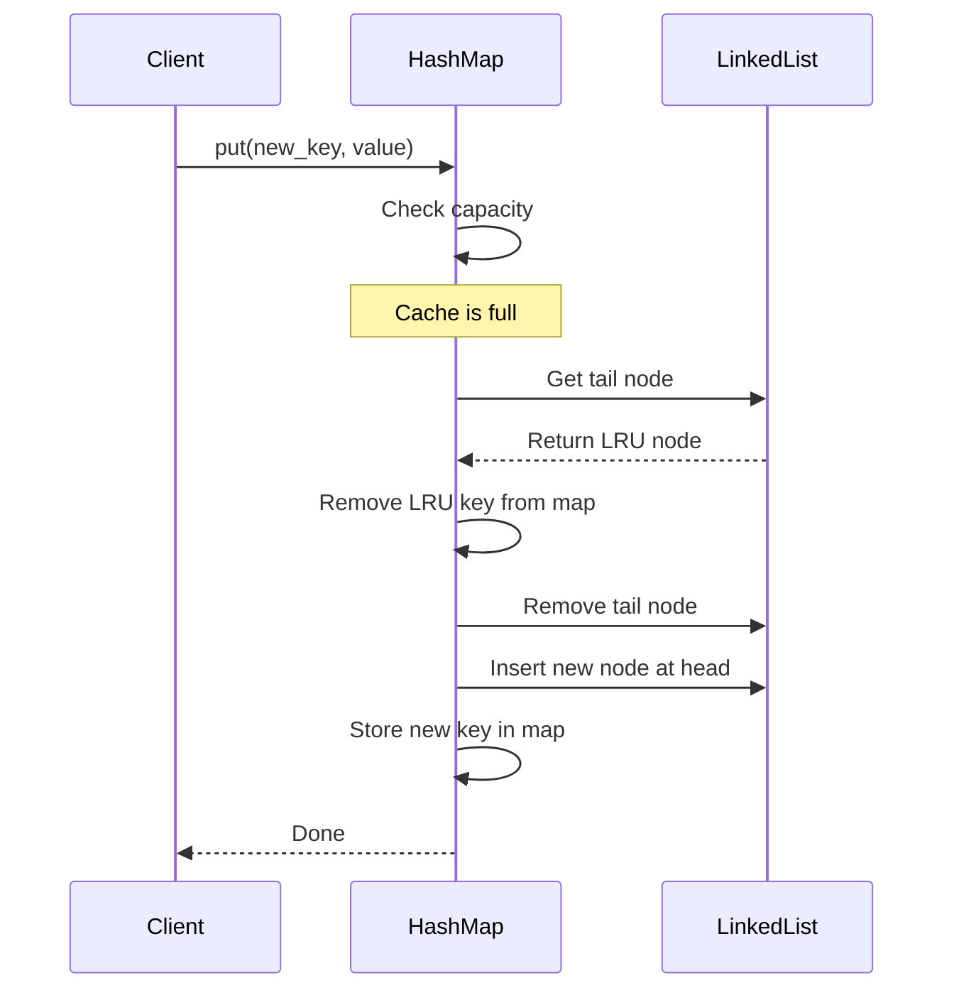

# LRU Caches in Python

**Published:** 2022-12-24


The **Least Recently Used** (LRU) cache is a cache eviction algorithm that organizes elements in order of use. In LRU, as the name suggests, the element that hasn't been used for the longest time will be evicted from the cache.

## LRU Cache Data Structure

An LRU cache combines a **doubly linked list** with a **hash map** to achieve O(1) time complexity for both lookups and evictions. The hash map provides fast key-based access, while the doubly linked list maintains the usage order.



## Cache Hit vs Cache Miss Flow

When a key is accessed, the cache either finds it (hit) or does not (miss). On a hit, the node is moved to the front. On a miss, a new node is inserted at the front and the least recently used node may be evicted if the cache is full.



## Implementation from Scratch

Here is a complete LRU cache implementation in Python using a doubly linked list and a dictionary:

```python
class Node:
    def __init__(self, key, value):
        self.key = key
        self.value = value
        self.prev = None
        self.next = None


class LRUCache:
    def __init__(self, capacity: int):
        self.capacity = capacity
        self.cache = {}  # key -> Node

        # Sentinel nodes to avoid edge cases
        self.head = Node(0, 0)
        self.tail = Node(0, 0)
        self.head.next = self.tail
        self.tail.prev = self.head

    def _remove(self, node: Node):
        """Remove a node from the linked list."""
        node.prev.next = node.next
        node.next.prev = node.prev

    def _add_to_front(self, node: Node):
        """Insert a node right after head (most recent position)."""
        node.next = self.head.next
        node.prev = self.head
        self.head.next.prev = node
        self.head.next = node

    def get(self, key: int) -> int:
        if key in self.cache:
            node = self.cache[key]
            self._remove(node)
            self._add_to_front(node)
            return node.value
        return -1

    def put(self, key: int, value: int):
        if key in self.cache:
            self._remove(self.cache[key])

        node = Node(key, value)
        self.cache[key] = node
        self._add_to_front(node)

        if len(self.cache) > self.capacity:
            # Evict the least recently used (node before tail)
            lru = self.tail.prev
            self._remove(lru)
            del self.cache[lru.key]
```

Usage:

```python
cache = LRUCache(2)

cache.put(1, 10)
cache.put(2, 20)
print(cache.get(1))   # 10 — moves key 1 to front

cache.put(3, 30)       # evicts key 2 (least recently used)
print(cache.get(2))   # -1 — key 2 was evicted
print(cache.get(3))   # 30
```

The sentinel head and tail nodes are the key trick here. They eliminate all the `if node is None` checks that would otherwise clutter every insert and remove operation. Every real node always has a valid `prev` and `next`, so `_remove` and `_add_to_front` are clean two-liner pointer swaps.

## Using Python's Built-in `functools.lru_cache`

For most real-world use cases, you do not need to implement LRU from scratch. Python's standard library provides `functools.lru_cache` as a decorator:

```python
from functools import lru_cache

@lru_cache(maxsize=128)
def fibonacci(n):
    if n < 2:
        return n
    return fibonacci(n - 1) + fibonacci(n - 2)

print(fibonacci(50))  # 12586269025 — computed instantly

# Inspect cache statistics
print(fibonacci.cache_info())
# CacheInfo(hits=48, misses=51, maxsize=128, currsize=51)

# Clear the cache
fibonacci.cache_clear()
```

The `maxsize` parameter controls capacity. Set `maxsize=None` for an unbounded cache (no eviction, useful when you know the keyspace is small). The decorator only works with **hashable** arguments since it uses a dictionary internally.

For class methods or when you need a cache scoped to an instance, be aware that `self` becomes part of the cache key. This means different instances maintain separate cache entries:

```python
from functools import lru_cache

class DatabaseClient:
    def __init__(self, host: str):
        self.host = host

    @lru_cache(maxsize=64)
    def query(self, sql: str) -> list:
        # expensive database call
        print(f"Executing: {sql}")
        return [{"result": "data"}]

client = DatabaseClient("localhost")
client.query("SELECT * FROM users")  # executes
client.query("SELECT * FROM users")  # cache hit, no execution
```

## Eviction Process

When the cache reaches capacity and a new entry must be added, the eviction process removes the least recently used item from the tail of the doubly linked list.


