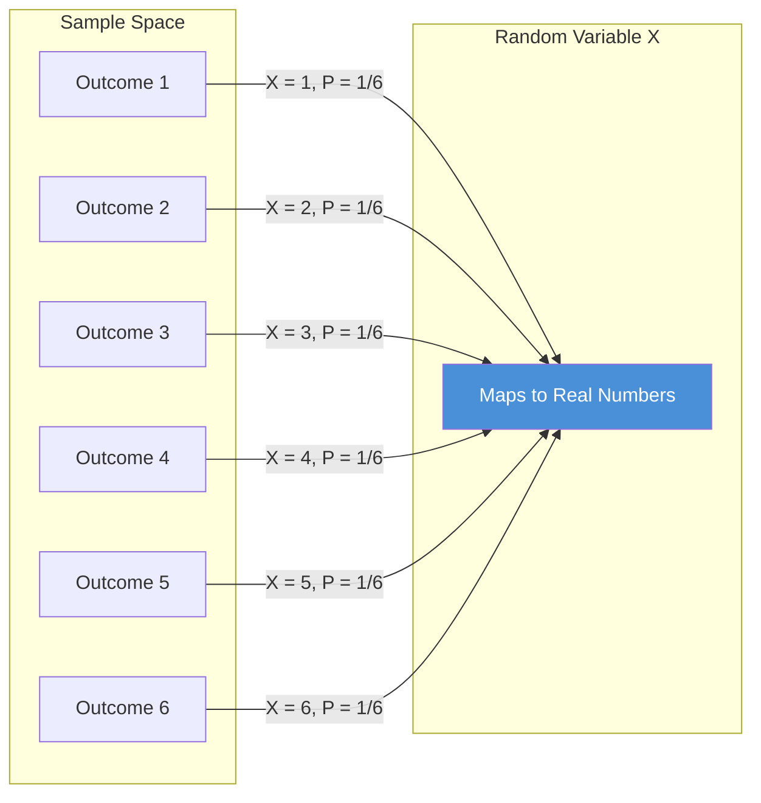
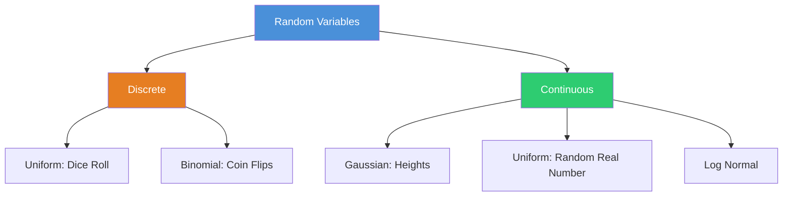
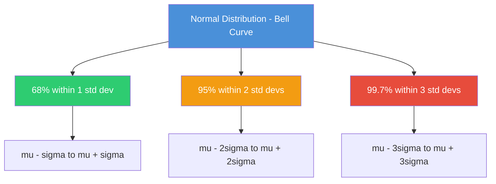

# Maths 101: Part 3: Random variables and Normal Distribution

**Published:** 2019-01-26


### **Random Variables**
The term random variable is not very descriptive.

A better term is measurement function.Consider tossing a fair six-sided die. There are only six outcomes possible,

Omega = {1, 2, 3, 4, 5, 6}

As we know, if the die is fair, then the probability of each outcome is 1/6. To say this formally, the measure of each set (i.e., {1}, {2}, . . . , {6}) is

P({1}) = P({2}) . . . = P({6}) = 1/6.

In other words, every number on the dice is equally probable.

Here we can define a measurement function.

In general, The measurement function maps a set into a number on the real line.

For example, In a throw of dice, we can define our random variable, we can define our measurement function as the probability of each outcome

X --> Value of random variable

{1} --> 1/6

{2} --> 1/6

;

:

{6} -->  1/6



Here is how you can simulate a discrete random variable like a dice roll in Python and compute its mean and variance:

```python
import numpy as np

# Simulate 10,000 dice rolls (discrete uniform random variable)
rolls = np.random.randint(1, 7, size=10000)

print(f"Sample mean: {rolls.mean():.3f}")       # Expected: 3.5
print(f"Sample variance: {rolls.var():.3f}")     # Expected: 2.917
print(f"Theoretical mean: {(1+2+3+4+5+6)/6:.3f}")
print(f"Theoretical variance: {np.mean([(x - 3.5)**2 for x in range(1,7)]):.3f}")
```

Random variables are of different types.

They could be

- Discrete
- Continuous

If you don't know what these are don't worry we will cover this in future parts.

The throwing dice is an example of discrete random variables. There are also continuous random variables. For eg, the height of students in a class etc.

The way the data is distributed in the graph is called the distribution of the data.

Random variables are also classified by their distributions for eg. Gaussian, uniform, log normal etc.



Examples of Gaussian distribution would include the height of students in a class and examples of uniform distribution would include tossing a coin or throwing a dice where each outcome is equally probable.

That being said it doesn't mean all uniform random variable are discrete and all Gaussian random variable is continuous. We can have a continuous uniform random variable.

### **Normal Distribution**
In probability theory, the normal (or Gaussian or Gauss or Laplace-Gauss) distribution is a very common continuous probability distribution.

Normal distributions are important in statistics and are often used in the natural and social sciences to represent real-valued random variables whose distributions are not known.

A random variable with a Gaussian distribution is said to be normally distributed and is called a normal deviate.

#### The 68-95-99.7 rule for a Normal Distribution
The normal distribution is commonly associated with the 68-95-99.7 rule which you can see in the image above.

Further one can see that roughly 68% of the data lies within 1 standard deviation of the mean.

Similarly, we can say that around 95% of the data is within 2 standard deviations of the mean, and 99.7% of the data is within 3 standard deviations of the mean.



You can plot a normal distribution and verify the 68-95-99.7 rule in Python:

```python
import numpy as np
import matplotlib.pyplot as plt
from scipy import stats

mu, sigma = 0, 1
x = np.linspace(mu - 4*sigma, mu + 4*sigma, 1000)
pdf = stats.norm.pdf(x, mu, sigma)

plt.figure(figsize=(8, 4))
plt.plot(x, pdf, 'k-', linewidth=2)
plt.fill_between(x, pdf, where=(x >= mu-sigma) & (x <= mu+sigma), alpha=0.4, label='68%')
plt.fill_between(x, pdf, where=(x >= mu-2*sigma) & (x <= mu+2*sigma), alpha=0.25, label='95%')
plt.fill_between(x, pdf, where=(x >= mu-3*sigma) & (x <= mu+3*sigma), alpha=0.1, label='99.7%')
plt.legend()
plt.title("Normal Distribution: 68-95-99.7 Rule")
plt.xlabel("x")
plt.ylabel("Density")
plt.show()

# Verify with random samples
samples = np.random.normal(mu, sigma, 100000)
print(f"Within 1 std dev: {np.mean(np.abs(samples - mu) <= sigma)*100:.1f}%")
print(f"Within 2 std devs: {np.mean(np.abs(samples - mu) <= 2*sigma)*100:.1f}%")
print(f"Within 3 std devs: {np.mean(np.abs(samples - mu) <= 3*sigma)*100:.1f}%")
```

#### Skewness
is the measure of how much distributions look departed from the symmetry. Distributions can be positive or negative skewed.

For example, for measurements that cannot be negative, which is usually the case, we can infer that the data have a skewed distribution if the standard deviation is more than half

the mean.

Such an asymmetry is referred to as positive skewness.

The opposite, negative skewness, is rare.

You can compute and visualize skewness using scipy:

```python
import numpy as np
from scipy import stats

# Positively skewed data (e.g., income distribution)
positive_skew = np.random.exponential(scale=2.0, size=10000)

# Symmetric data (normal distribution)
symmetric = np.random.normal(loc=5, scale=1, size=10000)

print(f"Exponential skewness: {stats.skew(positive_skew):.3f}")  # Positive
print(f"Normal skewness: {stats.skew(symmetric):.3f}")           # Near zero
```

#### Kurtosis
In layman terms, Kurtosis is a measure of the "peakedness" of the probability distribution.

However that is not accurate, read **Peter Westfall's comments below why that is not the case.**

Distributions with negative or positive excess kurtosis are called platykurtic distributions or leptokurtic distributions, respectively.

Hope you liked it and let us know what you think in the comments.

**Link to All Maths 101 posts**

Maths 101: Part 1: Data Types and their visualization

Math 101: Part 2: Measures of central tendency and Skewness

Maths 101: Part 3: Random variables and Normal Distribution

Maths 101: Part 4: PDF, Central Limit Theorem and Chebyshev's inequality
