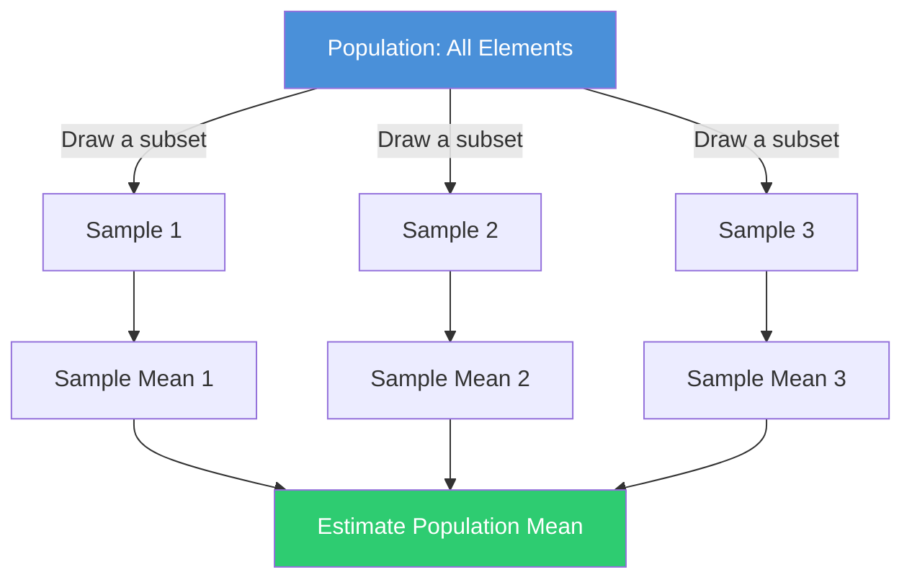
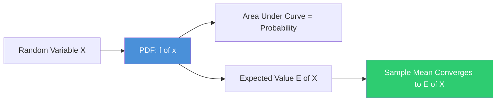
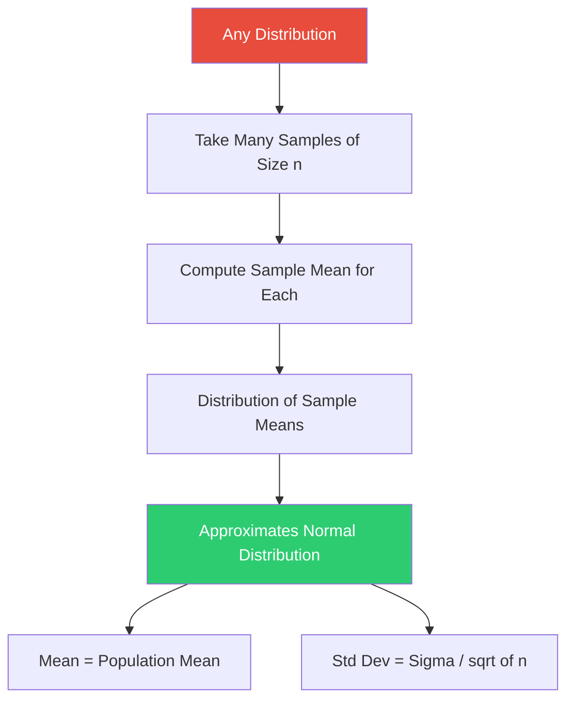
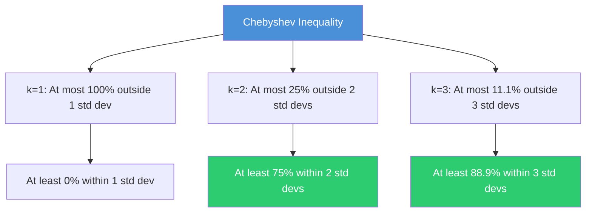

# Maths 101: Part 4: PDF, Central Limit Theorem and Chebyshev\u2019s inequality

**Published:** 2019-02-09


#### Populations and Samples
The main difference between a population and a sample has to do with how

observations are assigned to the data set

*Population Includes all of the elements from a set of data.*

*Sample Consists of one or more observations from the population.*



### Probability Density function(PDF)
The PDF, or density of a continuous random variable, is a function that describes

the relative likelihood of a random variable X to take on a given value x.

In the mathematical fields of probability and statistics, a random variate x is a particular

outcome of a random variable X: the random variates which are other outcomes of

the same random variable might have different values.

The PDF also defines the expected value E[X] of a continuous distribution of X.

The expected value is a function of the probability distribution of the observed

value in our population. Moreover The sample mean of our sample is the observed mean value of our data.

Further If the experiment has been designed correctly, the sample mean

should converge to the expected value as more and more samples are included in the

analysis.



Here is how to plot the PDF of several common distributions and compute expected values:

```python
import numpy as np
import matplotlib.pyplot as plt
from scipy import stats

x = np.linspace(-5, 10, 1000)

# Define several distributions
distributions = {
    "Normal (mu=2, sigma=1)": stats.norm(loc=2, scale=1),
    "Exponential (lambda=1)": stats.expon(scale=1),
    "Uniform (0, 5)": stats.uniform(loc=0, scale=5),
}

plt.figure(figsize=(8, 4))
for name, dist in distributions.items():
    pdf = dist.pdf(x)
    ev = dist.mean()
    plt.plot(x, pdf, label=f"{name}, E[X]={ev:.2f}")

plt.title("Probability Density Functions")
plt.xlabel("x")
plt.ylabel("f(x)")
plt.legend()
plt.xlim(-3, 8)
plt.show()
```

### **Central Limit Theorem**
In probability theory, the central limit theorem (CLT) establishes that, in some situations, when independent random variables are added, their properly normalized sum tends toward a normal distribution (informally a "bell curve") even if the original variables themselves are not normally distributed.

The theorem is a key ("central") concept in probability theory because it implies that probabilistic and statistical methods that work for normal distributions can be applicable to many problems involving other types of distributions.

For example, suppose that a sample is obtained containing a large number of observations, each observation being randomly generated in a way that does not depend on the values of the other observations, and that the arithmetic average of the observed values is computed.

If this procedure is performed many times, the central limit theorem says that the distribution of the average will be closely approximated by a normal distribution.

A simple example of this is that if one flips a coin many times the probability of getting a given number of heads in a series of flips will approach a normal curve, with mean equal to half the total number of flips in each series. (In the limit of an infinite number of flips, it will equal a normal curve.)



The following example demonstrates the CLT by drawing samples from a heavily skewed exponential distribution and showing that the distribution of sample means becomes normal:

```python
import numpy as np
import matplotlib.pyplot as plt

np.random.seed(42)
population = np.random.exponential(scale=2.0, size=100000)

sample_sizes = [2, 5, 30]
fig, axes = plt.subplots(1, 3, figsize=(14, 4))

for ax, n in zip(axes, sample_sizes):
    sample_means = [np.mean(np.random.choice(population, size=n)) for _ in range(5000)]
    ax.hist(sample_means, bins=50, density=True, alpha=0.7)
    ax.set_title(f"Sample size n={n}")
    ax.set_xlabel("Sample Mean")

fig.suptitle("CLT: Sample Means from Exponential Distribution")
plt.tight_layout()
plt.show()

# As n grows, the distribution of sample means approaches a normal distribution
# with mean = population mean and std = population std / sqrt(n)
print(f"Population mean: {population.mean():.3f}")
print(f"Population std:  {population.std():.3f}")
```

### Chebyshev's inequality
In probability theory, Chebyshev's inequality (also called the Bienayme-Chebyshev inequality) guarantees that, for a wide class of probability distributions, no more than a certain fraction of values can be more than a certain distance from the mean.

Specifically, no more than 1/k2 of the distribution's values can be more than k standard deviations away from the mean (or equivalently, at least 1-1/(k^2) of the distribution's values are within k standard deviations of the mean). The rule is often called Chebyshev's theorem, about the range of standard deviations around the mean, in statistics.

The inequality has great utility because it can be applied to any probability distribution in which the mean and variance are defined.



You can verify Chebyshev's inequality empirically with any distribution that has a finite mean and variance:

```python
import numpy as np

np.random.seed(0)
# Use a skewed distribution to show the inequality is universal
data = np.random.exponential(scale=2.0, size=100000)
mu = data.mean()
sigma = data.std()

for k in [1, 2, 3, 4]:
    within = np.mean(np.abs(data - mu) <= k * sigma) * 100
    chebyshev_lower = max(0, (1 - 1/k**2)) * 100
    print(f"k={k}: {within:.1f}% within k*sigma "
          f"(Chebyshev guarantees >= {chebyshev_lower:.1f}%)")
```

Note the only requirement for applying Chebyshev's inequality is that it has fixed mean.
