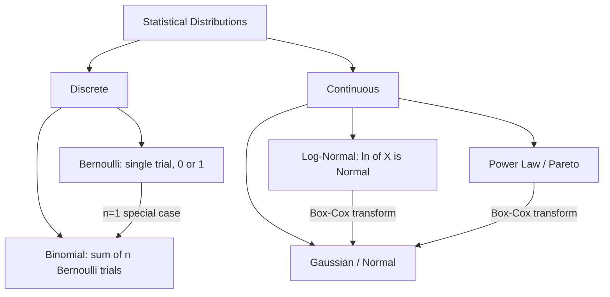
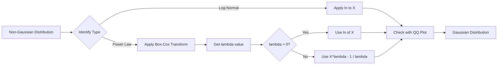

# Maths 101: Part 5: Different Types of Distribution

**Published:** 2019-02-23


## Types of Distributions


#### **Bernoulli and Binomial distribution**
A Bernoulli random variable has two possible outcomes: 0 or 1. A binomial distribution is the sum of independent and identically distributed Bernoulli random variables.

So, for example, say I have a coin, and, when tossed, the probability it lands heads is p. So the probability that it lands tails is 1−p (there are no other possible outcomes for the coin toss). If the coin lands heads, you win one dollar. If the coin lands tails, you win nothing.

For a single coin toss, the probability you win one dollar is p. The random variable that represents your winnings after one coin toss is a Bernoulli random variable.

Now, if you toss the coin 5 times, your winnings could be any whole number of dollars from zero dollars to five dollars, inclusive. The probability that you win five dollars is p5, because each coin toss is independent of the others, and for each coin toss the probability of heads is p.

What is the probability that you win exactly three dollars in five tosses? That would require you to toss the coin five times, getting exactly three heads and two tails. This can be achieved with probability (5C3)p^3(1−p)^2. And, in general, if there are n Bernoulli trials, then the sum of those trials is binomially distributed with parameters n and p.

Note that a binomial random variable with parameter n=1 is equivalent to a Bernoulli random variable, i.e. there is only one trial.

### Log Normal Distribution
A log-normal (or lognormal) distribution is a continuous probability distribution of a random variable whose logarithm is normally distributed. Thus, if the random variable X is log-normally distributed, then Y = ln(X) has a normal distribution.

Applications in Human behaviors
The length of comments posted in Internet discussion forums follows a log-normal distribution.

Users' dwell time on online articles (jokes, news etc.) follows a log-normal distribution.

The length of chess games tends to follow a log normal distribution.

How to check whether a distribution or random variable X is log distributed
For each of the points in X, we find the natural log of them. This will give us a new random variable Y.

For eg y1=ln(x1),y2=ln(x2), y3=ln(x3), y4=ln(x4)

Then apply QQ plots on Y to check if it's normally distributed.

#### Power Transformation
A power law is a functional relationship between two quantities, where a relative change in one quantity results in a proportional relative change in the other quantity, independent of the initial size of those quantities: one quantity varies as a power of another.

For instance, considering the area of a square in terms of the length of its side, if the length is doubled, the area is multiplied by a factor of four.

Pareto Distribution is a special case of Power transformation distribution.

As value of alpha decrease the tail becomes fatter.

**So how do we find if a distribution is power log distribution.** We draw log-log plots which should be a straight line.This method consists of plotting the logarithm of an estimator of the probability that a particular number of the distribution occurs versus the logarithm of that particular number.

Usually, this estimator is the proportion of times that the number occurs in the data set. If the points in the plot tend to "converge" to a straight line for large numbers in the x axis, then we can conclude that the distribution has a power-law tail.

 



#### Box Cox Transformation
So for transforming log-normal distribution to gaussian distributions we use the log of the random variable. What to do in case of power law or pareto distributions.

Here comes the box cox method into picture for transforming power law distribution to gaussian distribution.

So the idea is we apply box-cox method on a Random variable X which gives us lambda.

lambda=box-cos(x) where x is a point in power law distribution

To convert it to a gaussian distribution, if a point x lies in power law transform the corresponding x' in gaussian distributition would be

 if lambda !=0

else for lambda=0(or tending to zero)

 

We often use QQPlots to plot pdf(probability plot). Here is a code snippet that generates a normal and then a random uniform variable and then plot it.

```python
import numpy as np
import scipy.stats as stats
import matplotlib.pyplot as plt

# Generate normal and uniform random variables
normal_data = np.random.normal(loc=0, scale=1, size=1000)
uniform_data = np.random.uniform(low=0, high=1, size=1000)

fig, axes = plt.subplots(1, 2, figsize=(12, 5))

# QQ plot for normal data
stats.probplot(normal_data, dist="norm", plot=axes[0])
axes[0].set_title("QQ Plot: Normal Distribution")

# QQ plot for uniform data
stats.probplot(uniform_data, dist="norm", plot=axes[1])
axes[1].set_title("QQ Plot: Uniform Distribution")

plt.tight_layout()
plt.show()
```