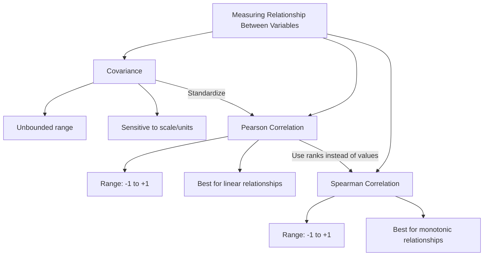
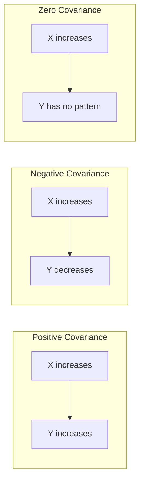

# Maths 101 : Part 6: Measuring relationship between two Random Variables

**Published:** 2019-03-11


Suppose you have taken the data for heights and weights of students in class and you want to figure out the correlation between heights and weights of students.

The relation between these two parameters is defined mathematically by one of the 3 ways

1) Covariance

2) Pearson Correlation Coefficient

3) Spearman's rank correlation coefficient

Each of these metrics has its own pros and cons so let's dive deeper into them.



 

### Covariance

Covariance is a measure of the joint variability of two random variables.

If the greater values of one variable mainly correspond with the greater values of the other variable, and the same holds for the lesser values, (i.e., the variables tend to show similar behavior), the covariance is positive.

In the opposite case, when the greater values of one variable mainly correspond to the lesser values of the other, (i.e., the variables tend to show the opposite behavior), the covariance is negative.

The sign of the covariance, therefore, shows the tendency in the linear relationship between the variables

 

In case we want to the covariance of a variable with respect to itself, it is always zero.

 

A simple way to understand covariance is by using this graph as an example

In this we can see stock market returns increase as economic growth increases and vice versa, hence we can say these two are positively correlated.

Further gasoline prices and world oil production decrease as the other increase and we can say they are negatively correlated.

The reason why monotonically increasing seems to have positive covariance is because for any point they will be either above mean or below mean and hence make overall covariance +tive.

**Note**

1) The magnitude of covariance has nothing to do with the amount of overlap. Let's say something has a covariance of 5 doesn't mean anything.

In fact, even if we change the units of heights and weights from cms to feet,

lbs to kgs the covariance for the same dataset will change.

What if we standardize the datasets before applying covariance, that becomes correlation and that can tell how much the data is correlated.

2) **However, if there are outliers in the dataset, we may have a situation where covariance is -time for monotonically increasing relation.**

```python
import numpy as np
import matplotlib.pyplot as plt

np.random.seed(42)

# Generate correlated data: heights (cm) and weights (kg)
n = 200
heights = np.random.normal(170, 10, n)
weights = 0.5 * heights + np.random.normal(0, 5, n)  # positively correlated

# Compute covariance matrix
cov_matrix = np.cov(heights, weights)
print(f"Covariance(height, weight): {cov_matrix[0, 1]:.2f}")
print(f"Variance(height): {cov_matrix[0, 0]:.2f}")
print(f"Variance(weight): {cov_matrix[1, 1]:.2f}")

# Scatter plot showing positive covariance
plt.figure(figsize=(7, 5))
plt.scatter(heights, weights, alpha=0.5, s=20)
plt.xlabel("Height (cm)")
plt.ylabel("Weight (kg)")
plt.title(f"Positive Covariance: {cov_matrix[0, 1]:.2f}")
plt.tight_layout()
plt.show()
```



### Pearson correlation coefficient
The Pearson correlation coefficient (PCC), also referred to as Pearson's r, the Pearson product-moment correlation coefficient (PPMCC) or the bivariate correlation, is a measure of the linear correlation between two variables X and Y.

Owing to the Cauchy–Schwarz inequality it has a value between +1 and −1,

where 1 is the total positive linear correlation,

0 is no linear correlation,

and −1 is the total negative linear correlation

 

ρ =1 when there is a positive and perfect correlation.

A naive example of this would be the height of a group of individuals in cms and inches.

0< ρ <1 means there is some correlation but a higher Pearson correlation coefficient (PCC) implies more correlation.

Similarly when -1< ρ <0 means they are inversely related and lower the ρ means higher inverse correlation.

ρ =0 when we can't establish a correlation

**PCC is good when we a linear relationship but doesn't that well for nonlinear relations**

```python
import numpy as np
from scipy.stats import pearsonr
import matplotlib.pyplot as plt

np.random.seed(42)
n = 200

# Linear relationship
x = np.random.normal(0, 1, n)
y_linear = 2 * x + np.random.normal(0, 0.5, n)

# Nonlinear (quadratic) relationship
y_quadratic = x**2 + np.random.normal(0, 0.3, n)

fig, axes = plt.subplots(1, 2, figsize=(12, 5))

r_lin, _ = pearsonr(x, y_linear)
axes[0].scatter(x, y_linear, alpha=0.5, s=20)
axes[0].set_title(f"Linear: Pearson r = {r_lin:.3f}")
axes[0].set_xlabel("X")
axes[0].set_ylabel("Y")

r_quad, _ = pearsonr(x, y_quadratic)
axes[1].scatter(x, y_quadratic, alpha=0.5, s=20)
axes[1].set_title(f"Quadratic: Pearson r = {r_quad:.3f} (misleading)")
axes[1].set_xlabel("X")
axes[1].set_ylabel("Y")

plt.tight_layout()
plt.show()
```

 

### Spearman's rank correlation coefficient
Spearman's rank correlation coefficient or Spearman's rho, named after Charles Spearman and often denoted by the Greek letter ρ(rho) .

It is a nonparametric measure of rank correlation (statistical dependence between the rankings of two variables).

It assesses how well the relationship between two variables can be described using a monotonic function.

The Spearman correlation between the two variables is equal to the Pearson correlation between the rank values of those two variables; while Pearson's correlation assesses linear relationships.

Spearman's correlation assesses monotonic relationships (whether linear or not).

If there are no repeated data values, a perfect Spearman correlation of +1 or −1 occurs when each of the variables is a perfect monotone function of the other.

**Spearman’s correlation coefficient does not take into consideration the linear or not.**

```python
import numpy as np
from scipy.stats import pearsonr, spearmanr
import matplotlib.pyplot as plt

np.random.seed(42)
n = 200

# Monotonic but nonlinear relationship (exponential)
x = np.random.uniform(0, 3, n)
y = np.exp(x) + np.random.normal(0, 0.5, n)

r_pearson, _ = pearsonr(x, y)
r_spearman, _ = spearmanr(x, y)

print(f"Pearson r:  {r_pearson:.3f}  (underestimates nonlinear association)")
print(f"Spearman r: {r_spearman:.3f} (captures monotonic relationship)")

plt.figure(figsize=(7, 5))
plt.scatter(x, y, alpha=0.5, s=20)
plt.xlabel("X")
plt.ylabel("Y = exp(X) + noise")
plt.title(f"Pearson r={r_pearson:.3f}, Spearman r={r_spearman:.3f}")
plt.tight_layout()
plt.show()
```

 

**Note**

**Correlation Doesn't imply Causation**

The statement means just because there is some relation with respect to increase or decrease of one variable with respect to another. It doesn't mean they cause one another.

 

 

 

If you took anything from the blog post, it is  please don't buy the rock 😛