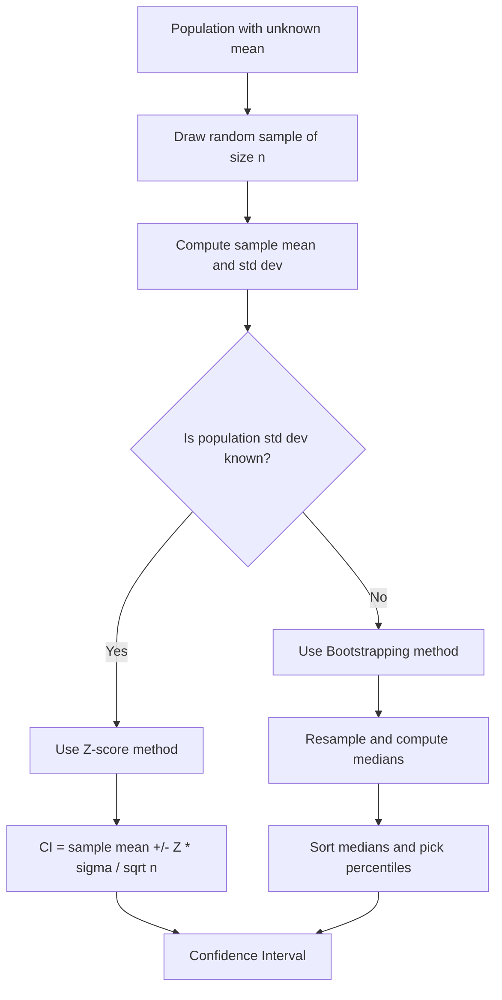
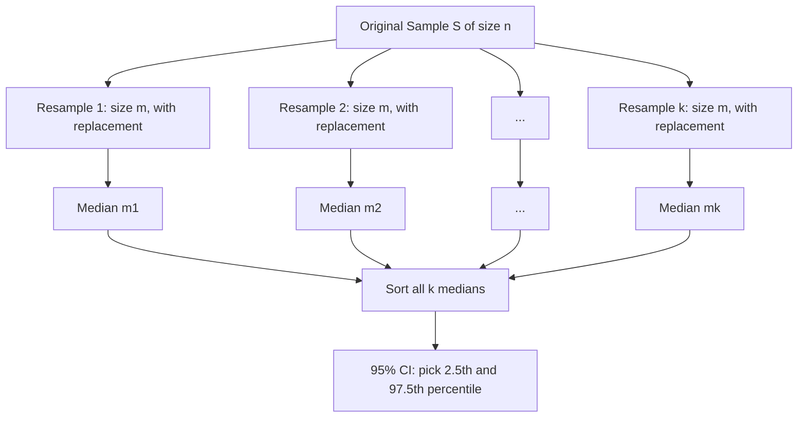

# Maths 101 : Part 7: Estimating Confidence Intervals

**Published:** 2019-03-23


In statistics, a confidence interval (CI) is a type of interval estimate which we compute using the statistics of the observed data.

The interval has an associated confidence level that, loosely speaking, quantifies the level of confidence that the value of the parameter lies in the interval.

For eg, if we want to determine the average salary of people in a country, we would say with 95% confidence that the mean salary lies between 60,000$ and 80,000$.

The % value is what I call confidence value and the range (60k-80k) is called a confidence interval.



Let's understand it with an example.

Let's say we have a population of data which contain weights of all students in a class.

In this population, we can pick a random variable which is a sample(randomly selected) of n=10 students {x1,x2,...x10}.

Now if we find the mean of the sample and compare it to mean of the population. We will see that the mean of the sample is very similar to mean of the population(not equal to(It may or may not be equal), but similar to).

µ(sample) ≅ µ(population)

In fact, as we increase the number of students in the sample (n), we see the mean of the sample becomes closer to mean of the population.

Here is a quick Python example demonstrating how the sample mean converges toward the population mean as the sample size grows:

```python
import numpy as np

np.random.seed(42)
population = np.random.normal(loc=160, scale=10, size=10000)
pop_mean = np.mean(population)

for n in [10, 50, 100, 500, 1000]:
    sample = np.random.choice(population, size=n, replace=False)
    print(f"n={n:>4d}  sample_mean={np.mean(sample):.2f}  pop_mean={pop_mean:.2f}")
```

#### **Point Estimate vs Interval estimate**

The question of confidence intervals (or interval estimates) comes in when we don't know the real mean value of the population and all we know is the mean of the sample.

Here we can say with some degree of certainty/confidence/higher probability that the mean of the population is within a particular range.

**Example**

Let's say for our sample of n = 10 students, our mean of the sample is µ = 160 lbs and the standard deviation is σ=10 lbs.

Now since we know that the distribution is Gaussian for weights of students in a general population, we can say

The mean of the population

lies between [140,180 ] lbs with 95.4% probability.

This estimation is called point estimate and the range is called confidence interval.

### **Methods of finding confidence intervals**

#### **Case 1: if we know the standard deviation of the population**.
If σ(population) is known, we can say that if we have taken n samples,

In that case, we can say,

Here if we want to have a confidence level of 95%, we will have to take the value of Z as 2.

Here is how to compute a confidence interval using z-scores in Python when the population standard deviation is known:

```python
import numpy as np
from scipy import stats

sample = np.array([155, 162, 148, 170, 158, 165, 152, 160, 168, 145])
sample_mean = np.mean(sample)
sigma = 10        # known population std dev
n = len(sample)
confidence = 0.95

z = stats.norm.ppf((1 + confidence) / 2)   # z-score for 95% CI
margin = z * sigma / np.sqrt(n)

print(f"Sample mean: {sample_mean:.2f}")
print(f"Z-score for 95% CI: {z:.4f}")
print(f"95% CI: [{sample_mean - margin:.2f}, {sample_mean + margin:.2f}]")
```

When the population standard deviation is unknown, use a t-distribution instead:

```python
import numpy as np
from scipy import stats

sample = np.array([155, 162, 148, 170, 158, 165, 152, 160, 168, 145])
sample_mean = np.mean(sample)
sample_std = np.std(sample, ddof=1)   # sample std dev (Bessel's correction)
n = len(sample)
confidence = 0.95

t = stats.t.ppf((1 + confidence) / 2, df=n - 1)
margin = t * sample_std / np.sqrt(n)

print(f"t-score for 95% CI (df={n-1}): {t:.4f}")
print(f"95% CI: [{sample_mean - margin:.2f}, {sample_mean + margin:.2f}]")
```

#### **Case 2: If we don't know the standard deviation of the population**
Confidence interval using bootstrapping


Let's say we want to find the 95% confidence interval for the median.

So when we find the sample of size n: S: {x1,x2,x3...xn}

n=10

From this we will take a sample of size m:

{x11,x12,...x1m} such that m<=n

So what we do is create samples of our sampled data using a uniform random variable. These samples may contain repetitions.

Similarly we can take k such samples

{x21,x22,...x2m}

{x31,x32,...x3m}

:

:

:

{xk1,xk2,...xkm}

Then we find the medians of these k sample sets that we created.

{x21,x22,...x2m} --> m1

{x31,x32,...x3m} -->m2

:

:

:

{xk1,xk2,...xkm} --> mk

So now we have a set of k medians {m1,m2...mk}

Lets say k=1000.

After that, we sort these samples and then we can say our confidence interval lies between m25 and m975.

A similar calculation is made for calculating the variance, mean and standard deviation. This method is called non-parametric technique since it doesn't make any assumptions about the data.

Here is a complete Python implementation of bootstrap confidence intervals:

```python
import numpy as np

np.random.seed(42)
sample = np.array([155, 162, 148, 170, 158, 165, 152, 160, 168, 145])

k = 10000  # number of bootstrap resamples
bootstrap_medians = np.array([
    np.median(np.random.choice(sample, size=len(sample), replace=True))
    for _ in range(k)
])

lower = np.percentile(bootstrap_medians, 2.5)
upper = np.percentile(bootstrap_medians, 97.5)

print(f"Original sample median: {np.median(sample):.2f}")
print(f"95% Bootstrap CI for the median: [{lower:.2f}, {upper:.2f}]")
```

You can also visualize the confidence interval to get an intuitive feel for the range:

```python
import numpy as np
import matplotlib.pyplot as plt
from scipy import stats

np.random.seed(42)
sample = np.random.normal(loc=160, scale=10, size=30)
sample_mean = np.mean(sample)
se = stats.sem(sample)
ci_low, ci_high = stats.t.interval(0.95, df=len(sample)-1, loc=sample_mean, scale=se)

plt.figure(figsize=(8, 3))
plt.errorbar(sample_mean, 0, xerr=[[sample_mean - ci_low], [ci_high - sample_mean]],
             fmt='o', color='steelblue', capsize=8, linewidth=2, markersize=8)
plt.axvline(x=160, color='red', linestyle='--', label='True mean (160)')
plt.title('95% Confidence Interval for the Mean')
plt.xlabel('Weight (lbs)')
plt.yticks([])
plt.legend()
plt.tight_layout()
plt.show()
```
