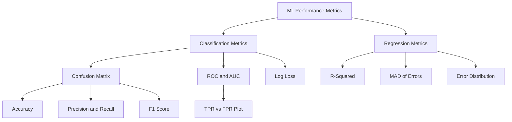
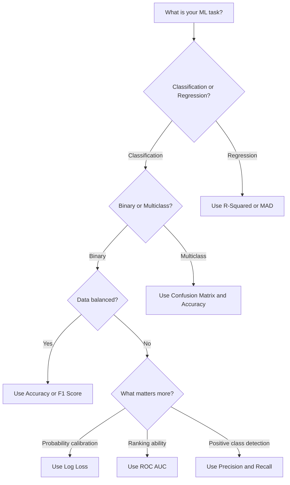

# Measuring Performance of Machine learning models

**Published:** 2019-11-24


To measure how well our models are performing we may need to define some metrics. One of the metrics which is quite straight forward is accuracy.

Accuracy is defined as the number of correctly classified points divided by the total number of points in Dtest.

But there are several places where accuracy may not be a good performance measure. Read more about it here

The following diagram shows the hierarchy of common ML performance metrics and when they apply:



### Confusion Matrix

In the field of machine learning and specifically the problem of statistical classification, a confusion matrix, also known as an error matrix.

It is a specific table layout that allows visualization of the performance of an algorithm, typically a supervised learning one (in unsupervised learning it is usually called a matching matrix).

We also compute something called a F1 score which is a very good metric for information retrieval and document searching.

Read more about it here

```python
import numpy as np
from sklearn.metrics import confusion_matrix, accuracy_score, f1_score

y_actual =    [1, 0, 1, 1, 0, 1, 0, 0, 1, 0]
y_predicted = [1, 0, 1, 0, 0, 1, 1, 0, 1, 0]

# Confusion matrix
cm = confusion_matrix(y_actual, y_predicted)
print("Confusion Matrix:\n", cm)

# Accuracy and F1
print(f"Accuracy: {accuracy_score(y_actual, y_predicted):.4f}")
print(f"F1 Score: {f1_score(y_actual, y_predicted):.4f}")
```

### Receiver Operating Characteristic Curve (ROC) curve and Area under Curve(AUC)

Another way to measure performance of machine learning models is area under ROC curve. This is a specific measure for binary classifiers.

It was a term coined by the telecommunications industry during the second world war era.

The ROC curve is created by plotting the true positive rate (TPR) against the false positive rate (FPR) at various threshold settings.

The true-positive rate is also known as sensitivity, recall or probability of detection in machine learning. The false-positive rate is also known as the fall-out or probability of false alarm and can be calculated as (1 − specificity).

Why would be even need this metric is in itself a great question. The issue with using TPR, FPR directly is you could have two models one have low FPR and the other having high TPR.

Which of these models would we pick here. Hence we need a more determinstic metric to decide.

Read more about here

```python
from sklearn.metrics import roc_auc_score

y_actual = [1, 0, 1, 1, 0]
y_probs  = [0.9, 0.3, 0.8, 0.6, 0.4]

auc = roc_auc_score(y_actual, y_probs)
print(f"ROC AUC: {auc:.4f}")
```

### Log loss

It is an error function which measures the performance of a classification model where the prediction input is a probability value between 0 and 1.

The goal of our machine learning models is to minimize this value.

A perfect model would have a log loss of 0.

Log Loss quantifies the accuracy of a classifier by penalising false classifications.

Minimising the Log Loss is basically equivalent to maximising the accuracy of the classifier.

It is also very highly used in Kaggle competitions.

```python
from sklearn.metrics import log_loss

y_actual = [1, 0, 1, 1, 0]
y_probs  = [0.9, 0.3, 0.8, 0.6, 0.4]

print(f"Log Loss: {log_loss(y_actual, y_probs):.4f}")
```

### R-Squared/Coefficient of determination

R-squared is a statistical measure of how close the data are to the fitted regression line. It is also known as the coefficient of determination, or the coefficient of multiple determination for multiple regression.

This metric is specifically designed for regression based algorithms where the output is a real value.

Read about it more here

```python
from sklearn.metrics import r2_score

y_actual    = [3.0, 5.0, 2.5, 7.0, 4.5]
y_predicted = [2.8, 5.1, 2.7, 6.8, 4.2]

r2 = r2_score(y_actual, y_predicted)
print(f"R-Squared: {r2:.4f}")
```

## Median absolute deviation (MAD) of Errors

In statistics, the median absolute deviation (MAD) is a robust measure of the variability of a univariate sample of quantitative data. It can also refer to the population parameter that is estimated by the MAD calculated from a sample.

For a univariate data set X1, X2, ..., Xn, the MAD is defined as the median of the absolute deviations from the data's median,

X_median = median(X)

Median Absolute deviation = median(|Xi-X_median|)

that is, starting with the residuals (deviations) from the data's median, the MAD is the median of their absolute values.

We can use the same technique by treating errors as our random variable X here and finding MAD of errors.

```python
import numpy as np

y_actual    = np.array([3.0, 5.0, 2.5, 7.0, 4.5])
y_predicted = np.array([2.8, 5.1, 2.7, 6.8, 4.2])

errors = y_actual - y_predicted
mad = np.median(np.abs(errors - np.median(errors)))
print(f"MAD of errors: {mad:.4f}")
```

The following diagram illustrates the process of selecting the right metric based on your ML task:



You can read more about it here

### Distribution of errors

We can plot error distributions like probability density function and cumulative density function and make important deductions based on it.

You can read more about it here
