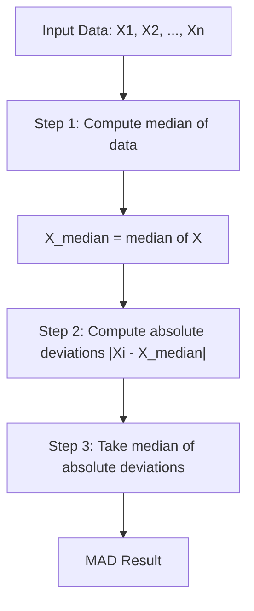
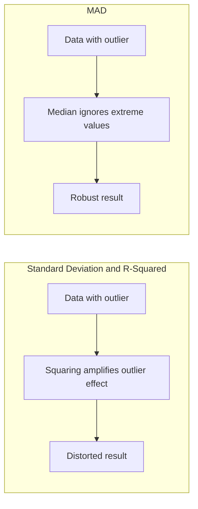
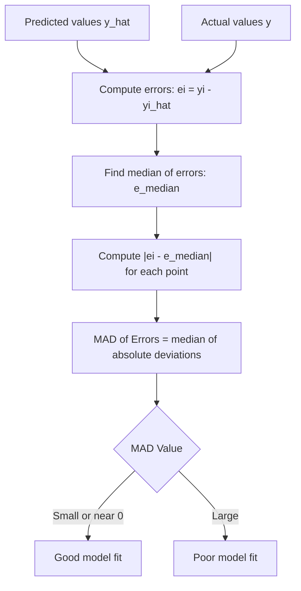

# Median absolute deviation (MAD) of Errors

**Published:** 2019-11-10

Median Absolute deviation is one of the other techniques specifically used for analyzing the performance of regression models.

#### **Computing MAD of errors**

For a univariate data set X1, X2, ..., Xn, the MAD is defined as the median of the absolute deviations from the data's median,

**X_median = median(X)**

**Median Absolute deviation = median(|Xi-X_median|)**

that is, starting with the residuals (deviations) from the data's median, the MAD is the median of their absolute values.

**Example**

Consider the data (1, 1, 2, 2, 4, 6, 9). It has a median value of 2.

The absolute deviations about 2 are (1, 1, 0, 0, 2, 4, 7) which in turn have a median value of 1 (because the sorted absolute deviations are (0, 0, 1, 1, 2, 4, 7)).

So the median absolute deviation for this data is 1.

**Why is it important**

If we recall the formula for calculating Sum of Squares Residual

The issue with R-Squared is it contains SSresidue which is 

So even if one of the errors is an outlier, it can screw up the calculation of SSresidue.

So coefficient of distribution is prone to outliers.

### Understanding MAD of errors

Assuming Error e, to be a random variable with being a vector of size n. Let e1, e2, e3.. en represent the computation of errors for each point in a univariate data set X1, X2, ..., Xn, .

Let |ei| represent the absolute value of ei.

the MAD of errors would be defined as the median of the absolute deviations from the data's median,

e_median = median(e)

Median Absolute deviation of Errors = median(|ei-e_median|)

In other words, if the median is analogous to mean, the Median Average Deviation is analogous to the standard deviation.

So if |ei| is small or approximately equal to zero for i={1..n}; that's the best case.

However if |ei| is large then it signifies a problem

def mad(arr):
    """ Median Absolute Deviation: a "Robust" version of standard deviation.
        Indices variabililty of the sample.
        https://en.wikipedia.org/wiki/Median_absolute_deviation 
    """
    arr = np.ma.array(arr).compressed() # should be faster to not use masked arrays.
    med = np.median(arr)
    return np.median(np.abs(arr - med))