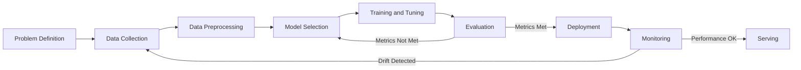
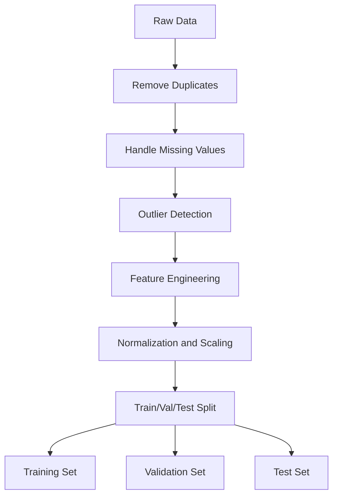
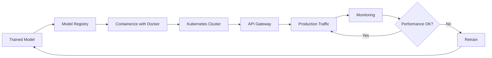

# Best Practices for Building Machine Learning Applications

**Published:** 2023-04-22

## ** Introduction to Building Machine Learning Applications**

The following diagram shows the end-to-end ML application lifecycle, from problem definition through production monitoring:

Building machine learning applications requires a thorough understanding of the fundamentals of machine learning and software development. This section will provide an overview of the key considerations and best practices for building machine learning applications.

- Identify the problem you want to solve and determine whether machine learning is the right approach.

- Understand the different types of machine learning, such as supervised, unsupervised, and reinforcement learning.

- Use a software development methodology that suits your project, such as Agile etc.

## Best Practices for Data Preprocessing

The data preprocessing pipeline transforms raw data into model-ready features:

Data preprocessing is a critical step in building machine learning applications, as it involves cleaning, transforming, and preparing data for modeling. This section will provide tips and best practices for data preprocessing.

To preprocess data for machine learning, you can:

- Clean and remove missing data, outliers, and duplicates.

- Transform data using techniques such as normalization, scaling, and feature engineering.

- Split data into training, validation, and testing sets to evaluate the performance of your model.

## Model Selection and Hyperparameter Tuning

Model selection and hyperparameter tuning are crucial steps in building machine learning applications, as they determine the performance and accuracy of your model. This section will provide tips and best practices for model selection and hyperparameter tuning.

To select the best model and tune hyperparameters, you can:

- Use evaluation metrics such as accuracy, precision, and recall to measure the performance of your model.

- Experiment with different algorithms and architectures, such as decision trees, neural networks, and ensemble methods.

- Tune hyperparameters using techniques such as grid search, random search, or Bayesian optimization.

## Deployment and Scaling

The deployment pipeline takes a trained model from artifact storage through to production serving with continuous monitoring:

Deploying and scaling machine learning applications requires careful consideration of the infrastructure, performance, and scalability of your system. This section will provide tips and best practices for deployment and scaling.

- Choose a deployment strategy that suits your project, such as on-premises, cloud-based, or serverless deployment.

- Use containerization tools such as Docker and Kubernetes to manage and scale your application.

- Monitor the performance and resource utilization of your application using tools such as Prometheus and Grafana.

## Performance Evaluation and Monitoring

Performance evaluation and monitoring are crucial steps in building machine learning applications, as they help you identify and address issues with your model and system. This section will provide tips and best practices for performance evaluation and monitoring.

- Use evaluation metrics such as accuracy, precision, recall, and F1 score to measure the performance of your model.

- Monitor the behavior of your model in production using tools such as A/B testing and canary releases.

- Monitor the performance and health of your system using tools such as Nagios, Prometheus, or Datadog.

**Conclusion**

Building high-quality machine learning applications requires careful consideration of the data, models, infrastructure, and performance of your system. By following the best practices outlined in this article, you can improve the accuracy, performance, and scalability of your machine learning applications. Remember to stay up-to-date with the latest technologies and best practices, and to continuously learn and improve your skills.