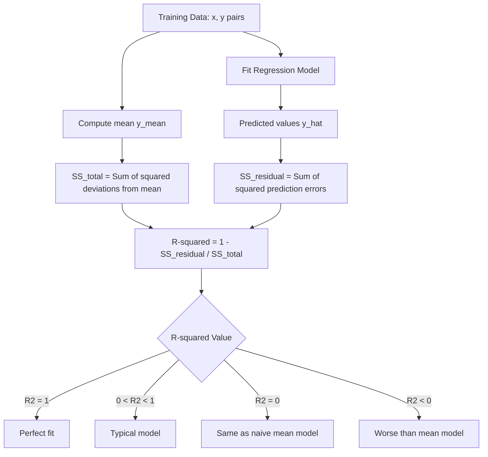
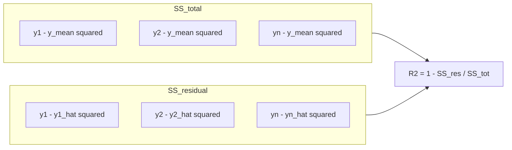

# R-Squared/Coefficient of determination

**Published:** 2019-10-20


R-squared is a statistical measure of how close the data are to the fitted regression line. It is also known as the coefficient of determination, or the coefficient of multiple determination for multiple regression.

This metric is specifically designed for regression-based algorithms where the output is a real value.



#### Computing Coefficient of determination

Let x, y, y^ be the input, output and predicted output vectors in linear regression.

Lets assume there are n points So for a point with input xi, output yi and predicted output yi^

We can define error ei be defined as ei = yi - yi^

#### Sum of Squares Total

Let say the mean of all the outputs in the training data be y_mean.

Hence

y_mean = (y1+y2+....yn)/n

or

Then we can define sum of squares total as

Sum of Squares, SStotal = ((y1 - y_mean)2 + (y2 - y_mean)2... (yn - y_mean)2)

Lets assume a very naive model for which for every new query point, we just return the average y_mean for any new query point.

In this case Sum of Squares would be 0.

#### Sum of Squares Residual

Similarly we can define SSresidue as the sum of sqaures of difference between expected output and predicted output.

SSresidue = ((y1 - y1^)2 + (y2 - y2^)2... (yn - yn^)2)

where ei = yi − fi 

For the naive model case,since every predicted value is mean

SSresidue=SStotal

#### Coefficient of determination

Hence we can say coefficient of determination is

R2 can be seen to be related to the fraction of variance unexplained (FVU), since the second term compares the unexplained variance (variance of the model's errors) with the total variance (of the data)



Now there are 4 cases related to this

**Case 1**: SSresidue=0 In this case R2=1,

which is the best case we could have.

**Case 2**: SSresidue=SStotal, In this case R2=0, which is the same as the naive mean model case.

**Case 3**:SSresidue < SStotal In this case R2 lies between 0 and 1, which would be for most cases.

**Case 4**:SSresidue > SStotal In this case R2 is less than 0.

This would be the worst case. This means our model is behaving worse than the naive mean model.

#### Python Examples

Computing R-squared manually with numpy:

```python
import numpy as np

y_true = np.array([3, -0.5, 2, 7])
y_pred = np.array([2.5, 0.0, 2, 8])

# Compute SS_total and SS_residual
ss_total = np.sum((y_true - np.mean(y_true)) ** 2)
ss_residual = np.sum((y_true - y_pred) ** 2)

r_squared = 1 - (ss_residual / ss_total)
print(f"SS_total:    {ss_total:.4f}")
print(f"SS_residual: {ss_residual:.4f}")
print(f"R-squared:   {r_squared:.4f}")
# R-squared: 0.9486
```

Computing R-squared with sklearn:

```python
from sklearn.metrics import r2_score

y_true = [3, -0.5, 2, 7]
y_pred = [2.5, 0.0, 2, 8]
print(r2_score(y_true, y_pred))
# 0.9486

# Perfect predictions: R2 = 1.0
print(r2_score([1, 2, 3], [1, 2, 3]))
# 1.0

# Predicting the mean for everything: R2 = 0.0
print(r2_score([1, 2, 3], [2, 2, 2]))
# 0.0

# Worse than the mean model: R2 < 0
print(r2_score([1, 2, 3], [3, 2, 1]))
# -3.0
```