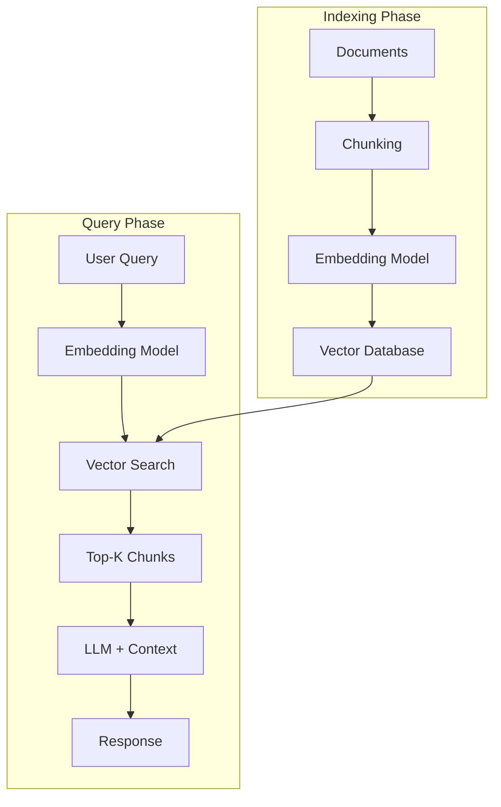
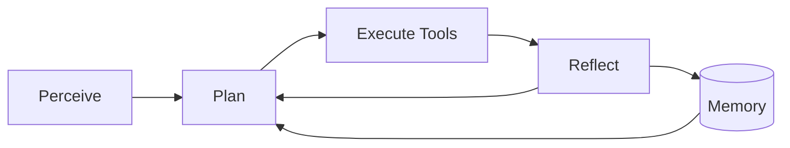

# AI Engineering: RAG and Agents

**Published:** August 3, 2025


Retrieval-Augmented Generation (RAG) and AI agents represent two of the most important patterns in modern AI application development. RAG gives models access to external knowledge, while agents give models the ability to take actions. Together, they form the backbone of most production AI systems today. This post covers how both work in depth, drawing from Chip Huyen's *AI Engineering* (Chapter 6) and practical deployment experience.

## Retrieval-Augmented Generation (RAG)

RAG addresses three fundamental limitations of standalone LLMs:

- **Hallucination**: LLMs generate plausible but incorrect information when they lack knowledge
- **Knowledge cutoff**: Training data has a temporal limit; the model does not know about recent events
- **Context window limits**: Even with long-context models, stuffing entire knowledge bases into the prompt is impractical and expensive

The core idea is simple: before generating a response, retrieve relevant information from an external knowledge base and include it in the prompt as context.

### RAG Architecture

The RAG pipeline has two phases:



**Indexing phase** (offline, done once):
1. Load documents from your knowledge base
2. Split documents into chunks
3. Generate embeddings for each chunk using an embedding model
4. Store embeddings and metadata in a vector database

**Query phase** (online, per request):
1. Convert the user query into an embedding
2. Retrieve the top-K most similar chunks from the vector database
3. Augment the LLM prompt with the retrieved chunks as context
4. Generate a response grounded in the retrieved information

### Retrieval Algorithms

There are two broad families of retrieval algorithms, each with different strengths.

**Term-based retrieval** uses exact keyword matching. BM25 is the standard algorithm -- it extends TF-IDF by accounting for document length and term frequency saturation. Term-based retrieval is fast, interpretable, and excels when the user query contains the exact terms present in the documents. It requires no training and no embedding model.

**Embedding-based retrieval** converts both queries and documents into dense vector representations and retrieves by vector similarity (typically cosine similarity or dot product). This approach handles synonyms, paraphrases, and semantic similarity that keyword search misses. The tradeoff is that it requires an embedding model, is more expensive to run, and can be less precise for exact-match queries.

| Aspect | Term-Based (BM25) | Embedding-Based |
|---|---|---|
| Matching | Exact keywords | Semantic similarity |
| Handles synonyms | No | Yes |
| Speed | Very fast | Requires ANN search |
| Training needed | None | Embedding model |
| Best for | Exact lookups, known terminology | Natural language queries |

**Hybrid search** combines both approaches, typically using Reciprocal Rank Fusion (RRF) to merge ranked results. Given rankings from multiple retrieval methods, RRF scores each document as:

```
RRF_score(d) = sum(1 / (k + rank_i(d))) for each retriever i
```

where k is a constant (typically 60). This is simple, effective, and does not require learned weights.

### Vector Search Algorithms

When using embedding-based retrieval, exact nearest-neighbor search over millions of vectors is too slow. Approximate Nearest Neighbor (ANN) algorithms trade a small amount of accuracy for orders-of-magnitude speedup:

- **HNSW (Hierarchical Navigable Small World)**: Builds a multi-layer graph where higher layers provide coarse navigation and lower layers provide fine-grained search. The most popular algorithm in practice -- used by Pinecone, Weaviate, and pgvector. High recall, but memory-intensive.
- **IVF (Inverted File Index)**: Partitions the vector space into clusters via k-means, then searches only the nearest clusters at query time. Lower memory than HNSW but requires tuning the number of clusters.
- **Product Quantization (PQ)**: Compresses vectors by splitting them into subvectors and quantizing each independently. Dramatically reduces memory at the cost of some accuracy. Often combined with IVF (IVF-PQ).
- **LSH (Locality-Sensitive Hashing)**: Uses hash functions that map similar vectors to the same bucket. Fast but lower recall than HNSW/IVF for high-dimensional data.
- **Annoy**: Spotify's tree-based algorithm. Builds a forest of random projection trees. Good for read-heavy, static datasets.

### Chunking Strategies

How you split documents into chunks significantly impacts retrieval quality:

- **Fixed-size chunking**: Split every N tokens with M tokens of overlap. Simple and predictable, but can break sentences and paragraphs mid-thought.
- **Recursive splitting**: Split by paragraphs first, then sentences, then tokens if still too long. Preserves semantic boundaries better than fixed-size.
- **Semantic chunking**: Use an embedding model to detect topic boundaries and split at natural transition points. Higher quality but more expensive.

Chunk size involves a tradeoff: smaller chunks (128-256 tokens) are more precise for retrieval but may lack context; larger chunks (512-1024 tokens) preserve more context but dilute the relevance signal. A common default is 512 tokens with 50-token overlap.

### Retrieval Optimization

Several techniques improve retrieval quality beyond basic vector search:

**Reranking**: After initial retrieval of top-K candidates (say K=20), run a cross-encoder reranker to re-score and reorder results before passing top-N (say N=5) to the LLM. Cross-encoders are more accurate than bi-encoders because they see the query and document together, but they are too slow for the initial retrieval pass over the full corpus.

**Query rewriting**: The user's raw query may not be optimal for retrieval. Techniques include expanding the query with synonyms, decomposing complex queries into sub-queries, and using the LLM itself to rewrite the query for better retrieval.

**Contextual retrieval**: A technique from Anthropic (2024) where each chunk is augmented with context from the full document before embedding. For example, prepending "This chunk is from [document title], section [section name]" to each chunk before generating its embedding. This helps the retriever understand what each chunk is about in the context of the broader document.

### RAG with Tabular Data

RAG is not limited to unstructured text. For tabular data, the pattern becomes **text-to-SQL**: the LLM generates a SQL query from the natural language question, executes it against the database, and uses the results to generate a response. This is powerful for analytics use cases but requires careful validation of generated SQL.

### Evaluating RAG

RAG evaluation is multidimensional. Key metrics include:

- **Context precision**: What fraction of retrieved chunks are actually relevant?
- **Context recall**: What fraction of relevant information was retrieved?
- **NDCG (Normalized Discounted Cumulative Gain)**: Are the most relevant results ranked highest?
- **Faithfulness**: Is the generated answer grounded in the retrieved context (vs. hallucinated)?
- **Answer relevance**: Does the answer actually address the user's question?

The MTEB (Massive Text Embedding Benchmark) and BEIR benchmarks are standard for evaluating embedding models across diverse retrieval tasks.

### When to Use RAG vs. Long Context

Modern models support context windows of 100K-200K tokens, raising the question: why not just stuff the entire knowledge base into the context? Anthropic's guidance suggests that RAG is preferred when the knowledge base exceeds roughly 200K tokens. Below that threshold, long context may be simpler and equally effective. Above it, RAG is necessary for both cost and quality reasons -- retrieving 5 relevant chunks is cheaper and often more accurate than passing 200 pages of context.

## AI Agents

An AI agent is a system where an LLM acts as the reasoning core, using tools and planning capabilities to autonomously accomplish goals. While RAG gives models access to information, agents give models the ability to *act*.

### Agent Architecture

An agent operates in a loop:



The key components are:

1. **Tools**: Functions the agent can call (APIs, databases, code execution, web search)
2. **Planning**: Decomposing goals into executable steps
3. **Memory**: Maintaining context across steps and sessions
4. **Reflection**: Evaluating outcomes and correcting errors

### Tools

Tools fall into three categories:

- **Information retrieval**: Search engines, RAG retrieval, database queries, API reads
- **Capability extension**: Code execution, calculators, image generation, translation
- **Write actions**: Sending emails, creating files, modifying databases, deploying code

The LLM selects tools via **function calling** -- the model is provided with tool descriptions (name, parameters, types) and outputs a structured function call. Most modern LLMs (GPT-4, Claude, Llama 3) support native function calling.

Tool selection quality varies significantly across models. Ablation studies show that the specific set of available tools matters -- adding irrelevant tools can confuse the agent and reduce performance.

### Planning

Planning is how agents decompose complex goals into executable steps. The most influential pattern is **ReAct** (Reasoning + Acting) from Yao et al. (2022), which interleaves reasoning traces with tool calls:

```
Thought: I need to find the current stock price of AAPL
Action: search("AAPL stock price today")
Observation: AAPL is trading at $198.50
Thought: Now I need to calculate the market cap
Action: calculator(198.50 * 15_500_000_000)
Observation: 3,076,750,000,000
Thought: I have the answer
Answer: Apple's market cap is approximately $3.08 trillion
```

Planning complexity scales with task complexity:

- **Sequential**: Steps execute one after another (simplest)
- **Parallel**: Independent steps execute concurrently
- **Conditional**: Different branches based on intermediate results
- **Iterative**: Loops until a condition is met

A key open question is whether LLMs can truly *plan* or merely *predict plausible next steps*. Yann LeCun and others have argued that autoregressive models fundamentally cannot plan because they lack the ability to backtrack and explore alternative paths. In practice, agents work around this by using explicit planning prompts and reflection loops.

### Agent Failure Modes

Understanding how agents fail is critical for building reliable systems:

- **Planning failures**: Selecting an invalid tool, calling a valid tool with wrong parameters, or providing incorrect parameter values
- **Goal failures**: The agent accomplishes something, but not what was actually requested
- **Tool failures**: External APIs return errors, rate limits, or unexpected responses
- **Infinite loops**: The agent gets stuck retrying a failed action or oscillating between states

Robust agents need retry logic, fallback strategies, maximum step limits, and human-in-the-loop escalation for high-stakes actions.

### Memory

Agents need memory to maintain context across their reasoning steps and across sessions:

- **Short-term memory**: The current conversation context and recent tool outputs. Limited by the LLM's context window.
- **Long-term memory**: Persistent storage (databases, files) that survives across sessions. Used for user preferences, past interactions, and learned information.

Memory management strategies for long conversations include:

- **FIFO (First-In-First-Out)**: Drop the oldest messages when context is full. Simple but loses potentially important early context.
- **Summarization**: Periodically summarize the conversation history and replace detailed messages with the summary. Preserves key information but loses detail.
- **Reflection-based**: Use a classifier to identify which memories are important to retain and which can be discarded. More sophisticated but adds latency and cost.

### Agent Frameworks and Patterns

Several frameworks simplify agent development:

- **Toolformer** (Schick et al., 2023): Trains the model itself to decide when and how to call tools
- **Voyager** (Wang et al., 2023): An agent that explores Minecraft, demonstrating tool composition -- building complex behaviors from simple tool primitives
- **SWE-agent** (Yang et al., 2024): An agent specialized for software engineering tasks, achieving strong performance on the SWE-bench coding benchmark

## RAG + Agents: Combined Systems

The most powerful AI applications combine RAG and agents. The agent plans and orchestrates, while RAG provides grounded knowledge at each step:

1. **Research assistant**: Agent plans research steps, RAG retrieves relevant papers at each step, agent synthesizes findings
2. **Code generation**: Agent plans implementation, RAG retrieves documentation and examples, agent writes and tests code
3. **Customer support**: Agent understands and classifies the query, RAG retrieves relevant knowledge base articles, agent formulates a grounded response

## Production Considerations

### Cost Management

Vector database costs can be significant at scale. Embedding regeneration (when switching embedding models) is expensive. Monitor your embedding API costs relative to your LLM API costs -- a common ratio is 10-20% of total API spend goes to embeddings.

### Evaluation in Production

RAG and agent systems require continuous evaluation:

- Track retrieval precision/recall over time to detect embedding drift
- Monitor agent success rates and failure mode distribution
- Use human evaluation on a sample of outputs to calibrate automated metrics
- A/B test changes to chunking, retrieval, and prompting strategies

### Safety

Agents that take write actions (sending emails, modifying databases, deploying code) require careful guardrails:

- Require explicit confirmation for irreversible actions
- Implement rate limiting on tool calls
- Maintain audit logs of all agent actions
- Use sandboxed environments for code execution

## Conclusion

RAG and agents are complementary patterns that address different limitations of standalone LLMs. RAG provides grounded access to external knowledge, eliminating hallucination and knowledge cutoff issues. Agents provide autonomous reasoning and action capabilities, enabling complex multi-step workflows.

Key takeaways:

- **Hybrid search** (BM25 + embeddings + reranking) consistently outperforms either approach alone
- **Chunking strategy** has an outsized impact on RAG quality -- invest time in getting it right
- **ReAct** is the foundational agent pattern, but robust agents also need memory, error handling, and human-in-the-loop escalation
- **PagedAttention and prompt caching** make RAG systems dramatically more cost-effective at scale
- **Evaluation is multidimensional**: retrieval quality, generation faithfulness, and end-to-end task success all need separate metrics

## References

- Lewis, P., Perez, E., Piktus, A., Petroni, F., et al. (2020). "Retrieval-Augmented Generation for Knowledge-Intensive NLP Tasks." [arXiv:2005.11401](https://arxiv.org/abs/2005.11401)
- Yao, S., Zhao, J., Yu, D., Du, N., et al. (2022). "ReAct: Synergizing Reasoning and Acting in Language Models." [arXiv:2210.03629](https://arxiv.org/abs/2210.03629)
- Kwon, W., Li, Z., Zhuang, S., et al. (2023). "Efficient Memory Management for Large Language Model Serving with PagedAttention." [arXiv:2309.06180](https://arxiv.org/abs/2309.06180)
- Formal, T., Piwowarski, B., and Clinchant, S. (2021). "SPLADE: Sparse Lexical and Expansion Model for First Stage Ranking." [arXiv:2107.05720](https://arxiv.org/abs/2107.05720)
- Johnson, J., Douze, M., and Jegou, H. (2017). "Billion-scale similarity search with GPUs." [arXiv:1702.08734](https://arxiv.org/abs/1702.08734)
- Malkov, Y. and Yashunin, D. (2016). "Efficient and Robust Approximate Nearest Neighbor using Hierarchical Navigable Small World Graphs." [arXiv:1603.09320](https://arxiv.org/abs/1603.09320)
- Thakur, N., Reimers, N., Ruckle, A., Srivastava, A., and Gurevych, I. (2021). "BEIR: A Heterogeneous Benchmark for Zero-shot Evaluation of Information Retrieval Models." [arXiv:2104.08663](https://arxiv.org/abs/2104.08663)
- Muennighoff, N., Tazi, N., Magne, L., and Reimers, N. (2023). "MTEB: Massive Text Embedding Benchmark." [arXiv:2210.07316](https://arxiv.org/abs/2210.07316)
- Schick, T., Dwivedi-Yu, J., Dessi, R., et al. (2023). "Toolformer: Language Models Can Teach Themselves to Use Tools." [arXiv:2302.04761](https://arxiv.org/abs/2302.04761)
- Wang, G., Xie, Y., Jiang, Y., et al. (2023). "Voyager: An Open-Ended Embodied Agent with Large Language Models." [arXiv:2305.16291](https://arxiv.org/abs/2305.16291)
- Yang, J., Jimenez, C.E., Wettig, A., et al. (2024). "SWE-agent: Agent-Computer Interfaces Enable Automated Software Engineering." [arXiv:2405.15793](https://arxiv.org/abs/2405.15793)
- Anthropic. (2024). "Contextual Retrieval." [Blog Post](https://www.anthropic.com/news/contextual-retrieval)
- Huyen, C. (2025). *AI Engineering*. O'Reilly Media. Chapter 6: RAG and Agents.
