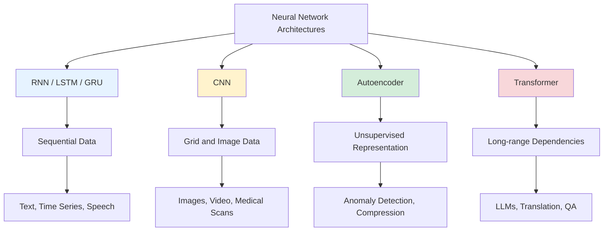
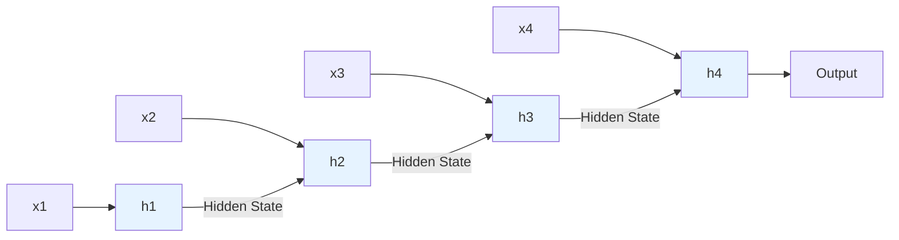
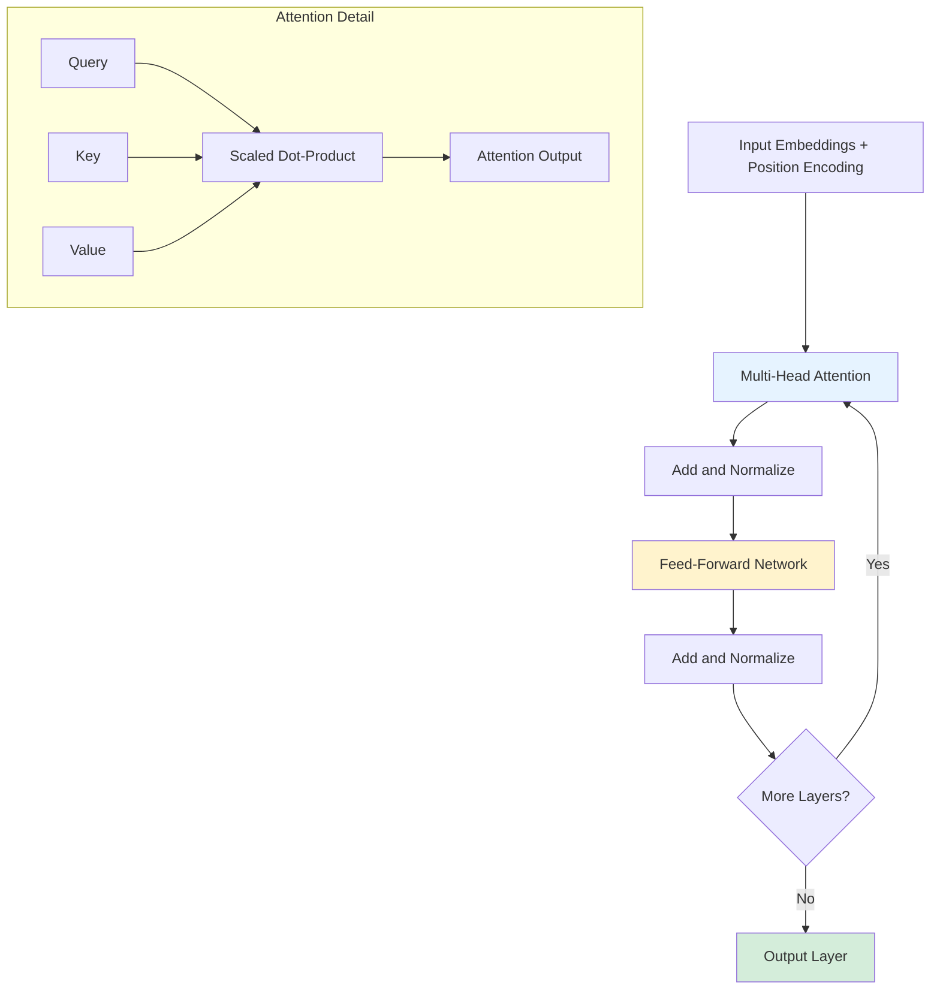
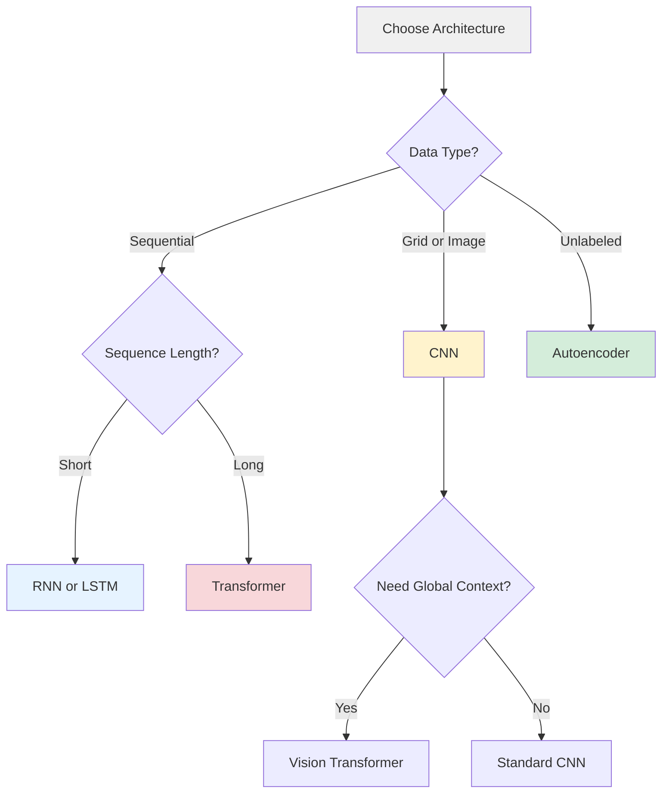

# RNN vs. CNN vs. Autoencoder vs. Attention/Transformer

**Published:** August 3, 2025

Understanding different deep learning architectures is crucial for building effective AI systems. This post provides a practical guide to various neural network architectures, their use cases, and implementation considerations.

## Recurrent Neural Networks (RNNs)

RNNs are designed to handle sequential data by maintaining hidden states that capture information from previous time steps.

### Key Characteristics:
- **Memory**: Maintains hidden state across time steps
- **Sequential Processing**: Processes input one element at a time
- **Vanishing Gradient Problem**: Traditional RNNs struggle with long sequences

### Common Variants:
- **LSTM (Long Short-Term Memory)**: Addresses vanishing gradients with gating mechanisms
- **GRU (Gated Recurrent Unit)**: Simpler alternative to LSTM with fewer parameters

### Data Flow:

### Use Cases:
- Natural language processing (text generation, translation)
- Time series forecasting
- Speech recognition
- Sentiment analysis

## Convolutional Neural Networks (CNNs)

CNNs excel at processing grid-like data structures, particularly images, using convolutional layers to detect spatial patterns.

### Key Characteristics:
- **Local Connectivity**: Each neuron connects to a local region
- **Parameter Sharing**: Same weights used across different spatial locations
- **Translation Invariance**: Can detect patterns regardless of position

### Architecture Components:
- **Convolutional Layers**: Extract features using filters
- **Pooling Layers**: Reduce spatial dimensions
- **Fully Connected Layers**: Final classification/regression

### Use Cases:
- Image classification and recognition
- Object detection
- Medical image analysis
- Video processing

## Autoencoders

Autoencoders are neural networks trained to reconstruct their input, learning efficient representations in the process.

### Key Characteristics:
- **Encoder-Decoder Architecture**: Compresses input to latent space, then reconstructs
- **Unsupervised Learning**: No labeled data required
- **Dimensionality Reduction**: Learns compact representations

### Variants:
- **Denoising Autoencoders**: Learn to remove noise
- **Variational Autoencoders (VAEs)**: Learn probabilistic latent representations
- **Sparse Autoencoders**: Encourage sparse activations

### Use Cases:
- Anomaly detection
- Dimensionality reduction
- Feature learning
- Data compression

## Attention/Transformer Models

Transformers revolutionized NLP by using self-attention mechanisms to process sequences in parallel and capture long-range dependencies.

### Key Characteristics:
- **Self-Attention**: Computes relationships between all positions in sequence
- **Parallel Processing**: All positions processed simultaneously
- **Position Encoding**: Injects positional information into embeddings

### Architecture:

- **Multi-Head Attention**: Multiple attention mechanisms in parallel
- **Feed-Forward Networks**: Position-wise fully connected layers
- **Layer Normalization**: Stabilizes training
- **Residual Connections**: Helps with gradient flow

### Use Cases:
- Large language models (GPT, BERT, T5)
- Machine translation
- Text summarization
- Question answering systems

## Comparison Summary

| Architecture | Best For | Strengths | Limitations |
|-------------|----------|-----------|-------------|
| RNN/LSTM | Sequential data | Handles variable-length sequences | Slow, struggles with long dependencies |
| CNN | Grid data (images) | Translation invariance, efficient | Limited to local patterns |
| Autoencoder | Unsupervised learning | Feature extraction, compression | May lose information |
| Transformer | Long sequences | Parallel processing, long-range dependencies | High computational cost |

## Implementation Considerations

When choosing an architecture:

1. **Data Type**: Sequential (RNN/Transformer) vs. Grid (CNN) vs. Unsupervised (Autoencoder)
2. **Sequence Length**: Short (RNN) vs. Long (Transformer)
3. **Computational Resources**: Transformers require significant GPU memory
4. **Training Data**: Supervised (RNN/CNN/Transformer) vs. Unsupervised (Autoencoder)

## Conclusion

Each architecture has its strengths and is suited for different tasks. Modern AI systems often combine multiple architectures:

- **Vision Transformers**: Applying transformers to image tasks
- **Hybrid Models**: Combining CNNs with RNNs or Transformers
- **Multimodal Systems**: Using different architectures for different modalities

Understanding these architectures is essential for designing effective AI infrastructure and making informed decisions about model selection and deployment.

