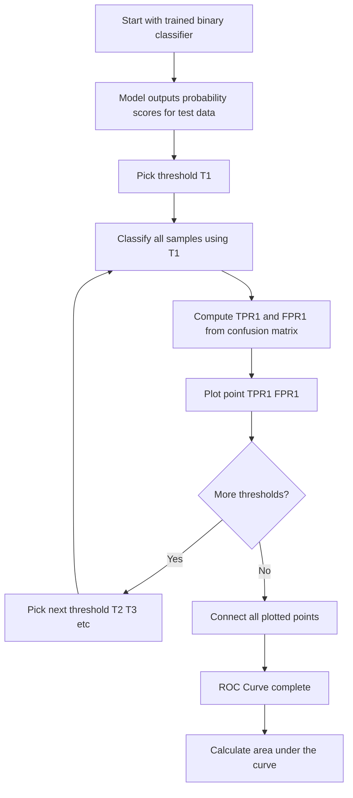
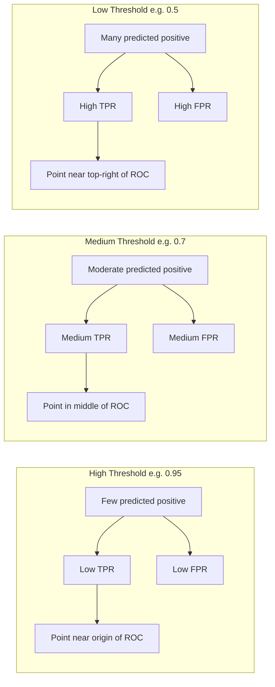
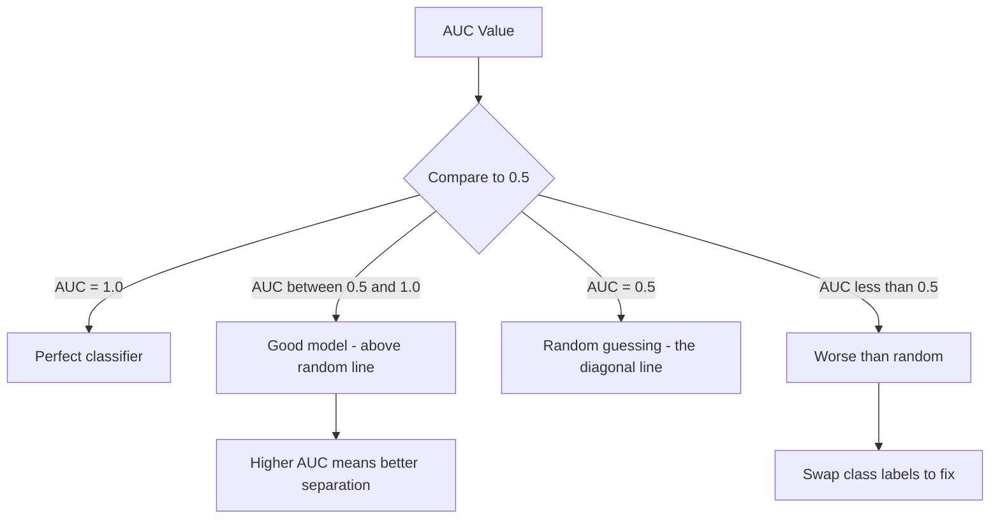

# Receiver operating characteristic (ROC ) curve

**Published:** 2019-08-11


For binary classification problems, a good way to measure the performance of a model is by finding out AUC (Area Under The Curve) of ROC (Receiver Operating Characteristics).

#### **What is a ROC ****curve?**

 It is a plot of True Positive Rate(TPR) vs FPR at various thresholding levels.

The following diagram shows the step-by-step process of constructing an ROC curve:



**Let's understand this with an example:**

Let's say we have a model with inputs x and output y which since it is a binary classifier, it's value is either 0 or 1. Our model generates however generates probability of an output class class being 1.

x(Input)y(Actual label)y^(Prediction or probability of class label=1)x110.95x200.91x310.87x410.65x500.7

**Since this is a probability, we need to have thresholds to predict the class labels here, let's select a threshold of τ****1**** = 0.95.**

In other words all y^ with probability greater than equal to 0.95 will be predicted 1 otherwise it will be predicted 0.

After this for different level of threshholds, we calculate predicted values Y1 (for τ1 = 0.95) and Y2 (for τ1 = 0.91) and so on.

For each of these Y1, Y2 and so on, we find (TPR1, FPR1) ,(TPR2, FPR2) ,

x(Input)y(Actual label)y^(probability of class label=1)Y1(τ1 = 0.95)Y2(τ2 = 0.91)x110.9511x200.9101x310.8700x410.6500x500.700

The following diagram shows how changing the threshold affects classification outcomes:



Consider having n such thresholds, hence we would take these (TPR1, FPR1), (TPR2, FPR2), .....(TPRn, FPRn) and plot a curve.

### Area under ROC curve

The green outline or boundary is called ROC curve and area under the curve is called AUC under ROC curve.

### Interpretting ROC Curve

ROC curves are interpreted by drawing a y=x line across the ROC curve. This line indicates random guessing with equal values of TPR and TFR.

The Area under curve(AUC) of this line is 0.5.

Any curve that is above this line(having an area >0.5) is considered good and any curve below this (having AUC <0.5 ) is considered bad.

The following diagram summarizes how to interpret different AUC values:



Here is how to plot an ROC curve and compute AUC in Python:

```python
import numpy as np
from sklearn.metrics import roc_curve, roc_auc_score
import matplotlib.pyplot as plt

# Actual labels and predicted probabilities
y_actual = np.array([1, 0, 1, 1, 0])
y_probs  = np.array([0.95, 0.91, 0.87, 0.65, 0.7])

# Compute ROC curve points
fpr, tpr, thresholds = roc_curve(y_actual, y_probs)

# Compute AUC
auc = roc_auc_score(y_actual, y_probs)
print(f"AUC: {auc:.4f}")

# Plot the ROC curve
plt.figure(figsize=(6, 5))
plt.plot(fpr, tpr, label=f"ROC curve (AUC = {auc:.2f})")
plt.plot([0, 1], [0, 1], linestyle="--", color="gray", label="Random")
plt.xlabel("False Positive Rate")
plt.ylabel("True Positive Rate")
plt.title("ROC Curve")
plt.legend()
plt.tight_layout()
plt.savefig("roc_curve.png")
plt.show()
```

### Key Points about ROC curve

- ROC curve is not a good metric in case of unbalanced data. For imbalanced data, AUC can be high for very naive models. For eg if we have 90% positive data, a model which naively classifies everything as +tive will still have a AUC of >0.5- Lets say we have two models trying to classify a dataset.

x(Input)y(Actual label)y^1(probability of class label=1)y^2(probability of class label=1)x110.950.2x200.910.15x310.870.10x410.650.08x500.70.07

Now Area under curve actually doesn't depend on the values in y^1 or y^2

All it cares is about the ordering of data.

In both y^1 or y^2, since they both are consistently decreasing, we can say

**AUC(y^1) = AUC(y^2)**

In other words it is scale independent. In some cases, it is a very good thing where we don't need to have higher probability to determine class labels.

- AUC for a random predictions(the straight y=x line) is always 0.5.Sometimes we would find cases where AUC for data is <0.5, in that case a simple swapping of class labels(switching what we call postive and negative) would help make AUC >0.5
