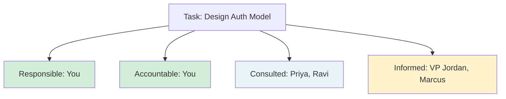
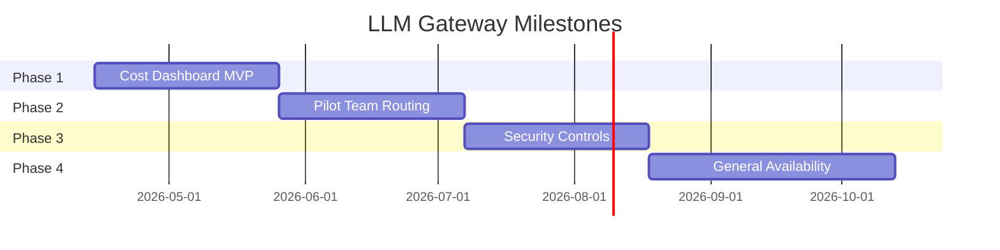

# Leading Large Projects: Add Structure

**Published:** April 12, 2026

Ambiguity is inevitable. Chaos is optional.

You have built context and clarified fundamentals. Now you need to give the project a skeleton. Structure is what converts a group of people who vaguely know what they are doing into a team that is aligned on who does what, when, and how. The more people involved, the more you need to make sure everyone is aligned on expectations.

Setting up structure can feel time-consuming when you are eager to start building. But these structures increase the likelihood that the thing you are eager to start working on will actually succeed. They also act as tools to help you feel in control, so if you are still a little overwhelmed, this is what makes it easier.

## Define Roles

At senior levels, engineering roles start to blur into each other. The difference between a very senior engineer, an engineering manager, and a technical program manager might not be immediately clear. All of them have some responsibility to identify risks, remove blockers, and solve problems. When there are multiple leaders, unclear expectations about who is doing what become a common source of conflict.

The beginning of a project is the best time to lay out each leader's responsibilities. Rather than waiting until two people discover they are doing the same job, or work is slipping through the cracks because nobody thinks it is theirs, describe what kinds of things will need to be done and who will do them.

### The LLM Gateway Leadership Table

| Responsibility | Owner |
|---|---|
| Overall technical direction | You (Tech Lead) |
| Infrastructure provisioning | Ravi (ML Platform) |
| Security architecture review | Priya (Security) |
| Product requirements and prioritization | Marcus (Search PM) |
| Cost tracking and finance reporting | Aisha (Finance) |
| Status updates to VP | You (Tech Lead) |
| Day-to-day engineering execution | You + borrowed engineers |
| On-call for the gateway service | ML Platform team (post-launch) |

### Using RACI

If you need more rigor, a popular tool is the RACI matrix: Responsible (doing the work), Accountable (owns the outcome), Consulted (asked for input), Informed (kept up to date). There should be only one accountable person per task.

RACI can be overkill for some situations, but when you need it, you really need it. It provides uncontroversial structure that gives you a way to broach the conversation about roles without it being weird. It helps break out of two bad patterns: never making a decision because you do not know who the decider is, and relitigating every decision because there is no process for making them.

However you approach it, try to get every leader aligned on what the roles are and who is doing what. If you are not sure that everyone knows you are the lead, the stress of a new project gets even worse.

One more thing: if you are the project lead, you are ultimately responsible for the project. That means you are implicitly filling any roles that do not already have someone in them. If nobody is tracking user requirements, that is you. If nobody is project managing, that is you as well.

### Watch for over-ownership

There is a subtle failure mode that is the opposite of dropped responsibilities: over-ownership. This is when you assume you own something that someone else already owns. It happens easily on cross-team projects where boundaries are blurry, and it can happen in three different directions.

**Over-owning across teams.** You see a gap, you step in, and you start making decisions -- only to discover that someone else was already responsible for that area. For the LLM Gateway, imagine you start designing the authentication model because nobody seems to be working on it. You spend a week on it, present your design, and then Priya from the Security team says: "We were already planning to handle this. We have a standard auth pattern that all new services are supposed to use." You have not just wasted a week. You have also signaled that you do not respect her team's domain.

**Over-owning upward from your manager.** This is the more common and more damaging version. You start making decisions that your manager expects to make, or you commit the team to a direction without checking with them first. Maybe you tell another team's lead "we will definitely support your use case by Q3" when your manager has not agreed to that scope. Maybe you send a project status update to the director that your manager wanted to frame differently. The intent is good -- you are trying to move fast and unblock things -- but you are stepping into your manager's decision space. This erodes trust quickly because your manager is accountable for the team's commitments and communications. When you make those calls without them, you are putting them in a position where they have to either back your decision or publicly override you. Neither is comfortable.

**Over-owning from a more senior engineer.** On projects with multiple senior engineers, it is possible to accidentally step into the scope of someone who is higher in title or who was brought in specifically to own a particular area. Maybe there is a principal engineer who is responsible for the overall architecture, and you start making architectural decisions in your workstream without consulting them. They may not say anything immediately, but resentment builds. The dynamic is awkward because you may not even realize you are overstepping -- you are just doing what feels natural for someone leading a piece of the project.

The fix is the same in all three cases: before you step into a gap, ask first. "I noticed nobody seems to be owning the auth model for the gateway. Is that something your team is planning to cover, or should I take a first pass?" For decisions that touch your manager's scope: "I think we should commit to supporting the Search team's use case by Q3. Does that align with what you are thinking, or should we discuss scope first?" These questions cost thirty seconds and can save weeks of friction.

Over-ownership is especially tempting for staff engineers because you are used to operating with broad scope. But broad scope does not mean you own everything. It means you are responsible for making sure everything is owned. Those are very different things.

## Recruit the Right People

If there are unfilled roles, you may have to find someone. Sometimes that means recruiting someone internally or picking subleads. Look for people who complement your own skill set. If you are a big-picture person, look for someone who loves getting into the details. For bonus points, find people who love doing the kind of work that you hate to do.

When recruiting, look beyond technical skills. You want people who are optimistic, good at conflict resolution, good at communication. People you can rely on to actually drive things forward. The people you bring onto the project will make a huge difference in whether you meet your deadlines and achieve your goals. Their success is your success, and their failure is very much your failure.

## Agree on Scope

It feels obvious, but it is somehow easy to forget: if you have fewer people, you cannot do as much. Agree on what you are going to try to do.

You are probably not going to deliver the whole project in one chunk. If you have multiple use cases or features, deliver incremental value along the way. Decide what you are doing first, set a milestone, and put a date beside it. Describe what that milestone looks like: what features are included, what can a user do.

Think of milestones as beta tests: every milestone is usable or demonstrable in some way, and gives users or stakeholders an extra opportunity to give feedback. Be prepared for each incremental change to potentially change the user requirements for the next one, because changing what your users can do will help them realize what else they want to do.

Make the increments small enough that there is always a milestone in sight. It is motivational to have a goal that feels reachable. Regular deliverables discourage people from leaving everything until the end.

If the project is big enough, split the work into workstreams: chunks of functionality that can be created in parallel, each with its own set of milestones. You might also describe different phases, where you complete a huge piece of work, reorient, and then kick off the next stage. Splitting the work up like this lets you add an abstraction and think at a higher altitude.

## Estimate Time

Almost nobody is good at time estimation. The most common advice is to break the work into the smallest tasks you can, since those are easiest to estimate. The second most common is to assume you are wrong and multiply everything by three.

A better approach: the only way to determine the timetable for a project is by gaining experience on that same project. As you deliver small slices of functionality, you gain experience in how long it takes your team to do something, and you update your schedules every time. Practice estimating and keep a log of how it goes. Like every other skill, the more you do it, the better you get at it.

Time estimation also means thinking about teams you depend on. Talk with them early and understand their availability. Engineers in platform teams have told me about the frustration of receiving a last-minute request for functionality that they could have easily provided if they had known about it a few months earlier. The later you tell other teams you will need something from them, the less likely you are to get what you need.

## Agree on Logistics

There are many small decisions that help set a project up to run smoothly:

- **Meeting cadence.** How often do the leads get together? Will you have daily standups for the core team? Regular demos?
- **Communication channels.** Where do people ask questions between meetings? A dedicated Slack channel, a mailing list, or just DMs?
- **Documentation home.** Create a project home on your company wiki. This becomes the single source of truth. A single fixed point in a chaotic universe.
- **Development practices.** What languages, deployment processes, code review standards, and testing expectations will you follow?
- **Informal communication.** Make it easy for people to chat and build relationships. A social channel, informal icebreakers, or getting everyone in the same place for a day can help people feel comfortable enough to ask questions and disagree constructively.

## Have a Kickoff Meeting

The last thing you might do is have a kickoff meeting. Even if all the important information is written down, there is something about seeing each other's faces that starts a project with momentum. Cover who everyone is, what the goals are, what has happened so far, what structures you have set up, what happens next, and how people can find out more.

## Phase Checklist

### Inputs

- [ ] Fundamentals document (from Phase 5)
- [ ] Stakeholder map and team list (from Phase 5)
- [ ] Draft milestones (from Phase 4)

### Outputs

- [ ] Roles and responsibilities table (or RACI matrix) agreed upon by all leaders
- [ ] Scope document: what is in and what is out for each milestone
- [ ] Milestone plan with dates, deliverables, and owners
- [ ] Logistics decided: meeting cadence, communication channels, documentation home, dev practices
- [ ] Kickoff meeting held (or scheduled)

## Conclusion

Structure is not bureaucracy. It is the scaffolding that lets a group of people work together without constantly stepping on each other. Define roles so people know what is expected of them. Agree on scope so everyone is pointed at the same milestones. Set up logistics so people know how to communicate. And do all of this early, before the project gains momentum and bad habits become entrenched.

## Series Navigation

This post is part of an 11-part series on Leading Large Projects as a Staff Engineer.

1. [Series Overview](/#/blog/staff-engineers-path-leading-large-projects)
2. [Embrace the Chaos](/#/blog/staff-engineers-path-embrace-the-chaos)
3. [Build Your Second Brain](/#/blog/staff-engineers-path-build-your-second-brain)
4. [Align on the Why](/#/blog/staff-engineers-path-align-on-the-why)
5. [Build Context with Three Maps](/#/blog/staff-engineers-path-build-context)
6. [Clarify the Fundamentals](/#/blog/staff-engineers-path-clarify-the-fundamentals)
7. **Add Structure** (you are here)
8. [Drive the Project](/#/blog/staff-engineers-path-drive-the-project)
9. [Explore Before You Decide](/#/blog/staff-engineers-path-explore-before-you-decide)
10. [Create Shared Understanding](/#/blog/staff-engineers-path-create-shared-understanding)
11. [Lead Through People, Not Authority](/#/blog/staff-engineers-path-lead-through-people)
