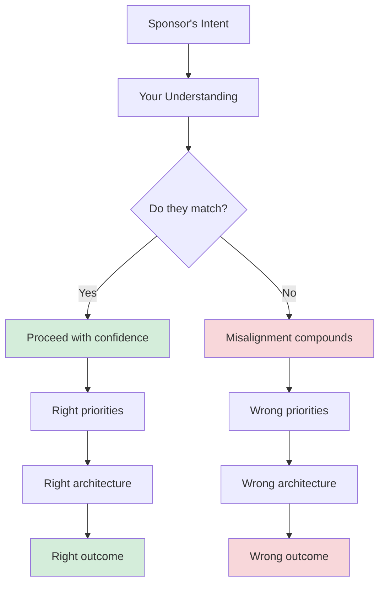
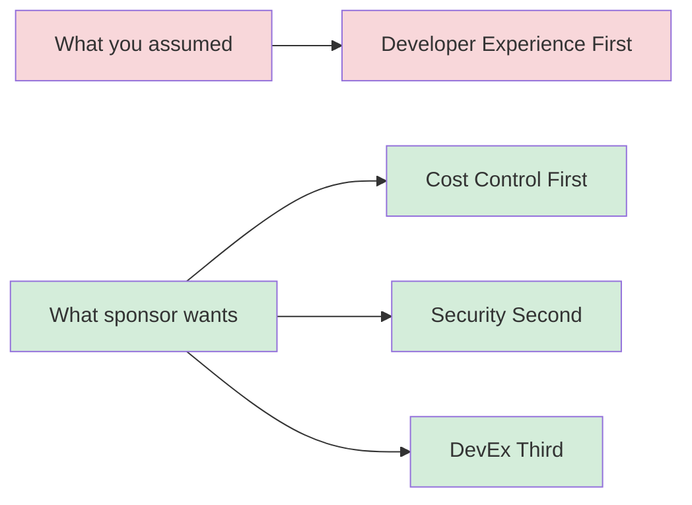

# Leading Large Projects: Align on the Why

**Published:** April 12, 2026

One of the most common failure modes in large projects is building the wrong thing really well. The engineering is solid. The architecture is clean. The code is well-tested. And none of it matters because the project solved a problem that was not the actual problem.

This happens more often than you would think, and it almost always traces back to the same root cause: the technical lead did not align with the project sponsor on what success looks like.

## Why Alignment Comes First

Before you write a line of code, before you sketch an architecture, before you even open your laptop, you need to understand who is sponsoring this project and what they actually want.

Your project sponsor is the person who is funding the work, who has the organizational authority to say "yes, we are doing this," and who will ultimately judge whether the project succeeded. This might be your VP, a director, or a product leader. Understanding what they care about is not optional. It is the foundation everything else rests on.

## How to Have the Conversation

Go in prepared. Before you meet with your sponsor, write down what you think they are hoping to achieve from the project and what success looks like. Then ask them if they agree. If they do not, or if there is any ambiguity at all, write down what they are telling you and double-check that you got it right.

It is surprisingly easy to misunderstand the mission, especially at the start of a project. A conversation with your project sponsor can confirm that you are on the right path, which is always reassuring. This is also a good time to clear up any confusion about what your role will be and who you should bring project updates to.

### Questions to ask your sponsor

- What problem are we solving? Why now?
- What does success look like to you?
- What matters most: speed, cost, quality, or scope?
- What would make you consider this project a failure?
- Who else should I be talking to?
- How often would you like updates, and in what form?

### What to validate

Write your understanding down after the conversation. Send it back to them. This does not need to be a formal document. A short email that says "Here is my understanding of what we discussed. Please let me know if I have anything wrong" is enough. The act of writing it down forces precision, and the act of sharing it creates a checkpoint.

## The LLM Gateway Example

For the LLM Gateway project, you might walk into the conversation with your VP thinking the goal is "build a centralized API for LLM access." But after the conversation, you learn something different.

Your VP's actual priorities, in order:

1. **Cost visibility and control.** Finance is asking hard questions about LLM spending, and today there is no way to answer them. The VP needs a single place to see which teams are spending what.
2. **Security and compliance.** The legal team has flagged that customer data is being sent to third-party LLM providers without proper review. This is a liability issue.
3. **Developer experience.** Teams are building their own integrations and it is duplicated effort, but this is a nice-to-have, not the primary driver.

This changes everything. If you thought the project was primarily about developer experience, you might have started with a beautiful SDK and a clean API design. But the VP needs cost dashboards and audit logs before any of that. You would have spent weeks building the wrong thing first.

## Misalignment Compounds

Misalignment at the start of a project does not stay small. It compounds. If you misunderstand the primary goal, you will prioritize the wrong work. You will make architectural decisions that optimize for the wrong thing. You will recruit people with the wrong skills. You will set milestones that do not track the right progress. And each of these downstream decisions makes the misalignment harder to correct.

Understanding the "why" might even make you reject the premise of the project. If the project you have been asked to lead will not actually achieve the goal, completing it would be a waste of everyone's time. Better to find out early.

## Access and Frequency

Depending on the project sponsor, you might have regular access to them, or you might get a single conversation and then nothing more for months. The less often you are going to talk with them, the more vital it is that you get all of the information up front.

If you can, establish a regular cadence. Even a brief monthly check-in where you share progress and validate that the goals have not shifted can save you from a painful surprise later. Organizational priorities change. New information emerges. What your sponsor wanted in April might be different from what they want in July. Staying aligned is not a one-time event. It is an ongoing practice.

## If Your Sponsor Is Unclear

Sometimes the sponsor does not have a clear answer to "What does success look like?" That is not a reason to skip the conversation. It is a reason to have it. You can help them clarify their thinking by presenting options: "It sounds like the main driver could be cost reduction or security compliance. If we had to pick one to tackle first, which would it be?" Helping your sponsor articulate what they want is itself a valuable contribution.

If the impetus for the work has come from you rather than from a sponsor, then you are on the hook to continually justify the project and make sure it stays funded. It will be easier to sell the value of the work if you can find other people who want it too.

## Conclusion

Your first job on a new project is not execution. It is alignment. Sit down with your sponsor, write down what you think they want, and verify it. This conversation might take thirty minutes, but the misalignment it prevents could save months. Treat it as the most important meeting of the entire project, because it very well might be.

## Series Navigation

This post is part of an 11-part series on Leading Large Projects as a Staff Engineer.

1. [Series Overview](/#/blog/staff-engineers-path-leading-large-projects)
2. [Embrace the Chaos](/#/blog/staff-engineers-path-embrace-the-chaos)
3. [Build Your Second Brain](/#/blog/staff-engineers-path-build-your-second-brain)
4. **Align on the Why** (you are here)
5. [Build Context with Three Maps](/#/blog/staff-engineers-path-build-context)
6. [Clarify the Fundamentals](/#/blog/staff-engineers-path-clarify-the-fundamentals)
7. [Add Structure](/#/blog/staff-engineers-path-add-structure)
8. [Drive the Project](/#/blog/staff-engineers-path-drive-the-project)
9. [Explore Before You Decide](/#/blog/staff-engineers-path-explore-before-you-decide)
10. [Create Shared Understanding](/#/blog/staff-engineers-path-create-shared-understanding)
11. [Lead Through People, Not Authority](/#/blog/staff-engineers-path-lead-through-people)
