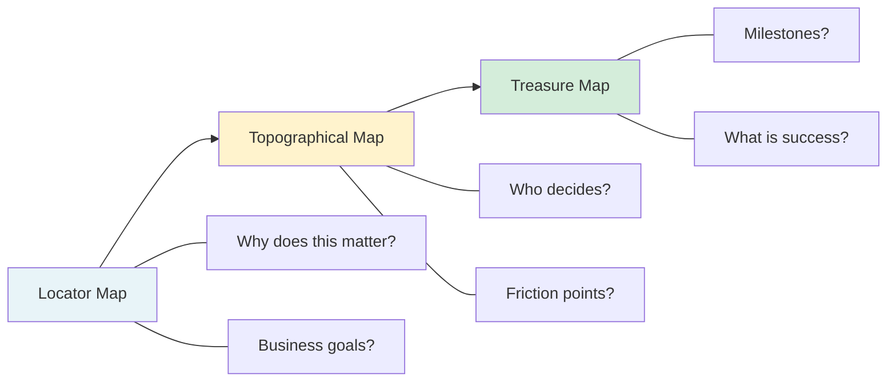
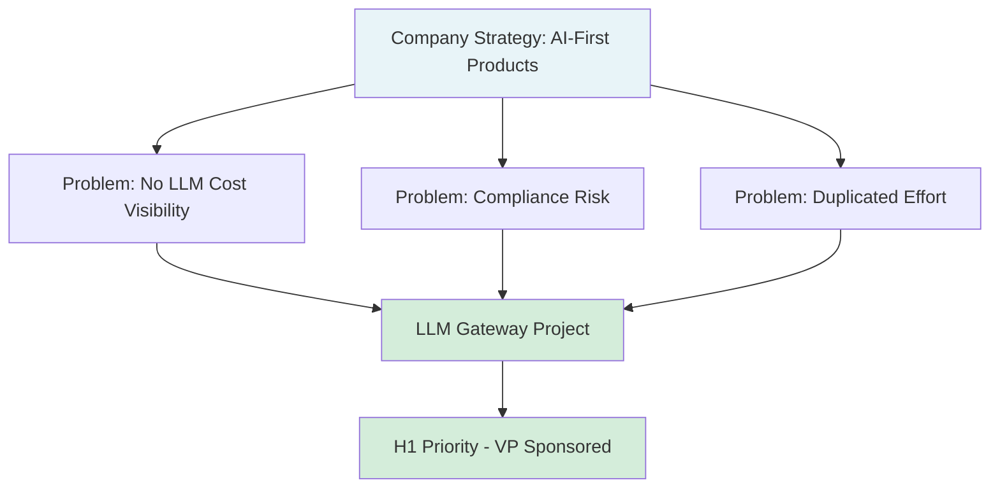
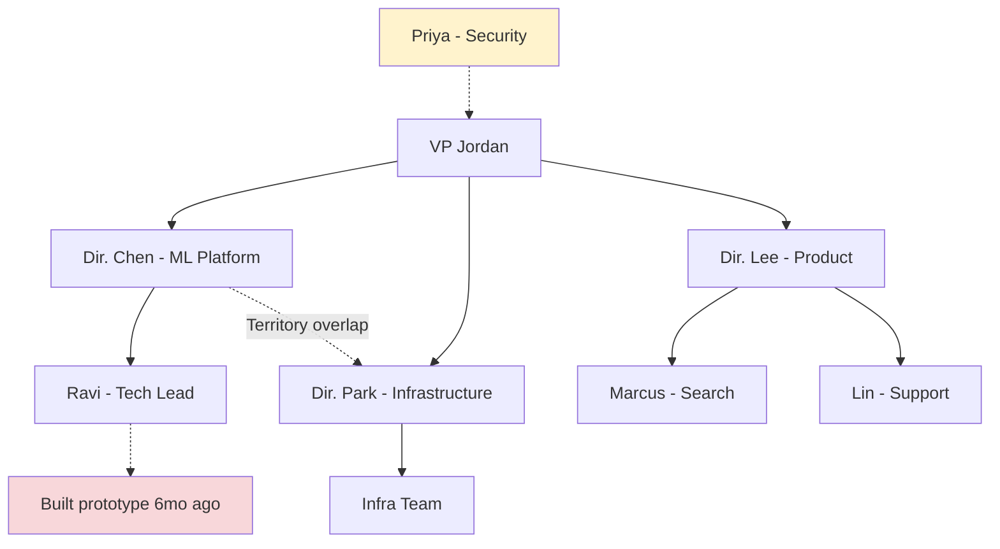
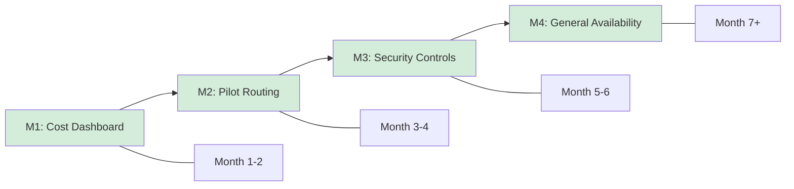

# Leading Large Projects: Build Context with Three Maps

**Published:** April 12, 2026

You have embraced the chaos, started your second brain, and aligned with your sponsor on the "why." Now comes the work of understanding the system you are operating in. Not just the technical system, but the organizational one. Staff engineers do not just build systems. They navigate organizations.

The start of a project is full of ambiguity. You can create perspective, for yourself and others, by taking on a mapping exercise. Think of it as building three distinct maps that together give you the full picture of the terrain you are crossing.

## The Three Maps

### 1. The Locator Map: Where Does This Fit?

The locator map puts the work in perspective. It answers the question: why does this project matter to the business, and how important is it relative to everything else?

Understanding business context is not a nice-to-have. It directly affects your decision-making throughout the project. If the LLM Gateway is a top-three company priority, you can justify asking for dedicated engineers from other teams. If it is a "nice to have" that your VP is funding from their discretionary budget, you need to operate differently: smaller scope, fewer dependencies, faster delivery.

For the LLM Gateway, your locator map might look like this:

- **Business driver:** LLM costs are growing 40% month-over-month with no visibility or controls. Legal has flagged compliance risks around customer data flowing to third-party APIs.
- **Priority level:** VP called it an H1 priority. The CFO asked about it in the last leadership meeting.
- **Competitive context:** Competitors are shipping AI features faster because they have centralized infrastructure. We are falling behind.
- **Related initiatives:** The ML Platform team has a roadmap for model serving. The Security team is rolling out a new data classification framework. Both overlap with our work.

### 2. The Topographical Map: How Does the Org Work?

The topographical map is about terrain. Think of teams and organizations as tectonic plates moving against each other, with friction and instability where the plates meet. Your job is to understand where those boundaries are and how to cross them.

This map answers questions that are not written in any document:

- **Who makes decisions?** Not who has the title, but who actually has influence. Sometimes a senior IC has more sway over technical direction than their manager does.
- **Where are the friction points?** Which teams have a history of disagreement? Where do handoffs typically break down?
- **What are the political boundaries?** Which director wants to own what? Are there turf wars that your project might trigger?
- **How do people like to work?** Some teams communicate through docs, others through Slack, others through meetings. Knowing this helps you engage each team effectively.

For the LLM Gateway:

- The ML Platform team and the Infrastructure team have overlapping mandates. Neither is sure who owns "model access." Your project will force that question.
- The Security team is understaffed and tends to say "no" to anything that adds to their review queue. You need to bring them in early rather than surprising them at the end.
- Director Chen (who oversees ML Platform) and Director Park (who oversees Infrastructure) have historically competed for headcount. Your project touches both of their territories.

### 3. The Treasure Map: Where Are You Going?

The treasure map shows your destination and the path to get there. It answers: what are the milestones, and what does success look like at each stage?

This is where the project starts to feel tangible. You are not just understanding the landscape anymore. You are plotting a route through it.

For the LLM Gateway, an early treasure map might look like:

- **Milestone 1 (Month 1-2):** Cost visibility. A read-only dashboard showing LLM spend per team, per model, per day. No routing changes, just observability.
- **Milestone 2 (Month 3-4):** Centralized routing for one pilot team. The Search team routes their LLM calls through the gateway. Rate limiting and basic auth in place.
- **Milestone 3 (Month 5-6):** Security controls. Prompt logging, data classification checks, audit trail. Security team signs off.
- **Milestone 4 (Month 7+):** General availability. All teams migrate to the gateway. Self-serve onboarding, multi-model support, cost allocation.

Each milestone is usable or demonstrable in some way. Each one delivers value and gives stakeholders an opportunity to provide feedback and course-correct.

## Building the Maps Takes Conversations

You cannot build these maps by reading documentation alone. They require conversations. Talk to the people who have been at the company longer than you. Talk to the people who tried similar projects before. Talk to the people who will be your biggest supporters and your biggest skeptics.

Some questions that help fill in the maps:

- "What has been tried before in this space, and what happened?"
- "If this project succeeds, who benefits most? Who might feel threatened?"
- "What is the one thing that could kill this project?"
- "How do decisions typically get made in your team?"
- "What would make you excited about this project?"

You are not just gathering information. You are building relationships. Every conversation is an opportunity to establish trust and show people that you care about their perspective. This investment pays off throughout the life of the project.

## When the Maps Conflict

Sometimes your three maps will tell you contradictory things. The locator map says this is a top priority. The topographical map reveals that the two teams you depend on most are in a turf war. The treasure map shows milestones that require cooperation from both.

This is useful information. It means you know where the risk is. You can address it directly: talk to both directors, propose a clear ownership split, or escalate to your sponsor if needed. The maps do not solve problems. They show you where the problems are so you can solve them before they derail the project.

## Conclusion

Building context is not a phase you complete and move past. It is something you continue doing throughout the project as the organizational landscape shifts around you. But the initial investment in understanding where the project fits, how the organization works, and where you are going gives you a foundation that makes every subsequent decision easier. Take the time to build all three maps. The locator map keeps you grounded in business reality. The topographical map keeps you from stepping on landmines. The treasure map keeps everyone pointed in the same direction.

## Series Navigation

This post is part of an 11-part series on Leading Large Projects as a Staff Engineer.

1. [Series Overview](/#/blog/staff-engineers-path-leading-large-projects)
2. [Embrace the Chaos](/#/blog/staff-engineers-path-embrace-the-chaos)
3. [Build Your Second Brain](/#/blog/staff-engineers-path-build-your-second-brain)
4. [Align on the Why](/#/blog/staff-engineers-path-align-on-the-why)
5. **Build Context with Three Maps** (you are here)
6. [Clarify the Fundamentals](/#/blog/staff-engineers-path-clarify-the-fundamentals)
7. [Add Structure](/#/blog/staff-engineers-path-add-structure)
8. [Drive the Project](/#/blog/staff-engineers-path-drive-the-project)
9. [Explore Before You Decide](/#/blog/staff-engineers-path-explore-before-you-decide)
10. [Create Shared Understanding](/#/blog/staff-engineers-path-create-shared-understanding)
11. [Lead Through People, Not Authority](/#/blog/staff-engineers-path-lead-through-people)
