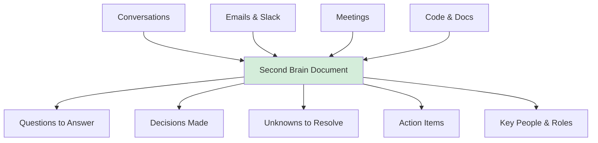
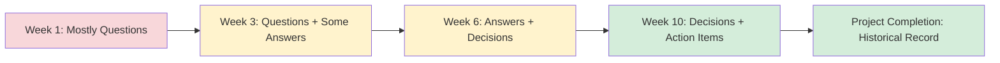

# Leading Large Projects: Build Your Second Brain

**Published:** April 12, 2026

You are two days into leading the LLM Gateway project. You have talked to six people and each one gave you different information. The ML platform lead mentioned a rate limiting concern. The security engineer brought up a compliance requirement you had not considered. Your manager casually mentioned that the VP expects a demo in eight weeks. A product manager sent you a link to a requirements doc that was last updated four months ago.

Where did you write all of that down? If the answer is "I did not," you are already losing information.

## The Problem: Your Brain Is Not Enough

Large projects generate an enormous amount of information. Names, decisions, open questions, half-formed ideas, dependencies, deadlines, rumors, technical constraints, and things people said in passing that might turn out to be critical later. No one can hold all of this in their head.

The bigger the project, the more your working memory becomes a bottleneck. You will forget which team raised which concern. You will lose track of decisions that were made verbally. You will walk into a meeting and not remember what you wanted to ask. This is not a character flaw. It is a cognitive limitation that every human shares. The solution is to stop relying on your brain as the sole repository.

## Create Your Anchor Document

Before you try to solve the problem, you need to externalize it. Create a single document, just for you, that is going to act as an extension of your brain for the duration of the project. It is going to be full of uncertainty and rumors, leads to follow, reminders, bullet points, to-dos, and lists. When you are not sure what to do next, you return to that document and look at what past you thought was important.

This is not a project plan. It is not a design doc. It is not something you share with stakeholders. It is your personal scratch space, the place where you dump everything so that your brain can focus on thinking instead of remembering.



## What Goes In Your Second Brain

There is no right format. Some people use a single long document. Others prefer a structured wiki page. Some use bullet points in a notes app. The format matters less than the habit of putting everything in one place. Here is what typically ends up in mine:

### Open questions

Things you do not know yet but need to find out. For the LLM Gateway: "Who is currently paying for OpenAI API access? Is it centralized or does each team have their own account?" or "Has anyone evaluated whether we need SOC 2 compliance for routing customer data through a gateway?"

### Assumptions

Things you believe to be true but have not verified. "I am assuming the ML platform team will own the infrastructure for this." Write these down explicitly so you can validate them. Unspoken assumptions are the most dangerous kind.

### Decisions

When a decision gets made, record it, even informally. Who decided, what was decided, and why. Decisions made in hallway conversations or Slack threads have a way of getting relitigated if they are not written down somewhere.

### People and roles

Who is involved, what team they are on, and what they care about. For a cross-team project, this is more valuable than you might think. Three weeks in, when you need to ask about authentication, you want to immediately know that the person to talk to is Priya on the security team, not spend twenty minutes trying to remember who mentioned it.

### To-dos and follow-ups

Things you said you would do, things other people said they would do, and things that need to happen but no one has committed to yet. That last category is especially important because those are the items that will fall through the cracks.

### Signals and rumors

Things you overheard or picked up that might matter. "The director mentioned they are thinking about reorganizing the platform teams next quarter." This might be noise, or it might fundamentally change your project. Write it down and decide later.

## The LLM Gateway Second Brain

Here is a simplified version of what the first week's second brain might look like for the LLM Gateway project:

```
LLM Gateway - Working Notes (Week 1)
=====================================

OPEN QUESTIONS
- Who owns the OpenAI/Anthropic vendor relationships today?
- What is the current monthly spend across all teams?
- Are there any existing contracts that constrain which models we can use?
- Does the security team need to review all prompts, or just the architecture?
- What latency requirements do the product teams have?

ASSUMPTIONS (UNVERIFIED)
- ML Platform team will provide compute infrastructure
- We can start with a single cloud region
- Teams will be willing to migrate off their custom integrations
- Budget exists for this (need to confirm with VP)

DECISIONS
- Apr 8: VP confirmed this is a H1 priority (verbal, in 1:1)
- Apr 9: Agreed with ML Platform lead that we will NOT fork their
  existing model serving infra, we will build alongside it

KEY PEOPLE
- Sponsor: VP of Engineering (Jordan)
- ML Platform: Ravi (tech lead), reports to Director Chen
- Security: Priya (staff eng), needs to review auth model
- Product (Search): Marcus, wants AI search by Q3
- Product (Support): Lin, wants AI chat summarization
- Finance: Aisha, tracking LLM costs

TO-DO
- [ ] Schedule 1:1 with Priya re: security requirements
- [ ] Get current cost data from Aisha
- [ ] Read the old prototype doc that Ravi mentioned
- [ ] Find out if there is a procurement process for new vendors

SIGNALS
- Ravi seemed unenthusiastic. His team built a prototype 6 months
  ago that was shelved. Need to understand the history there.
- Marcus mentioned his team already has a working OpenAI integration
  and does not want to be "blocked by infrastructure."
```

This is not polished. It is not meant to be. It is a working tool that keeps you oriented when the project is pulling you in ten directions at once.

## The Habit Matters More Than the Format

The key insight is not that you need a specific template. It is that you need a single place to return to when things feel unclear. Putting absolutely everything in one place removes the "Where did I write that down?" problem. It reduces cognitive load because your brain can stop trying to hold everything and instead focus on making connections and decisions.

Update it regularly. Revisit it before meetings. Cross things off when they are resolved. Add new questions as they come up. Over the course of the project, this document becomes an invaluable record of how you got from chaos to clarity.



## Conclusion

Your second brain is the simplest tool in this series, but it is also one of the most important. It converts the swirling chaos of a new project into something tangible that you can look at, organize, and act on. You do not need a fancy tool or a specific methodology. You need the discipline to write things down in one place and the habit of returning to that place when you are not sure what to do next. Start the document before you try to solve anything. You will thank yourself every week for the rest of the project.

## Series Navigation

This post is part of an 11-part series on Leading Large Projects as a Staff Engineer.

1. [Series Overview](/#/blog/staff-engineers-path-leading-large-projects)
2. [Embrace the Chaos](/#/blog/staff-engineers-path-embrace-the-chaos)
3. **Build Your Second Brain** (you are here)
4. [Align on the Why](/#/blog/staff-engineers-path-align-on-the-why)
5. [Build Context with Three Maps](/#/blog/staff-engineers-path-build-context)
6. [Clarify the Fundamentals](/#/blog/staff-engineers-path-clarify-the-fundamentals)
7. [Add Structure](/#/blog/staff-engineers-path-add-structure)
8. [Drive the Project](/#/blog/staff-engineers-path-drive-the-project)
9. [Explore Before You Decide](/#/blog/staff-engineers-path-explore-before-you-decide)
10. [Create Shared Understanding](/#/blog/staff-engineers-path-create-shared-understanding)
11. [Lead Through People, Not Authority](/#/blog/staff-engineers-path-lead-through-people)
