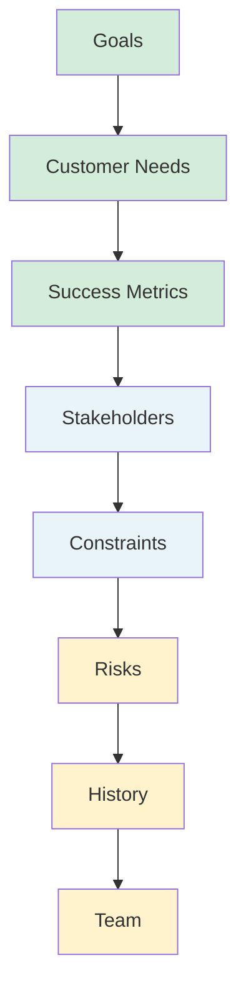
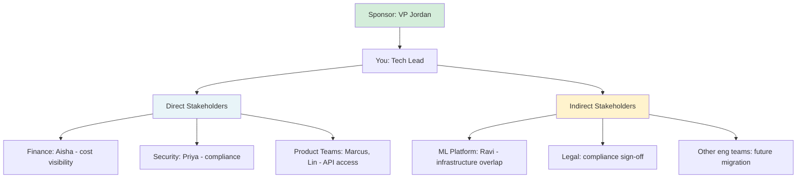

# Leading Large Projects: Clarify the Fundamentals

**Published:** April 12, 2026

You have context. You understand the organizational terrain. Now, before execution begins, you need to make a set of fundamentals explicit. These are the things that, if left unclear, will cause the project to drift. Skipping this step is how you end up solving the wrong problem with perfect execution.

Think of these fundamentals as the project's constitution. Every decision you make later should be traceable back to one of them. If you cannot explain why you are doing something by pointing at a goal, a customer need, or a constraint, that is a signal you have drifted.

## The Fundamentals Checklist

### Goals

Why are you doing this project? Out of all of the possible business goals, the technical investments, and the pending tasks, why is this the one that is happening? The "why" is going to be a motivator and a guide throughout the project. If you are setting off to do something and you do not know why, chances are you will do the wrong thing. You might complete the work without solving the real problem you were intended to solve.

Understanding the "why" might even make you reject the premise of the project. If the project you have been asked to lead will not actually achieve the goal, completing it would be a waste of everyone's time. Better to find out early.

For the LLM Gateway: The goal is not "build a gateway." The goal is "give the company visibility and control over LLM usage so we can manage costs, ensure compliance, and accelerate AI feature development." The gateway is the means, not the end. If you could achieve those goals without building a gateway, that would be a valid outcome too.

### Customer Needs

Even on the most internal project, you have "customers": someone is going to use the things you are creating. If you do not understand what your customers need, you are not going to build the right thing.

A story worth remembering: an engineer described a project to upgrade a system to make a new feature available for another team. "Why do they need it?" someone asked. "Maybe they don't," he said. "We think they do, but we have no way of knowing." These two teams sat in the same building, on the same floor.

For the LLM Gateway, your customers are:

- **Product engineers** who want a simple API to call LLMs without managing vendor credentials, retry logic, or rate limiting.
- **Finance** who wants a dashboard showing spend per team and per model.
- **Security** who wants audit logs and the ability to block prompts containing customer PII.
- **Team leads** who want to set budgets and usage quotas for their teams.

Talk to them. Ask them to describe the workflow they wish they had. Do not mentally fill in what you wish they had said. Listen to their actual responses.

### Success Metrics

Describe how you will measure your success. The existence of code tells you nothing about whether any problem has actually been solved. In some cases, the real success will come from deleting lines of code.

Think about what success will really look like. Will it mean less money spent, fewer security incidents, faster feature development? Is there an objective metric you can set up now that will let you compare before and after?

For the LLM Gateway:

| Metric | Before | Target |
|--------|--------|--------|
| Monthly LLM cost visibility | None (unknown spend per team) | 100% of spend attributed to teams |
| Time to integrate a new LLM model | 2-4 weeks per team | < 1 day via gateway config |
| Security review coverage | Ad hoc, maybe 20% of integrations | 100% of calls routed through audited gateway |
| Duplicate integration code across teams | 5+ independent implementations | 1 shared gateway client |

If you initiated the project yourself, be even more disciplined about defining success metrics. Treat your own ideas with the most skepticism and get real, measurable goals in place quickly, so you can see how the project is trending.

### Stakeholders

Who wants this project and who is paying for it? Who are the main customers? Is there an intermediate person between you and the original project sponsor?

Clarify for yourself who your first customer or main stakeholder is, what they are hoping to see from you, and when.

### Constraints

You are going to be constrained. Understand what those constraints are. Are there deadlines that absolutely cannot move? Do you have a budget? Are there teams you depend on that might be too busy to help you?

For the LLM Gateway:

- **Timeline:** VP wants a cost dashboard demo within 8 weeks.
- **Headcount:** You have yourself and can borrow two engineers from the ML Platform team part-time. No new hires approved yet.
- **Technical:** Must integrate with the existing auth system. Cannot require product teams to change their deployment pipelines.
- **Organizational:** Security team has a 3-week review queue. Need to get in line early.

Understanding your constraints sets your own expectations and other people's too. There is a big difference between "build a gateway" and "build a gateway with two part-time engineers and a hard deadline in eight weeks." Describe the reality of the situation you are in, so you will not spend all your time being mad at reality for not being as you wish it to be.

### Risks

Some things will go wrong, and the more ambitious the project, the riskier it will be. Try to predict some of the risks. What could happen that could prevent you from reaching your goals on deadline?

For the LLM Gateway:

- **Technical risk:** Introducing a proxy layer adds latency. Product teams with real-time requirements might reject it if latency is too high.
- **Adoption risk:** Teams with working integrations have no incentive to migrate. The Search team's custom OpenAI integration works fine. Why would they switch?
- **People risk:** Ravi (ML Platform lead) built a prototype that was shelved. He might be resentful or territorial. If he disengages, you lose critical infrastructure knowledge.
- **Scope risk:** Once the gateway exists, every team will want features. Scope creep is almost guaranteed.

You can mitigate risk by being clear about your areas of uncertainty. What do you not know, and what approaches can you take that will make those less ambiguous? One of the most common risks is wasted effort. If you make frequent iterative changes, you have a better chance of getting user feedback and course-correcting than if you have a single win-or-lose release at the end.

### History

Even if this is a brand-new project, there is going to be some historical context you need to know. Has this been tried before? Are there leftover components? Are there people who tried and failed and might be resentful?

For the LLM Gateway, the history matters a lot. Ravi built a prototype six months ago. It was shelved because the org was not ready. Understanding why it was shelved, what it got right, and what it got wrong is essential. You might be able to reuse parts of it, or you might learn what political dynamics killed it last time so you can navigate them differently.

If you are new to an existing project, do not just jump in. Have a lot of conversations. Find out what half-built systems you are going to have to use, work around, or clean up. Remember: respect what came before.

### Team

Depending on the size of the project, you might have a few key people or a massive cast. If you are the lead of a project that only includes one team, you will probably talk regularly with everyone. On a bigger project with many teams involved, you need a contact person on each team. For even bigger projects, you might have a sublead in each area.

It is vital to build good working relationships with all of the other leaders and help each other out. Do not waste your time in power struggles. You will be more likely to achieve your shared goals if you work well together.

## Conclusion

These fundamentals are not busywork. They are the foundation that keeps the project from drifting. Write them down. Share them. Refer back to them when decisions get hard. A project without clear fundamentals is a project that will keep rediscovering what it is trying to do, and every rediscovery costs time, energy, and trust.

## Series Navigation

This post is part of an 11-part series on Leading Large Projects as a Staff Engineer.

1. [Series Overview](/#/blog/staff-engineers-path-leading-large-projects)
2. [Embrace the Chaos](/#/blog/staff-engineers-path-embrace-the-chaos)
3. [Build Your Second Brain](/#/blog/staff-engineers-path-build-your-second-brain)
4. [Align on the Why](/#/blog/staff-engineers-path-align-on-the-why)
5. [Build Context with Three Maps](/#/blog/staff-engineers-path-build-context)
6. **Clarify the Fundamentals** (you are here)
7. [Add Structure](/#/blog/staff-engineers-path-add-structure)
8. [Drive the Project](/#/blog/staff-engineers-path-drive-the-project)
9. [Explore Before You Decide](/#/blog/staff-engineers-path-explore-before-you-decide)
10. [Create Shared Understanding](/#/blog/staff-engineers-path-create-shared-understanding)
11. [Lead Through People, Not Authority](/#/blog/staff-engineers-path-lead-through-people)
