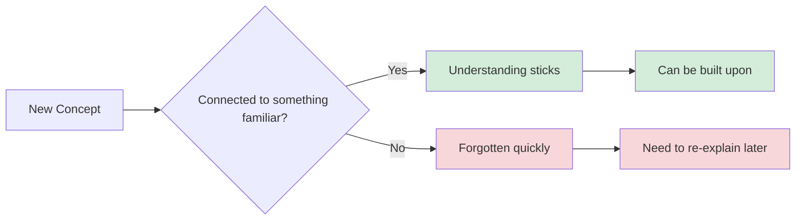
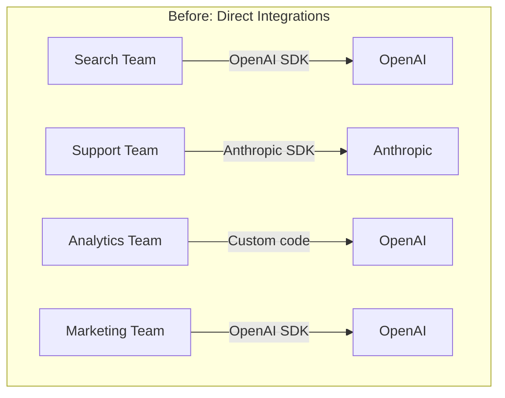
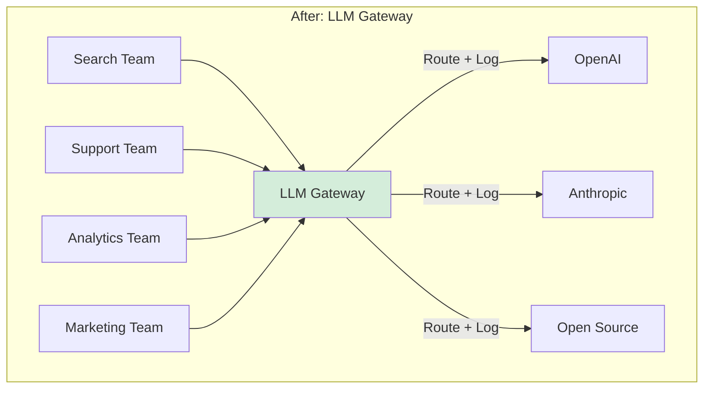

# Leading Large Projects: Create Shared Understanding

**Published:** April 12, 2026

Large projects fail when people use the same words differently, when teams optimize for different outcomes, or when everyone nods along in a meeting but walks away with different pictures of what was agreed. Your job as the technical lead is to reduce complexity so that everyone sees the same picture. If people do not understand the problem the same way, they will not solve it the same way.

## Why Shared Understanding Is Hard

As the project lead, you have an incentive to spend time understanding the tricky concepts because it helps you achieve your goals. But the people you ask for help have a different focus and may not try as hard. Unless you take the time to reduce the complexity for them, they could end up thinking about the project in a way that leads them to optimize for the wrong outcome or muddy a clear story you are trying to tell the organization.

The challenge is connecting new information to things people already know. Abstract ideas need hooks into existing knowledge, or they become what Alain de Botton calls "necklace beads without a connecting chain": facts that are as useless as they are forgettable because they do not connect to anything familiar.

## Mental Models

When you are learning about a complex domain, you are deluged with new terms and concepts. Most documentation explains each concept through its relationship to other new terms, or describes them in abstract ways that make sense only if you already understand the whole domain. The breakthrough comes when someone frames it in relation to something familiar.

They might use an analogy: "Think of the gateway like a load balancer, but for LLM API calls instead of HTTP requests." They might use an example: "When the Search team sends a prompt, the gateway adds their team ID, routes it to the cheapest model that meets their latency requirements, and logs the cost." Neither of these models is perfect, but they do not have to be. They have to be close enough to make a chain back to some other thing you already understand.

Just like we build APIs and interfaces to let us work with components without dealing with their messy details, we can build abstractions to let us work with ideas. As you describe the project, you will likely have abstract concepts that are not easy to understand without deep domain knowledge. Give people a head start by providing a convenient, memorable name for the concept, using an analogy, or connecting it back to something they already understand.

### The LLM Gateway Example

For the LLM Gateway, there are several concepts that need to be made concrete for different audiences:

| Concept | For Engineers | For Finance | For Security |
|---------|---------------|-------------|--------------|
| Request routing | "Like a reverse proxy, but it picks the LLM provider based on model, cost, and team config" | "The system that decides which vendor handles each request and tracks the cost" | "The chokepoint where we can inspect and log every prompt before it leaves the company" |
| Token budget | "A rate limiter scoped to team + model, configured in tokens per day" | "A spending cap per team per month, like a departmental credit card limit" | "An enforcement mechanism that prevents any team from sending unlimited data to external providers" |
| Prompt audit log | "An append-only event stream of every request, like an access log but with prompt content" | "The data source for the cost attribution reports" | "The compliance record that proves we know what data left the building and when" |

The same system, described three different ways depending on what the audience already knows and cares about.

## Naming

Two people can use the same words and mean quite different things. Even very common words like "user," "customer," and "account" may have specific meanings that change depending on whether you are talking to someone in finance, marketing, or engineering.

Take the time to understand what words are meaningful to the people you intend to communicate with, and use their words when you can. If you are trying to talk with multiple groups at once, provide a glossary, or at least be deliberate about describing what you mean by the terms you are using.

For the LLM Gateway, the word "model" means different things to different teams. The ML Platform team means a specific trained neural network with version numbers. The product team means a capability tier: "the fast one" or "the smart one." Finance means a line item on the vendor invoice. Getting everyone to use precise language prevents expensive misunderstandings later.

## Pictures and Diagrams

If you really want to reduce complexity, use pictures. There is no easier way to help people visualize what you are talking about. If something is changing, a set of "before" and "after" pictures can be clearer than an entire essay.

Be aware of existing visual associations. Do not use a cylinder on your diagram unless you are okay with readers thinking of it as a datastore. If you use colors, some of your audience will try to interpret their meaning, assuming green means good and red means bad.

Pictures can also take the form of graphs or charts. If you can show a goal and a line trending toward that goal, it is easy to see what success will look like.

## Writing Things Down

Even if you are not hearing objections when you talk about your plans, your colleagues may not have internalized them. Their implicit agreement may not mean anything. The most efficient way to make sure everyone is aligned is to write things down.

Whether you are creating features, product plans, APIs, architecture, processes, or really anything else where multiple people need to have the same understanding, you will not truly know if people understand and agree until you write it down.

### RFCs and Design Documents

A common approach is a request for comment document (RFC). At minimum, an RFC should include:

- **Context:** Title, author, date, status. Anchor the document in space and time so someone finding it in two years knows whether it is relevant.
- **Goals:** Why you are doing this. The goal should not include implementation details. "Create a serverless API to translate sounds" specifies an implementation in the goal. The specific implementation should serve the goal, not be the goal.
- **Design:** How you intend to achieve the goal. Be specific. It is better to be wrong or controversial than to be vague. If you are wrong, people will tell you and you will learn something. If you are vague, nobody can give you useful feedback.
- **Security and compliance:** What you have worth protecting and from whom.
- **Alternatives considered:** This section demonstrates that you are here to solve the problem and not just excited about the solution. Why would simpler solutions or off-the-shelf products not work?

A tip that was a game-changer for writing clearly: instead of saying "this" or "that," add a noun to spell out exactly what you are referring to, even if you just mentioned it. "We only have two boxes left. To solve this shortage, we should order more." Without "shortage," the reader has to guess what "this" refers to.

### Wrong Is Better Than Vague

It is a better use of your time to be wrong than to be vague. If you are wrong, people will tell you and you can change direction. If you are vague, no one can give you useful feedback, and you lose the opportunity to learn. Having disagreements about your design does not mean you need to change course, but it gives you information you would not have had otherwise.

## Conclusion

Shared understanding is not a luxury. It is a prerequisite for effective collaboration on large projects. Build mental models that connect to what people already know. Name things carefully and consistently. Use diagrams to make the abstract concrete. Write your plans down so people can actually engage with them. The time you spend making things clear for others is not overhead. It is the core work of leading a project that spans multiple teams.

## Series Navigation

This post is part of an 11-part series on Leading Large Projects as a Staff Engineer.

1. [Series Overview](/#/blog/staff-engineers-path-leading-large-projects)
2. [Embrace the Chaos](/#/blog/staff-engineers-path-embrace-the-chaos)
3. [Build Your Second Brain](/#/blog/staff-engineers-path-build-your-second-brain)
4. [Align on the Why](/#/blog/staff-engineers-path-align-on-the-why)
5. [Build Context with Three Maps](/#/blog/staff-engineers-path-build-context)
6. [Clarify the Fundamentals](/#/blog/staff-engineers-path-clarify-the-fundamentals)
7. [Add Structure](/#/blog/staff-engineers-path-add-structure)
8. [Drive the Project](/#/blog/staff-engineers-path-drive-the-project)
9. [Explore Before You Decide](/#/blog/staff-engineers-path-explore-before-you-decide)
10. **Create Shared Understanding** (you are here)
11. [Lead Through People, Not Authority](/#/blog/staff-engineers-path-lead-through-people)
