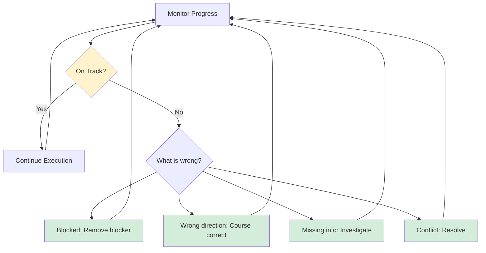

# Leading Large Projects: Drive the Project

**Published:** April 12, 2026

There is a talk by Kripa Krishnan, VP of Google Cloud Platform, called "Avoid the Lake!" where she makes the analogy of project leadership crystal clear: "Driving doesn't mean you put your foot on the gas and you just go straight." Driving is an active, deliberate, mindful role. It means choosing your route, making decisions, and reacting to hazards on the road ahead. If you are the project lead, you are in the driver's seat. You are responsible for getting everyone safely to the destination.

"Driving a project" does not mean moving fast. It means making decisions, adjusting direction, and reacting to risks. It requires constant awareness and course correction.

## What Driving Actually Looks Like

As the driver, your responsibilities include:

- **Making sure decisions get made.** Not necessarily making them yourself, but ensuring they are not left hanging. If a decision has been deferred three times, that is your problem to solve.
- **Reacting to issues.** When something goes wrong, you do not get to say "the project is blocked and so there is nothing we can do." You are responsible for rerouting, escalating, or breaking the news.
- **Guiding direction.** Keeping the team focused on what matters and not letting them drift into bikeshedding or gold-plating.
- **Maintaining momentum.** Projects have a natural tendency to slow down. Regular milestones, clear expectations, and visible progress counteract that.

## The LLM Gateway: Driving in Practice

It is month two of the LLM Gateway project. The cost dashboard MVP is in progress. Here is what driving looks like day to day:

**Monday:** You check in with the two borrowed engineers. One is making good progress on the API usage tracking. The other is stuck because the billing data from OpenAI comes in a format that does not map cleanly to your internal team structure. This is not something they can solve alone. You spend an hour helping them design a mapping layer and agree to talk to Finance about the team-to-cost-center mapping.

**Wednesday:** Marcus from the Search team sends a Slack message asking if his team can start routing calls through the gateway next week. The gateway is not ready for that. You have a conversation with Marcus, explain the timeline, and agree on a specific date for the pilot. You update your second brain and send a status note to your VP.

**Friday:** Ravi mentions in passing that his team's sprint is fully committed and his engineers cannot help with the gateway until next month. This threatens your timeline. You talk to Ravi's manager, explain the impact, and work out a compromise: one engineer for half their time.

None of this is glamorous. None of it is deeply technical. All of it is driving.

## Coding as a Project Lead

How much code you contribute will vary depending on the size of the project and the team. If you are on a tiny team, you might be deep in the weeds of every change. On a project with multiple teams, you might contribute occasional features, or just small fixes, or you might work at a higher level and not code at all.

Writing code is rarely the highest leverage thing you can spend your time on. Most of the code you write could be written by someone more junior. But coding gives you a depth of understanding that is hard to gain otherwise, and it helps you spot problems. If spending a day a week coding keeps you engaged and excited, you will likely do better in the rest of your job. Staying involved in the implementation ensures that you feel the cost of your own architectural decisions.

However, notice if you are contributing code at the expense of more difficult, more important things. This is a form of snacking: taking on work that you know how to do and that has a shorter feedback loop, while avoiding the big, difficult design decisions or crucial organizational maneuvering.

### Be an exemplar, not a bottleneck

As the person responsible for moving the project along, your time is less predictable than everyone else's. If you take on the biggest, most important coding tasks, chances are you will take longer to get to them, which blocks others. Pick work that is not time-sensitive or on the critical path.

Think of your code as a lever to help everyone else. Create a standard pattern, replace all existing instances with your approach, and let future work follow naturally. Aim for your solutions to empower your team, not to take over from them.

Whatever you do will set expectations for the team. Meet or exceed your testing standards, add useful comments, and be careful about taking shortcuts. If you are the most senior person on the team and you are sloppy, you are going to have a sloppy team.

## Communicating

### Talking to each other

Find opportunities for your team members to talk with each other regularly and build relationships. It should feel easy to reach out and ask questions, and they should be comfortable enough with each other that they can disagree without it getting tense. Familiarity makes it feel safer to ask clarifying questions. Engineers who do not know each other may be uncomfortable saying "I do not know what that term means." It will be harder to work together and uncover misunderstandings as a result.

### Sharing status

Your project has other people who care about it: stakeholders, sponsors, customer teams who are waiting for you to be done. Make it easy for them to find out what is going on.

When you deliver status updates, explain them in terms of impact. Your audience probably does not care that you stood up three microservices. They care about what users can do now and when they will be able to do the next thing. Lead with the headlines. Do not assume they will sift through your update for the key facts.

Be realistic and honest. If your project is having difficulties, it may be tempting to report that the status is green. When you do this, you risk an unpleasant surprise at the end when you have to admit it has not been green for a while. These are called "watermelon" projects: all green on the outside, but the inside is red. If your project is stuck, do not hide it. Ask for help.

## Navigating Obstacles

Something will always go wrong. Maybe a technology that is core to your plans will not scale. Maybe someone vital to the project quits. Maybe your organization announces a change in business direction. It is inevitable that you will meet roadblocks and have to change direction.

As the person at the wheel, you are accountable for what happens. You do not get to say the project is blocked. You are responsible for rerouting, escalating to someone who can help, or breaking the news to stakeholders that the goal is now unreachable.

When you are having difficulties, remember that you are not the only person who wants your project to succeed. Your manager's job is to make you successful. If you are not telling them you need help, it is going to be harder for them to do their job. Do not struggle alone.

## Phase Checklist

### Inputs

- [ ] Milestone plan with dates and owners (from Phase 6)
- [ ] Roles and responsibilities table (from Phase 6)
- [ ] Communication channels and meeting cadence (from Phase 6)

### Outputs

- [ ] Regular status updates being sent to stakeholders
- [ ] Decision log: decisions made, by whom, and why
- [ ] Blockers identified and tracked with owners and resolution dates
- [ ] Updated milestone plan reflecting reality (dates adjusted as you learn)
- [ ] Code patterns established that the team can follow

## Conclusion

Driving a project is not a passive activity. It is the ongoing work of making decisions, removing blockers, adjusting course, and keeping everyone pointed in the same direction. The best drivers are not the fastest. They are the most aware, the most responsive, and the most honest about the road ahead.

## Series Navigation

This post is part of an 11-part series on Leading Large Projects as a Staff Engineer.

1. [Series Overview](/#/blog/staff-engineers-path-leading-large-projects)
2. [Embrace the Chaos](/#/blog/staff-engineers-path-embrace-the-chaos)
3. [Build Your Second Brain](/#/blog/staff-engineers-path-build-your-second-brain)
4. [Align on the Why](/#/blog/staff-engineers-path-align-on-the-why)
5. [Build Context with Three Maps](/#/blog/staff-engineers-path-build-context)
6. [Clarify the Fundamentals](/#/blog/staff-engineers-path-clarify-the-fundamentals)
7. [Add Structure](/#/blog/staff-engineers-path-add-structure)
8. **Drive the Project** (you are here)
9. [Explore Before You Decide](/#/blog/staff-engineers-path-explore-before-you-decide)
10. [Create Shared Understanding](/#/blog/staff-engineers-path-create-shared-understanding)
11. [Lead Through People, Not Authority](/#/blog/staff-engineers-path-lead-through-people)
