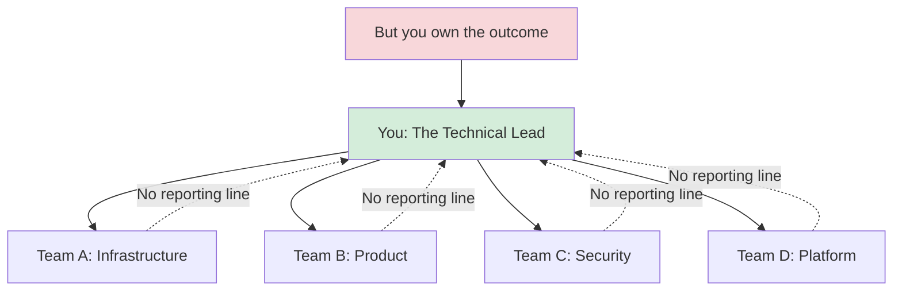
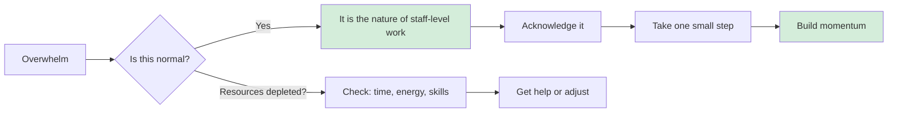

# Leading Large Projects: Embrace the Chaos

**Published:** April 12, 2026

It is Monday morning. Your VP just told you that you are leading the LLM Gateway project. By lunchtime, you have received four Slack messages from people you have never met, a forwarded email thread you were not originally on, a link to a half-finished design doc from six months ago, and a meeting invite titled "Gateway Sync" with twelve attendees and no agenda. You do not know what the project scope is. You do not know who the stakeholders are. You are not even sure if you are supposed to be doing this full-time or fitting it in alongside your other work.

Welcome to the start of a staff-level project. It feels like chaos because it is chaos.

## The Reality: Leadership Without Authority

As a staff engineer, you are often the technical lead of a project where multiple teams are involved, no one reports to you, ownership is unclear, and expectations are fuzzy. The other people on the project are not your direct reports, and they are still getting instructions from their managers. You have a mandate to get something done, but it is possible that not everyone agrees on what that mandate is or whether they are supposed to be helping you with it.

And yet, you are still responsible for the outcome.

This is the defining challenge of staff-level work: end-to-end accountability without direct control. You are thinking about the whole problem, including the parts of it that lie in the fissures between teams and the parts that are not really anyone's job.

## Feeling Overwhelmed Is the Job

Maybe you are joining an existing project, with all of its history, decisions, personality dynamics, and documentation. Maybe the project is new, but there are already detailed requirements, a project spec, milestones, and a documented list of eager stakeholders. Or maybe there is just a whiteboard scrawl, or a bunch of long email threads that culminated in a director deciding to fund a project to solve a poorly articulated, unscoped problem.

It is normal to feel overwhelmed when you are beginning a project. It takes time and energy to build the mental maps that let you navigate it all, and at the start of the project it might feel like more than you can handle.

You might even find yourself feeling that you have been put in this position by mistake or that the project is too hard for you, struggling with a fear that you will let others down or fail publicly. This is imposter syndrome, and it is remarkably common at this level.

But here is the thing: the difficulty is the point. If it was not messy and difficult, they would not need you. Think about how this work would feel if someone else was doing it. No matter who was doing this project, they would find it difficult too. You are doing something hard here and you might make mistakes, but someone has to. The job is to be the person brave enough to make, and own, the mistakes.

## The LLM Gateway Example

For the LLM Gateway project, the chaos looks like this. The ML platform team thinks the gateway should be their project. The security team has opinions about prompt injection but no one has asked them yet. The product team wants to ship an AI feature next quarter and is tired of waiting for infrastructure alignment. Finance wants to understand why the company's OpenAI bill tripled last month. And there is a senior engineer on another team who built a prototype gateway six months ago and feels territorial about it.

None of this is unusual. This is what the start of a cross-cutting project looks like. The question is not how to avoid the chaos. The question is what to do with it.

## Five Things You Can Do Right Now

When the overwhelm hits, you do not need a grand plan. You need a next step. Here are five things that help.

### 1. Acknowledge the chaos

Do not pretend you have it all figured out. You can preface any statement with "I am new to this, so tell me if I have this wrong, but here is what I think we are doing." You will learn a lot. Later on, it becomes a little more cognitively expensive or may even feel embarrassing not to know things. Do not waste the brief period where it is easy not to know.

### 2. Decide who gets your uncertainty

Think about who you are going to talk with when the project is difficult and you are feeling out of your depth. Your junior engineers are not the right people. They are looking to you for safety and stability. You should show your less seasoned colleagues that senior people are learning too, but do not let your fears spill onto them. Part of your job will be to remove stress for them.

That does not mean you should carry your worries alone. Find at least one person who you can be open and unsure with. This might be your manager, a mentor, or a peer. Choose a sounding board who will listen, validate, and say "Yes, this stuff is hard for me too" rather than refusing to ever admit weakness or just trying to solve your problems for you.

### 3. Give yourself a win

If the problem is still too big, aim to take a step, any step, that helps you exert some control over it. Talk to someone. Draw a picture. Create a document. Describe the problem to someone else. Small actions build momentum and reduce the feeling of being stuck.

### 4. Use your strengths

You are going to want to pour a lot of information into your brain as efficiently as possible, so use your core muscles. If you are most comfortable with code, jump in and read the existing codebase. If you tend to go first to relationships, talk to people. If you are a reader, go get the documents. Your preferred starting point will not give you all of the information you need, but it will convince your brain that this is just another project.

### 5. Check your resources

The feelings of overwhelm might be a signal that you are low on time, energy, or skills. Check in with yourself. Is there anything you can do to get more time or energy? Are there people who could help? Are there skills you need to build?

## Phase Checklist

### Inputs

- [ ] Project assignment or mandate (even if vague)
- [ ] Any existing docs, email threads, or prior art forwarded to you
- [ ] Names of people mentioned as involved

### Outputs

- [ ] Honest self-assessment of your resource levels (time, energy, skills)
- [ ] At least one sounding board identified (manager, peer, mentor)
- [ ] Initial list of people to talk to
- [ ] One small win completed (a conversation, a question asked, a doc read)

## Conclusion

The beginning of a large project is supposed to feel chaotic. You are not failing. You are encountering the nature of staff-level work. The difference between a project that succeeds and one that does not is rarely the technical approach. It is whether the lead had the perseverance to push through the initial chaos and start making sense of it. Your first job is not execution. Your first job is making sense of the chaos.

## Series Navigation

This post is part of an 11-part series on Leading Large Projects as a Staff Engineer.

1. [Series Overview](/#/blog/staff-engineers-path-leading-large-projects)
2. **Embrace the Chaos** (you are here)
3. [Build Your Second Brain](/#/blog/staff-engineers-path-build-your-second-brain)
4. [Align on the Why](/#/blog/staff-engineers-path-align-on-the-why)
5. [Build Context with Three Maps](/#/blog/staff-engineers-path-build-context)
6. [Clarify the Fundamentals](/#/blog/staff-engineers-path-clarify-the-fundamentals)
7. [Add Structure](/#/blog/staff-engineers-path-add-structure)
8. [Drive the Project](/#/blog/staff-engineers-path-drive-the-project)
9. [Explore Before You Decide](/#/blog/staff-engineers-path-explore-before-you-decide)
10. [Create Shared Understanding](/#/blog/staff-engineers-path-create-shared-understanding)
11. [Lead Through People, Not Authority](/#/blog/staff-engineers-path-lead-through-people)
