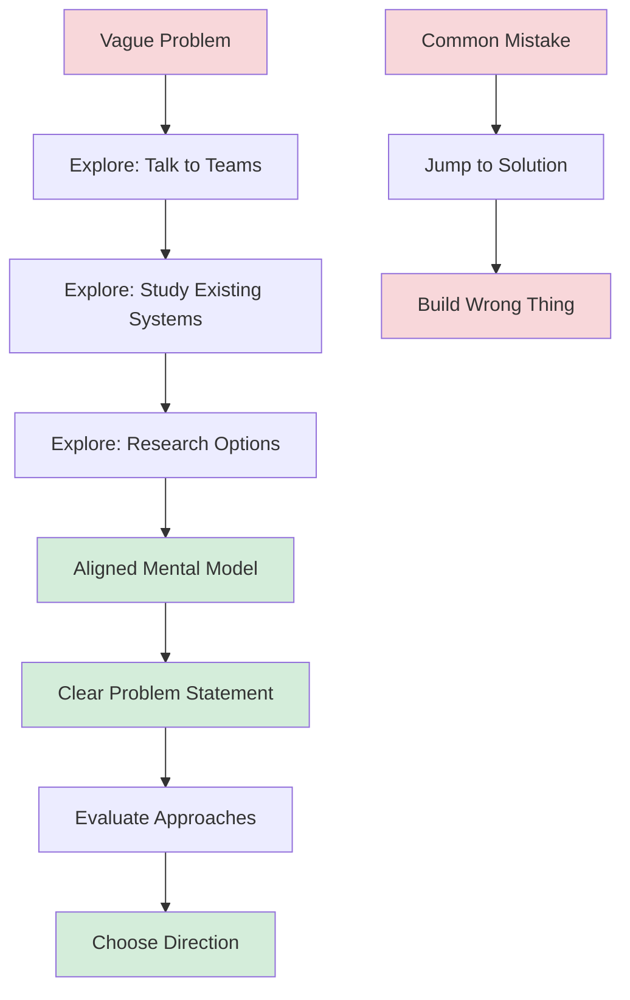
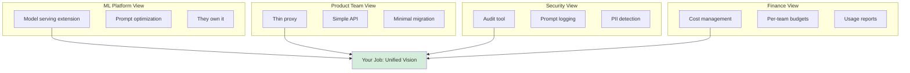

# Leading Large Projects: Explore Before You Decide

**Published:** April 12, 2026

A common mistake at the start of a project is jumping to solutions too early. You hear the problem, and your brain immediately starts designing the system. By the end of the first meeting, you have already picked the database, the language, and the deployment strategy. The problem is that on day one, you do not fully understand the problem. Different teams have different assumptions. And the solution you are envisioning might not address the real need.

Be suspicious when a brand-new project already has a design document or plan, and even more when those include implementation details: "Build a GraphQL server with Node.js to..." Unless the problem is really straightforward, you will not have enough information about it on day one to make these kinds of granular decisions.

## Why Exploration Matters

It will take some research and exploration to understand the project's true needs and evaluate the approaches you might take to achieve them. If you are creating a design where it is difficult to articulate the goals, or if the goals are just a description of your implementation, that is a sign that you have not spent enough time in the exploration stage.

## Align Mental Models Across Teams

The bigger the project, the more likely it is that different teams have different mental models of what you are trying to achieve, what will be different once you have achieved it, and what approach you are all taking.

Some teams might have constraints that you do not know about, or unspoken assumptions about the direction the project will take. They might have only agreed to help you because they think your project will also achieve some other goal they care about, and they might be wrong. Team members may fixate on smaller, less important aspects of the project or niche use cases, or expect a different scope than you do. They may be using different vocabulary to describe the same thing, or using the same words but meaning something different.

### The LLM Gateway Example

When you start exploring the LLM Gateway project, you discover that different teams have very different pictures of what the gateway is:

- **The ML Platform team** thinks the gateway is an extension of their model serving infrastructure. They envision it handling model selection, prompt optimization, and caching. They assume they will own and operate it.
- **The Search product team** thinks the gateway is a thin proxy with an API key. They want to call it, get a response, and not think about it. They definitely do not want to change their existing integration much.
- **The Security team** thinks the gateway is primarily an audit and compliance tool. They want every prompt logged, classified, and reviewable. They care less about the API design and more about the data pipeline.
- **Finance** thinks the gateway is a cost management tool. They want per-team budgets, alerts when spending exceeds thresholds, and monthly reports broken down by model and use case.

None of these are wrong. But they are different, and if you design the system to satisfy one team's mental model, you will disappoint the others. Your job is to get to the point where you can concisely explain what different teams want in a way that they will agree is accurate.

## Build Your Elevator Pitch

As you explore and uncover expectations, you will start building up a crisp definition of what you are doing. Exploring helps you form an elevator pitch about the project, a way to sum it up and reduce it to its most important aspects. You will also start building up a clear description of what you are not doing.

For the LLM Gateway, after two weeks of exploration, your elevator pitch might become: "The LLM Gateway is a centralized proxy for all LLM API calls that gives the company cost visibility, security controls, and a consistent developer experience. It is not a model serving platform, not a prompt engineering tool, and not a replacement for teams' existing ML infrastructure."

That clarity did not exist on day one. It took conversations, disagreements, and deliberate exploration to get there.

## Look at Existing Solutions

Be open to existing solutions, even if they are less interesting than creating something new. Study and learn from other teams, both in your company and outside, before diving into creating some new thing. The existing work might not be exactly the shape of whatever you have been envisioning, but be receptive to the idea that it might be a workable shape.

Learn from history. Understand whether similar projects have succeeded or failed, and where they struggled. Remember that creating code is just one of the stages of software engineering: running code needs to be maintained, operated, deployed, monitored, and someday deleted. If there is a solution that means your organization has fewer things to maintain after your project, weigh that up when you are choosing your approach.

For the LLM Gateway, Ravi's six-month-old prototype might contain useful ideas. An open-source project like LiteLLM might handle 80% of the routing logic you need. A vendor solution might be worth evaluating even if it is less technically interesting than building your own. The goal is to solve the problem, not to write the most code.

## When to Stop Exploring

Exploration has diminishing returns. At some point, you have enough information to make a decision and move forward. You will know you are ready when:

- You can articulate the problem in a way that all stakeholders agree with
- You can explain what you are not doing and why
- You have identified at least two viable approaches and can describe their trade-offs
- The remaining unknowns can be resolved through building, not through more research

If you have gone into the project with an architecture or a solution in mind, it can be jarring to realize that it might not actually solve the real problem. This is such a difficult mental adjustment that some project leads cling tightly to their original ideas, resisting all information that contradicts their worldview. That does not make for a good solution. Keep an open mind about how you are solving the problem until you have agreed on what you need to solve.

## Conclusion

Exploration is not procrastination. It is the work of making sure you build the right thing before you build it well. Resist the urge to start coding on day one. Talk to people. Understand the problem from multiple perspectives. Look at what already exists. Only then should you commit to an approach. The time you spend exploring will save you far more time than it costs.

## Series Navigation

This post is part of an 11-part series on Leading Large Projects as a Staff Engineer.

1. [Series Overview](/#/blog/staff-engineers-path-leading-large-projects)
2. [Embrace the Chaos](/#/blog/staff-engineers-path-embrace-the-chaos)
3. [Build Your Second Brain](/#/blog/staff-engineers-path-build-your-second-brain)
4. [Align on the Why](/#/blog/staff-engineers-path-align-on-the-why)
5. [Build Context with Three Maps](/#/blog/staff-engineers-path-build-context)
6. [Clarify the Fundamentals](/#/blog/staff-engineers-path-clarify-the-fundamentals)
7. [Add Structure](/#/blog/staff-engineers-path-add-structure)
8. [Drive the Project](/#/blog/staff-engineers-path-drive-the-project)
9. **Explore Before You Decide** (you are here)
10. [Create Shared Understanding](/#/blog/staff-engineers-path-create-shared-understanding)
11. [Lead Through People, Not Authority](/#/blog/staff-engineers-path-lead-through-people)
