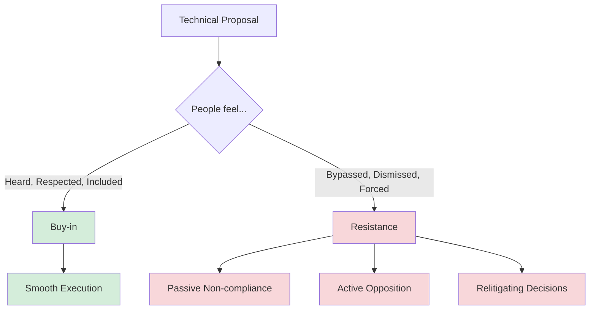
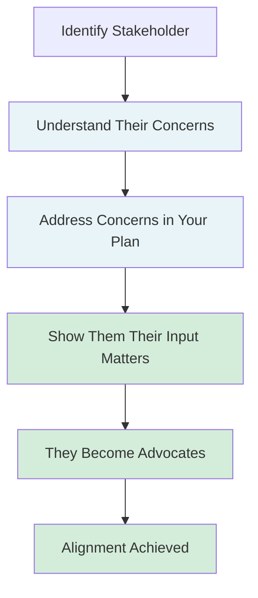
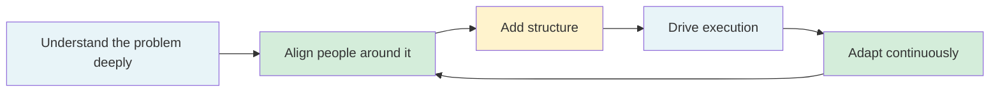

# Leading Large Projects: Lead Through People, Not Authority

**Published:** April 12, 2026

You cannot force alignment. You must create it.

This is the final and perhaps most important lesson of leading large projects as a staff engineer. You have no direct reports. You have no hiring or firing authority over the people who need to do the work. You cannot mandate compliance. What you have is influence, and influence is built through trust, competence, and the deliberate act of making people feel heard.

Everything in this series has been building toward this. Embracing the chaos, aligning on the why, building context, adding structure, driving execution, exploring options, creating shared understanding: all of these are in service of the deeper skill of leading people who do not report to you toward an outcome that benefits everyone.

## Alignment Is Emotional Before It Is Logical

Engineers like to believe that the best technical argument wins. Present the data, lay out the trade-offs, and the rational choice becomes obvious. But that is not how organizations actually work.

People need to feel:

- **Heard.** Their concerns were acknowledged, not dismissed.
- **Respected.** Their expertise was valued, not overridden.
- **Included.** They were part of the decision, not surprised by it.
- **Safe.** Disagreeing will not result in retaliation or exclusion.

If people feel confused, attacked, forced, or bypassed, they will resist, even if the technical direction is correct. You can be right about the architecture and still fail the project because you did not bring people along.

## How to Create Alignment

### Listen before you propose

Before you present your plan, understand what each stakeholder cares about. What are their constraints? What would make this project a win for them? What are they worried about? When you propose a direction that already accounts for their concerns, alignment becomes much easier.

### Incorporate feedback visibly

When someone gives you feedback and you change your plan because of it, tell them. "I updated the design based on what you said about latency requirements" is a powerful signal that you actually listen, not just perform listening. People who see their input reflected in the outcome become advocates.

### Pre-align before big decisions

The worst time to discover disagreement is in a room full of people. Before a major decision point, have one-on-one conversations with the key stakeholders. Understand their positions. Address concerns privately. By the time you bring the decision to the group, you want the outcome to be a formality, not a debate.

### The LLM Gateway Example

For the LLM Gateway, leading through people looks like this:

**Ravi (ML Platform):** He built a prototype that was shelved. He has institutional knowledge and also resentment. Instead of ignoring his work, you ask him to walk you through what he built, what he learned, and what he would do differently. You incorporate two of his design ideas into your architecture. You give him credit in the design doc. He goes from skeptic to advocate.

**Marcus (Search Product):** He is impatient. He does not want to be "blocked by infrastructure." Instead of telling him to wait, you make his team the pilot. You give him early access and a direct line to you for issues. His team becomes your proof point and your biggest champion.

**Priya (Security):** She is overwhelmed and expects to say no. Instead of dumping a fully formed plan on her, you bring her in early with a specific question: "What would the audit log need to look like for you to be comfortable with this?" You design around her answer. She becomes a collaborator, not a blocker.

**Director Chen and Director Park:** They have competing interests. Instead of letting the turf war fester, you propose a clear ownership split in writing: "ML Platform owns model serving. Infrastructure owns the gateway routing layer. Here is where they integrate." You present it to both directors separately, incorporate their feedback, and then bring it to a joint meeting where the structure is already agreed upon.

## Avoid Creating Chaos

As a project lead with influence over multiple teams, you can inadvertently create the very chaos you are trying to reduce. Be careful not to:

- **Surprise people.** If a decision affects someone's team, they should hear about it from you before they hear about it in a meeting or read about it in a document.
- **Undermine managers.** You are a technical lead, not the manager of the people working on your project. Respect the reporting lines. If you need someone's priorities to change, talk to their manager, not around them.
- **Create urgency unnecessarily.** Not everything is a fire. If you constantly escalate or create pressure, people will stop taking your signals seriously.
- **Take credit for collective work.** Nothing erodes trust faster than a leader who presents the team's work as their own. Be generous with credit and specific about who contributed what.

## The Final Mental Model

Leading a staff-level project is not about being the smartest person in the room. It is about turning ambiguity into progress. The full arc looks like this:

Notice the loop. This is not a linear process. As you drive execution and learn new things, you go back and realign people, adjust structure, and adapt. The project is never fully "figured out." It is always being figured out, and your job is to keep that process moving forward.

## What It Really Means

I have written previously about [large-scale feature development](/#/blog/large-feature-development), which covers the mechanics of delivering a single big feature: understanding the problem, planning the implementation, testing, and releasing. A staff-level project is different in kind, not just in scale. It often comprises multiple large features being built simultaneously by teams that do not share a manager, a codebase, or sometimes even a common understanding of what they are building. The technical skills from feature development still apply, but the new dimension is organizational: you are leading people, not just code.

The best project leads are not the ones with the best ideas. They are the ones who can take a messy, unclear, multi-team problem and guide everyone toward a shared outcome. That is what staff engineering really is.

## Phase Checklist

### Inputs

- [ ] Approved design document (from Phase 9)
- [ ] Roles and responsibilities (from Phase 6)
- [ ] Stakeholder map with each person's concerns (from Phase 5)

### Outputs

- [ ] Key stakeholders converted from observers to advocates
- [ ] Pre-alignment completed on all major decisions before group meetings
- [ ] Feedback loop established: people see their input reflected in decisions
- [ ] Team morale and trust healthy (no one feels bypassed or dismissed)
- [ ] Project on track with aligned, motivated people pulling in the same direction

## Conclusion

Leading through people is not a soft skill that supplements your technical work. It is the core skill that makes everything else possible. Without it, the best architecture in the world will die in a room full of people who do not trust the person proposing it. With it, even imperfect plans become successful projects because the people executing them are aligned, motivated, and pulling in the same direction.

## Series Navigation

This post is part of an 11-part series on Leading Large Projects as a Staff Engineer.

1. [Series Overview](/#/blog/staff-engineers-path-leading-large-projects)
2. [Embrace the Chaos](/#/blog/staff-engineers-path-embrace-the-chaos)
3. [Build Your Second Brain](/#/blog/staff-engineers-path-build-your-second-brain)
4. [Align on the Why](/#/blog/staff-engineers-path-align-on-the-why)
5. [Build Context with Three Maps](/#/blog/staff-engineers-path-build-context)
6. [Clarify the Fundamentals](/#/blog/staff-engineers-path-clarify-the-fundamentals)
7. [Add Structure](/#/blog/staff-engineers-path-add-structure)
8. [Drive the Project](/#/blog/staff-engineers-path-drive-the-project)
9. [Explore Before You Decide](/#/blog/staff-engineers-path-explore-before-you-decide)
10. [Create Shared Understanding](/#/blog/staff-engineers-path-create-shared-understanding)
11. **Lead Through People, Not Authority** (you are here)
