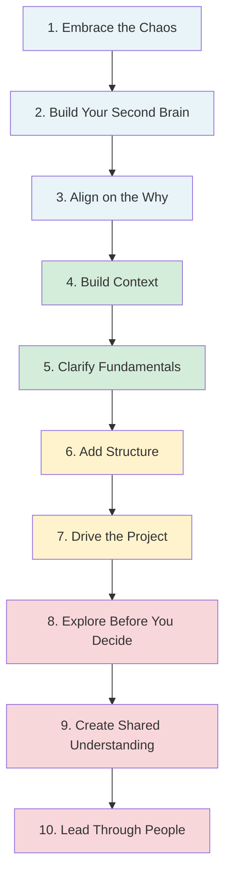

# Leading Large Projects as a Staff Engineer: A Series Overview

**Published:** April 12, 2026

You just got tapped to lead a project that spans multiple teams, has unclear requirements, and no one reports to you. Welcome to staff engineering.

Most engineers assume that leading a big project is about having the best technical idea. It is not. The hardest part of large projects is not technology. It is ambiguity, people, and alignment. If the problem were straightforward, it would not need a staff engineer.

This series walks through the lifecycle of a large, ambiguous, multi-team project from the perspective of the technical lead. The material is drawn from Chapter 5 of Tanya Reilly's "The Staff Engineer's Path," and I have added a running example throughout: building an **LLM Gateway**, a centralized service that gives every team in a company a unified API for accessing large language models. It is the kind of project that touches infrastructure, platform, product, security, and finance teams all at once, and it is exactly the kind of ambiguous, cross-cutting work that lands on a staff engineer's desk.

## The Defining Challenge

As a staff engineer leading a project, you are often in a position where multiple teams are involved, no one reports to you, ownership is unclear, and expectations are fuzzy. And yet, you are still responsible for the outcome. This is the defining challenge of staff-level work: end-to-end accountability without direct control.

## What Leadership Actually Means

When engineers hear "you are leading this project," many picture themselves making big architectural decisions, writing the most critical code, or presenting the final design to leadership. That is not what leadership means at this level.

Leadership means making the people around you more effective. In practice, that looks like:

- **Clearing blockers.** An engineer on the project is stuck waiting on another team's API. A dependency is unclear. A decision is sitting in limbo because nobody knows who has the authority to make it. Your job is to notice these things and resolve them, whether that means having a conversation, escalating, or just making the decision yourself.
- **Helping people deliver their work.** You are not here to do everything. You are here to make sure everyone else can do their part. That might mean pair programming on a tricky problem, reviewing a design, breaking a vague ticket into concrete steps, or simply asking "what do you need from me to finish this?"
- **Aligning yourself with leadership's vision.** You need to understand what your manager, your director, and the organization care about, and make sure the project is moving toward those goals. If leadership cares about cost reduction and you are optimizing for developer experience, you are misaligned no matter how good the work is. (I cover this in depth in a separate post on [Aligning with Leadership](/#/blog/aligning-with-your-manager).)
- **Driving alignment on architecture.** Big decisions should not live in your head. They should be written down as RFCs or design documents, reviewed by the people who will be affected, and agreed upon before implementation begins. Your job is to make sure these decisions get made explicitly rather than implicitly, and that the people who need to weigh in have the opportunity to do so.
- **Collaborating cross-functionally.** A staff-level project almost always spans multiple teams. Leadership means building bridges between those teams: understanding what each team needs, translating between their different contexts, and helping them achieve their own goals through the project. If the Security team needs an audit log and the Product team needs low latency, your job is to find the design that serves both, not to pick a winner.

Leadership is not about being the smartest person in the room or writing the most code. It is about making sure the right things happen, the right people are unblocked, the architecture is agreed upon rather than assumed, and the project stays pointed at the outcome the organization actually needs.

## The Phases

Leading a large project is not a single skill. It is a sequence of overlapping phases, each with its own challenges. Here is the roadmap we will follow:

**Phase 1: Embrace the Chaos.** The beginning is always messy. Feeling overwhelmed is not a signal you are failing. It is a signal you are doing staff-level work.

**Phase 2: Build Your Second Brain.** Before you try to solve the problem, externalize it. Create a single document that acts as an extension of your brain for the duration of the project.

**Phase 3: Align on the Why.** One of the most common failure modes is building the wrong thing really well. Align with your project sponsor before doing anything else.

**Phase 4: Build Context with Three Maps.** To operate effectively, you need to understand the system you are in: where the project fits, how the organization works, and where you are going.

**Phase 5: Clarify the Fundamentals.** Before execution begins, make the goals, customers, success metrics, stakeholders, constraints, risks, and history explicit.

**Phase 6: Add Structure.** Ambiguity is inevitable. Chaos is optional. Define roles, set scope, agree on logistics, and give the project a skeleton it can grow into.

**Phase 7: Drive the Project.** Driving does not mean going fast. It means making decisions, adjusting direction, and reacting to risks. It is active, not passive.

**Phase 8: Explore Before You Decide.** Resist the urge to jump to solutions. You do not fully understand the problem on day one. Explore the space before committing to an approach.

**Phase 9: Create Shared Understanding.** Large projects fail when people use the same words differently or optimize for different outcomes. Your job is to reduce complexity so everyone sees the same picture.

**Phase 10: Lead Through People, Not Authority.** You cannot force alignment. You must create it. The best project leads are the ones who can take a messy, unclear, multi-team problem and guide everyone toward a shared outcome.

## The Running Example: LLM Gateway

Throughout this series, we will use a concrete example to illustrate each phase. Imagine you are a staff engineer at a mid-size company. Different teams have started integrating LLMs into their products independently. Some use OpenAI, some use Anthropic, some are experimenting with open-source models. Costs are spiraling, there is no visibility into usage, prompt injection vulnerabilities are popping up, and every team is building their own retry logic and rate limiting from scratch.

Your VP of Engineering pulls you aside and says: "We need a unified LLM Gateway. You are leading it."

That is where the story begins.

## How This Differs from Feature Development

I have written previously about [large-scale feature development](/#/blog/large-feature-development), which covers the mechanics of delivering a single big feature: understanding the problem, planning the implementation, testing, and releasing. A staff-level project is different in kind, not just in scale. It often comprises multiple large features being built simultaneously by teams that do not share a manager, a codebase, or sometimes even a common understanding of what they are building. The technical skills from feature development still apply, but the new dimension is organizational: you are leading people and navigating ambiguity across team boundaries, not just shipping code.

## Conclusion

What makes a great project lead is rarely genius. It is perseverance, courage, and a willingness to talk to other people. The reason a project is difficult is usually not that you are pushing the boundaries of technology. It is that you are dealing with ambiguity: unclear direction, messy complicated humans, and legacy systems whose behavior you cannot predict.

This series will give you a phase-by-phase playbook for navigating that ambiguity and turning it into progress.

## Series Navigation

This post is part of an 11-part series on Leading Large Projects as a Staff Engineer.

1. **Series Overview** (you are here)
2. [Embrace the Chaos](/#/blog/staff-engineers-path-embrace-the-chaos)
3. [Build Your Second Brain](/#/blog/staff-engineers-path-build-your-second-brain)
4. [Align on the Why](/#/blog/staff-engineers-path-align-on-the-why)
5. [Build Context with Three Maps](/#/blog/staff-engineers-path-build-context)
6. [Clarify the Fundamentals](/#/blog/staff-engineers-path-clarify-the-fundamentals)
7. [Add Structure](/#/blog/staff-engineers-path-add-structure)
8. [Drive the Project](/#/blog/staff-engineers-path-drive-the-project)
9. [Explore Before You Decide](/#/blog/staff-engineers-path-explore-before-you-decide)
10. [Create Shared Understanding](/#/blog/staff-engineers-path-create-shared-understanding)
11. [Lead Through People, Not Authority](/#/blog/staff-engineers-path-lead-through-people)
