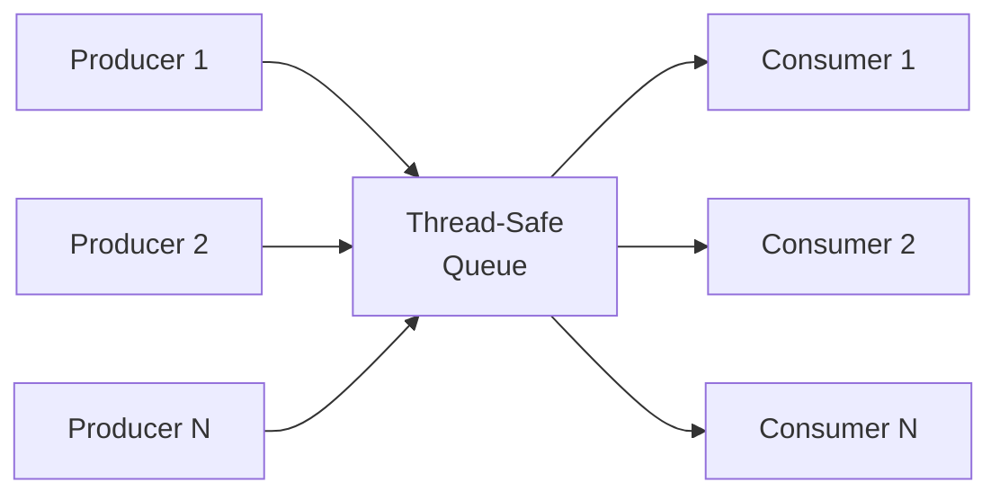
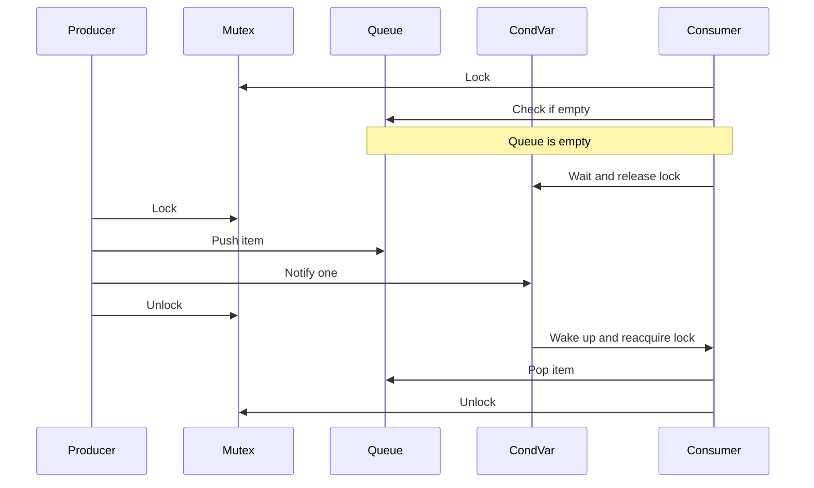
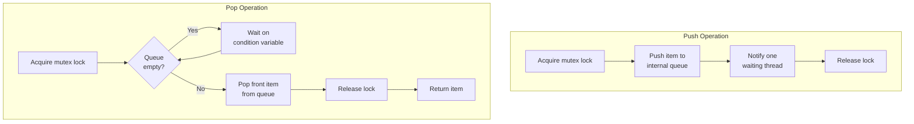

# Thread-safe queue implementation in C++

**Published:** 2021-09-06


Below is an implementation of thread-safe queue using synchronization primitives.

## Producer-Consumer Pattern

A thread-safe queue is the backbone of the producer-consumer pattern. Multiple producer threads enqueue items while multiple consumer threads dequeue them, all coordinated through synchronization primitives.



## Mutex and Condition Variable Flow

The queue uses a mutex to protect shared state and a condition variable to signal consumers when data is available. This avoids busy-waiting and ensures correct synchronization.



## Implementation

```cpp
#include <queue>
#include <mutex>
#include <condition_variable>

template <typename T>
class ThreadSafeQueue {
private:
    std::queue<T> queue_;
    std::mutex mutex_;
    std::condition_variable cond_;

public:
    void push(T item) {
        std::lock_guard<std::mutex> lock(mutex_);
        queue_.push(std::move(item));
        cond_.notify_one();
    }

    T pop() {
        std::unique_lock<std::mutex> lock(mutex_);
        cond_.wait(lock, [this] { return !queue_.empty(); });
        T item = std::move(queue_.front());
        queue_.pop();
        return item;
    }

    bool try_pop(T& item) {
        std::lock_guard<std::mutex> lock(mutex_);
        if (queue_.empty()) {
            return false;
        }
        item = std::move(queue_.front());
        queue_.pop();
        return true;
    }

    bool empty() const {
        std::lock_guard<std::mutex> lock(mutex_);
        return queue_.empty();
    }

    size_t size() const {
        std::lock_guard<std::mutex> lock(mutex_);
        return queue_.size();
    }
};
```

## Push and Pop Operations

Both push and pop operations acquire the mutex before modifying the queue. The pop operation additionally waits on the condition variable if the queue is empty. The `try_pop` variant returns immediately with a boolean indicating whether an item was available, which is useful when you do not want the consumer to block.



## Usage Example

```cpp
#include <iostream>
#include <thread>
#include <vector>

int main() {
    ThreadSafeQueue<int> queue;

    // Producer threads
    std::vector<std::thread> producers;
    for (int i = 0; i < 3; ++i) {
        producers.emplace_back([&queue, i] {
            for (int j = 0; j < 5; ++j) {
                int value = i * 10 + j;
                queue.push(value);
                std::cout << "Producer " << i << " pushed " << value << "\n";
            }
        });
    }

    // Consumer threads
    std::vector<std::thread> consumers;
    for (int i = 0; i < 2; ++i) {
        consumers.emplace_back([&queue, i] {
            for (int j = 0; j < 7; ++j) {
                int value = queue.pop();
                std::cout << "Consumer " << i << " popped " << value << "\n";
            }
        });
    }

    for (auto& t : producers) t.join();
    for (auto& t : consumers) t.join();

    // Drain remaining items
    int item;
    while (queue.try_pop(item)) {
        std::cout << "Remaining: " << item << "\n";
    }

    return 0;
}
```
