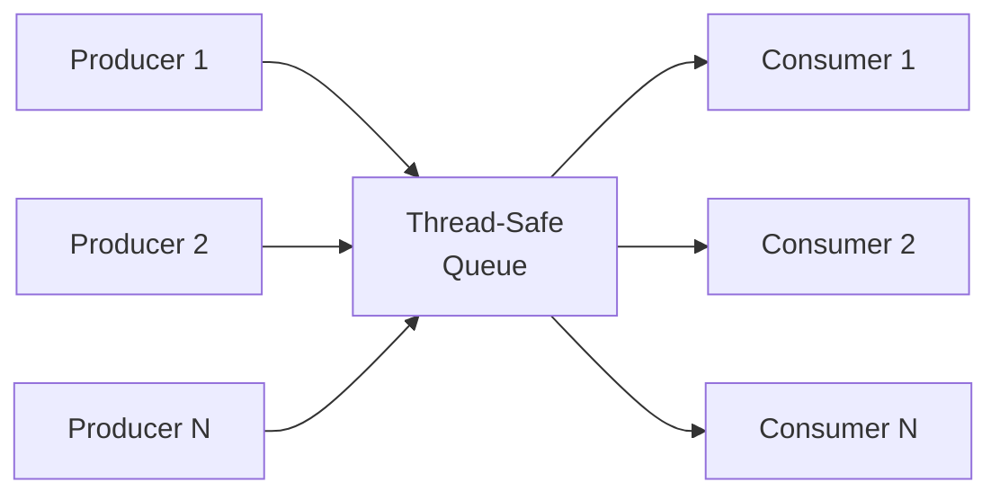
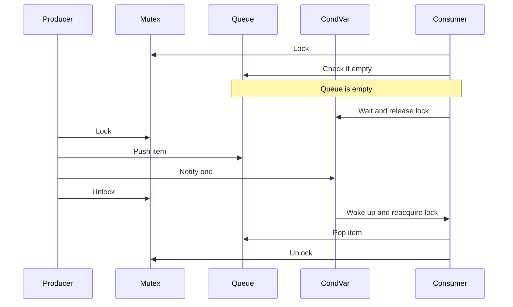
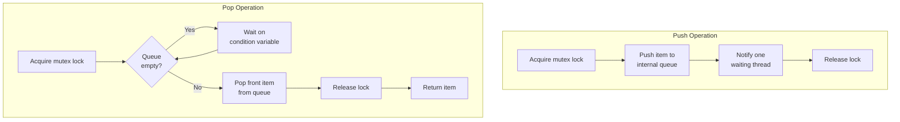

# Thread-safe queue implementation in C++

**Published:** 2021-09-06

Below is an implementation of thread-safe queue using synchronization primitives.

## Producer-Consumer Pattern

A thread-safe queue is the backbone of the producer-consumer pattern. Multiple producer threads enqueue items while multiple consumer threads dequeue them, all coordinated through synchronization primitives.

## Mutex and Condition Variable Flow

The queue uses a mutex to protect shared state and a condition variable to signal consumers when data is available. This avoids busy-waiting and ensures correct synchronization.

## Push and Pop Operations

Both push and pop operations acquire the mutex before modifying the queue. The pop operation additionally waits on the condition variable if the queue is empty.

