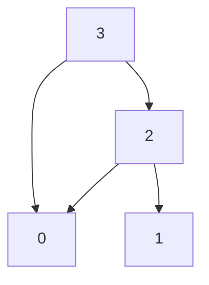
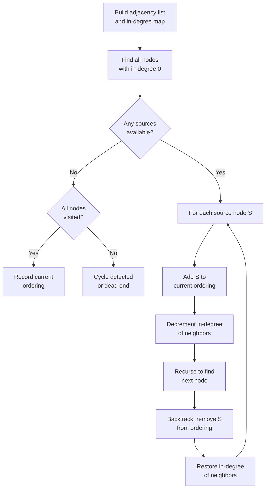
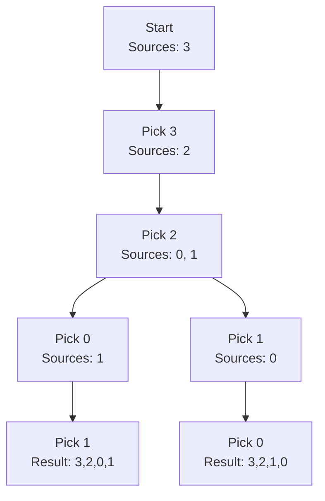

# Topological Sort: All Possible Orders

**Published:** June 13, 2020

Topological Sort is used to find a linear ordering of elements that have dependencies on each other. For example, if event 'B' is dependent on event 'A', 'A' comes before 'B' in topological ordering.

Lets say we are asked to find all possible variations of topological sort.

**There are 'N' tasks, labeled from '0' to 'N-1'. Each task can have some
prerequisite tasks that need to be completed before it can be scheduled.
Given the number of tasks and a list of prerequisite pairs, write a method
to print all possible ordering of tasks meeting all prerequisites.**

## Example DAG

The following diagram shows Example 2, where Tasks=4 and Prerequisites=[3, 2], [3, 0], [2, 0], [2, 1]. The arrows represent dependencies: an arrow from A to B means A must come before B.

This DAG produces two valid topological orderings: [3, 2, 0, 1] and [3, 2, 1, 0].

Example 1:

Input: Tasks=3, Prerequisites=[0, 1], [1, 2]
Output: [0, 1, 2]
Explanation: There is only possible ordering of the tasks.
Example 2:

Input: Tasks=4, Prerequisites=[3, 2], [3, 0], [2, 0], [2, 1]
Output:
1) [3, 2, 0, 1]
2) [3, 2, 1, 0]
Explanation: There are two possible orderings of the tasks meeting all prerequisites.
Example 3:

Input: Tasks=6, Prerequisites=[2, 5], [0, 5], [0, 4], [1, 4], [3, 2], [1, 3]
Output:
1) [0, 1, 4, 3, 2, 5]
2) [0, 1, 3, 4, 2, 5]
3) [0, 1, 3, 2, 4, 5]
4) [0, 1, 3, 2, 5, 4]
5) [1, 0, 3, 4, 2, 5]
6) [1, 0, 3, 2, 4, 5]
7) [1, 0, 3, 2, 5, 4]
8) [1, 0, 4, 3, 2, 5]
9) [1, 3, 0, 2, 4, 5]
10) [1, 3, 0, 2, 5, 4]
11) [1, 3, 0, 4, 2, 5]
12) [1, 3, 2, 0, 5, 4]
13) [1, 3, 2, 0, 4, 5]

## Algorithm: BFS-Based Approach

The algorithm to find all topological orderings uses a modified BFS (Kahn's algorithm) with backtracking. At each step, all nodes with in-degree 0 are candidates. We pick each candidate, recurse, then undo the choice to explore other orderings.

## Backtracking Walkthrough

The following sequence illustrates how the algorithm explores choices for Example 2 (Tasks=4, Prerequisites=[3,2], [3,0], [2,0], [2,1]). At each level, nodes with in-degree 0 are candidates.

**Time and Space Complexity
**

If we don't have any prerequisites, all combinations of the tasks can represent a topological ordering.
 As we know, that there can be N! combinations for 'N' numbers, therefore the time and space complexity of our algorithm will be O(V! * E) where 'V' is the total number of tasks and 'E' is the total prerequisites.

We need the 'E' part because in each recursive call, at max, we remove (and add back) all the edges.
